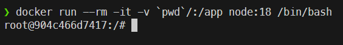

{}

If you have already created projects locally, skip down to the [Remove Node Modules]() section below. You can Dockerize existing projects as well! 

{}

## Get Effective IDs

First, we need to make a note of our effective user ID and group ID in the terminal:

```bash
# Terminal
id
```

You should get output that begins with something similar to this:

```
uid=1000(youboon2) gid=1000(youboon2)
```

Remember those two numbers for later!

## Create Projects

To create the projects themselves, we're going to use a one-off Docker command to run a container. 

```bash
# Terminal
docker run --rm -it --user=1000:1000 -v `pwd`/:/app node:18 bash
```

{}

Modify the command above to match your IDs found earlier. See below for details. Make sure you run this command in the root directory of your project!

{}

In this command:

* `docker run` will start a container to run a command. The container is removed when the command is finished.
* `--rm` will remove the container when it is finished
* `-it` will provide an interactive terminal
* `--user=1000:1000` will set the user and group IDs to 1000, respectively - match these to the output you received above.
* ``-v `pwd`/:/app</code>`` will create a volume mount between the current directory and the `/app` directory in the container.
  * Backticks around a command in the terminal will use the result of that command in the outer command. You could instead enter the full path to the current directory as part of the command, as in `-v /home/user/projects/fullstack:/app/code`.
  * See [Docker Volumes](https://docs.docker.com/storage/volumes/) for more details.
* `node:18` is the name of the Docker image to run.
  * Refer to [Node](https://hub.docker.com/_/node/) on DockerHub for other image versions. At the time of writing, Node 18 is the current LTS version.
* `bash` will load the Bash terminal inside of the container

Refer to the [Docker run](https://docs.docker.com/engine/reference/commandline/run/) documentation for more details.

Once we have run that command, we should get a terminal inside of the container:



To create the projects, we are going to use [Express Application Generator](https://expressjs.com/en/starter/generator.html) and [Create React App](https://create-react-app.dev/). You can refer to those pages for additional options that you can use when creating these projects.

```bash
# Docker Container Terminal
npx express-generator -v ejs /app/server
npx create-react-app /app/client
```

{}

This guide uses React, but you could easily use Vue or another frontend framework here. Just make sure it is placed in the `/app/client` directory inside of the container.

{}

Once we are done, we can exit the container:

```bash
# Docker Container Terminal
exit
```

This will stop the container and remove it.

## Remove Node Modules {#01}

Finally, we want to remove the `node_modules` folders from both the `client` and `server` folders. These are created when the project is first initialized, but we don't want them outside of our actual containers. So, **DELETE** both `node_modules` folders!

## Configure Docker

Now let's configure Docker to allow us to load both projects in separate Docker containers.

Create a `docker-compose.yml` file in the root directory of the project with the following content:

```yml
# docker-compose.yml
services:
  
  # server
  project-server:
    build:
      # location of Dockerfile
      context: ./server
    container_name: project-server
    # set the user ID to match our user
    user: "1000"
    networks:
      - project-network
      # allow external connections (remove this in production)
      - default
    volumes:
      # mount code into container
      - ./server:/app/server
      # maintain existing node_modules in container
      - /app/server/node_modules
  
  # client
  project-client:
    build:
      # location of Dockerfile
      context: ./client
    container_name: project-client
    # set the user ID to match our user
    user: "1000"
    depends_on:
      # requires server to start
      - project-server
    networks:
      - project-network
      # allow external connections
      - default
    volumes:
      # mount code into container
      - ./client:/app/client
      # maintain existing node_modules in container
      - /app/client/node_modules

networks:
  # internal Docker network for project
  project-network:
    name: project-network
    internal: true
```

Refer to [Docker Compose File Reference](https://docs.docker.com/compose/compose-file/compose-file-v3/) for what this does.

{}

Update `user: "1000"` in each of these files to match the user ID found earlier.

{}

We'll also need to add a Dockerfile to each project:

```dockerfile
# client/Dockerfile
# For running in development mode only
FROM node:18
USER 1000
WORKDIR /app/client
COPY --chown=1000:1000 package*.json ./
RUN npm install
EXPOSE 3000
CMD ["npm", "start"]
```

```dockerfile
# server/Dockerfile
# For running in development mode only
FROM node:18
USER 1000
WORKDIR /app/server
COPY --chown=1000:1000 package*.json ./
RUN npm install
EXPOSE 3000
CMD ["npm", "run", "dev"]
```

Refer to [Dockerfile Reference](https://docs.docker.com/engine/reference/builder/) for the structure of these files.

{}

Update `user: "1000"` and `--chown=1000:1000` in each of these files to match the user ID and group ID found earlier.

{}

Finally, we can start and run the Docker containers using Docker Compose:

```bash
# Terminal
docker compose up -d
```

Refer to the [Docker Compose CLI Reference](https://docs.docker.com/compose/reference/) for how to use Docker Compose commands. 


It will take a bit to build and configure both containers, but eventually the command should finish. This will be faster in the future. You can confirm they are running using the `docker ps` command.


To stop the containers when you are done, use

```bash
# Terminal
docker compose down
```

## Commit

This is a great place to stop and commit your work to GitHub. 