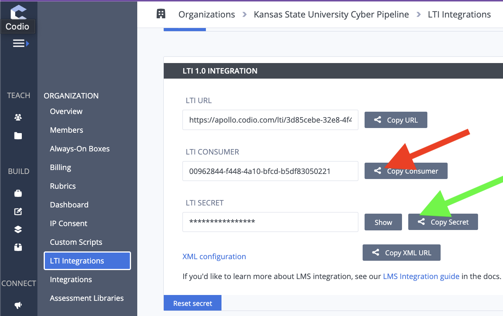

{}

The first step in creating a new Canvas course that you want to connect to a Codio course, is connecting the Canvas course to the Codio Organization. 

# Install Codio

By default, Codio is not an installed app on Canvas. You will need to install the app. 

Once you install it, you will be prompted to enter the 'Consumer Key' and 'Secret Key'

{}

Canvas's "Add App" is requesting Codio's "Organization" information.

{}

To get these requested keys, you will need to do the following

# Get Codio LTI Keys

Open up the organization by selecting the button that looks like a power button. Then select "Organizations"

{}

You might have just one organization and that is fine! 

{}

If you have more than one organization, select the organization where the course was created. Once you select the organization, you will select "LTI Integrations".

# Copy the Keys

You will copy Codio's "LTI Consumer" into Canvas's "Consumer Key" and Codio's "LTI Secret" into Canvas's "Shared Secret". 

# Launch URL

The last step is to set up the launch url in Canvas. To access this, you will need to open the Codio app in Canvas

{}

Unless the "Secret Key" in Codio gets changed, we won't have to worry about these values in the future. 

{}