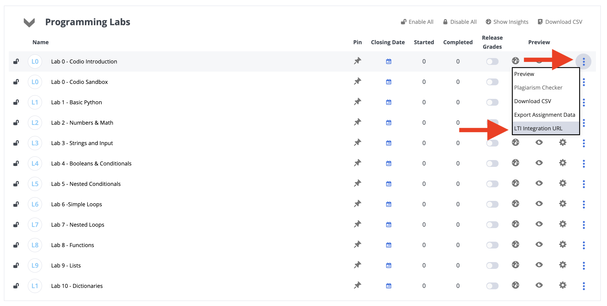
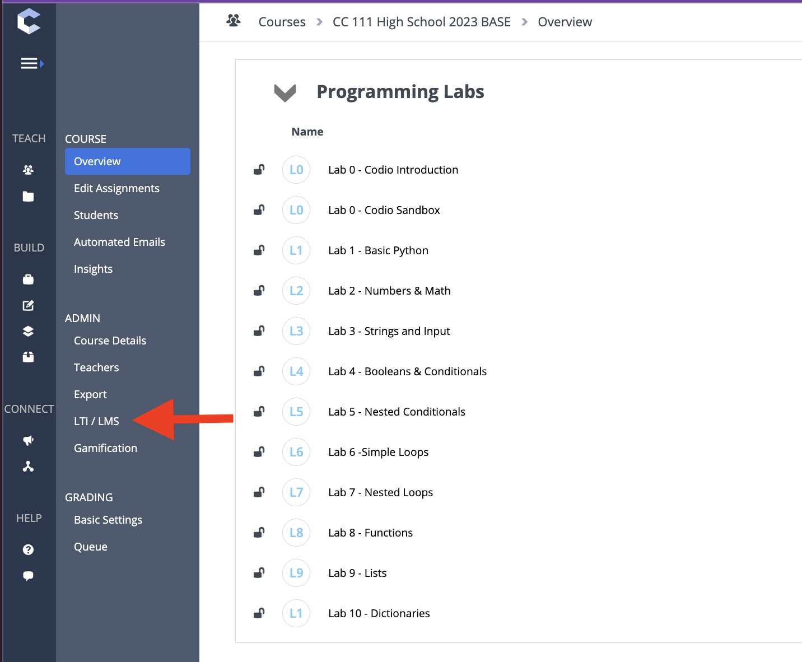
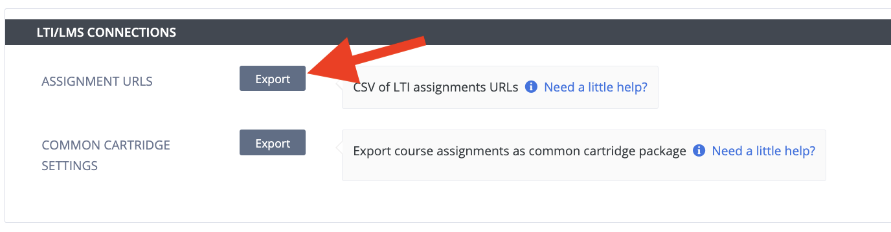

{}

In this part, we will be adding assignments to the Canvas course. 

The key parts of this step are to have the submission type be an "External Tool" and "Load in a New Tab". 

You will need to get the assignment URL from Codio.

### Accessing All LTI/LMS URLs

When first setting up a course, it is helpful to export the Assignment URLs.

