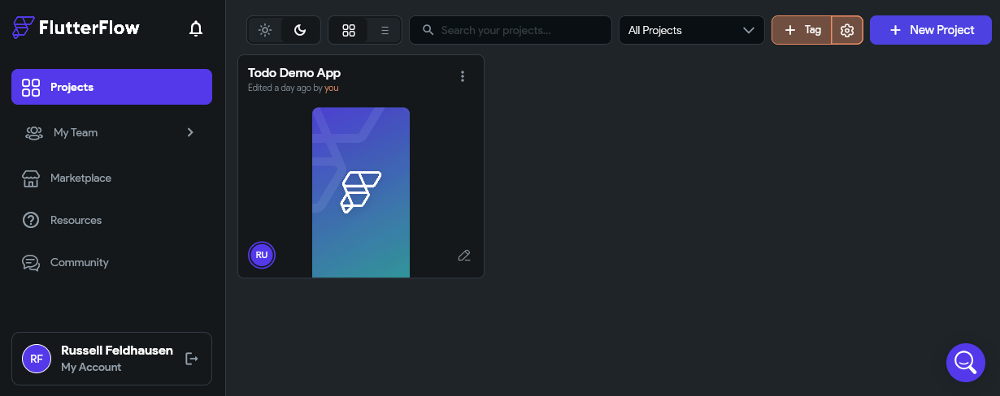
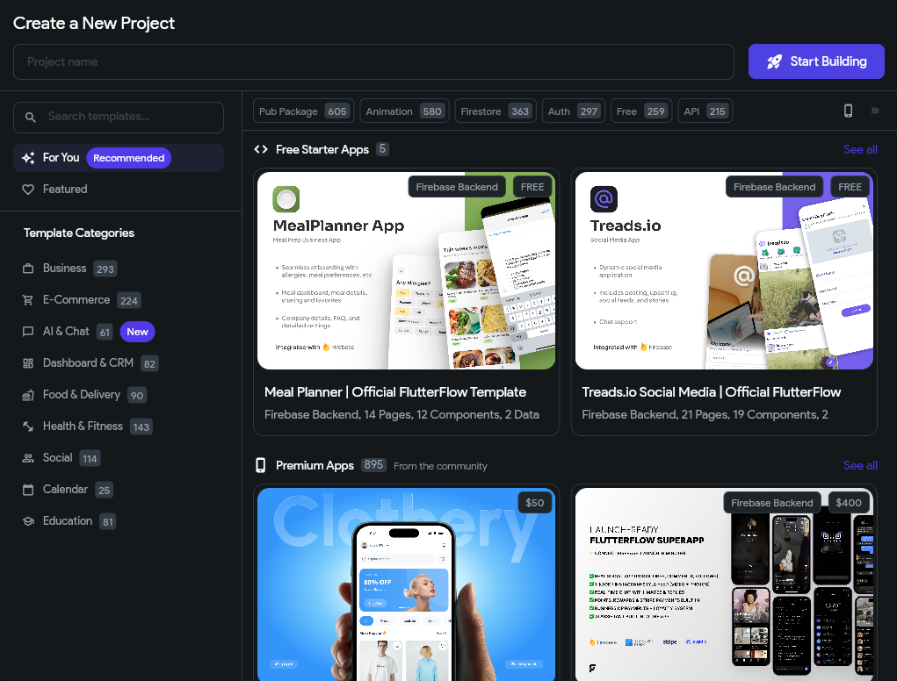
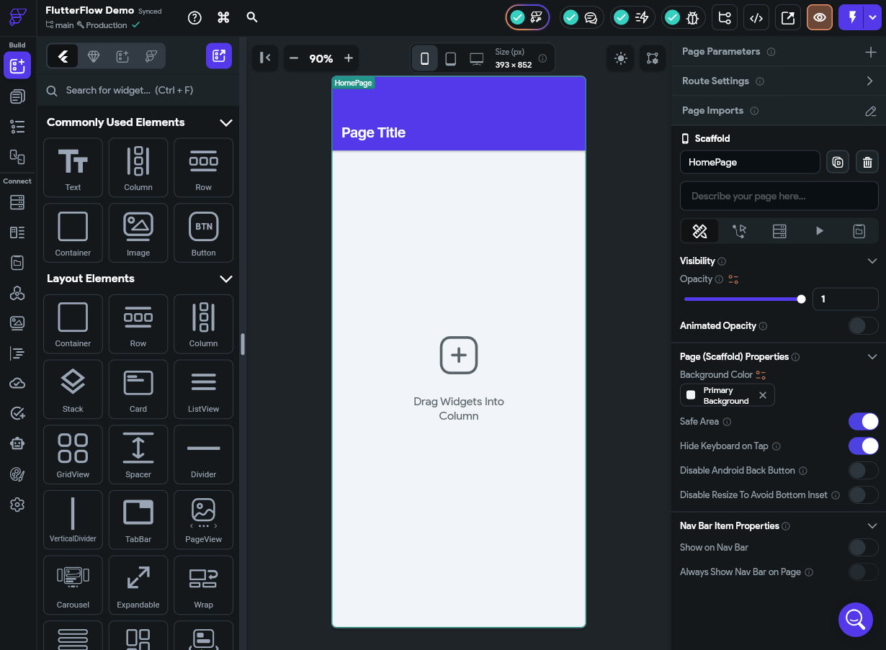
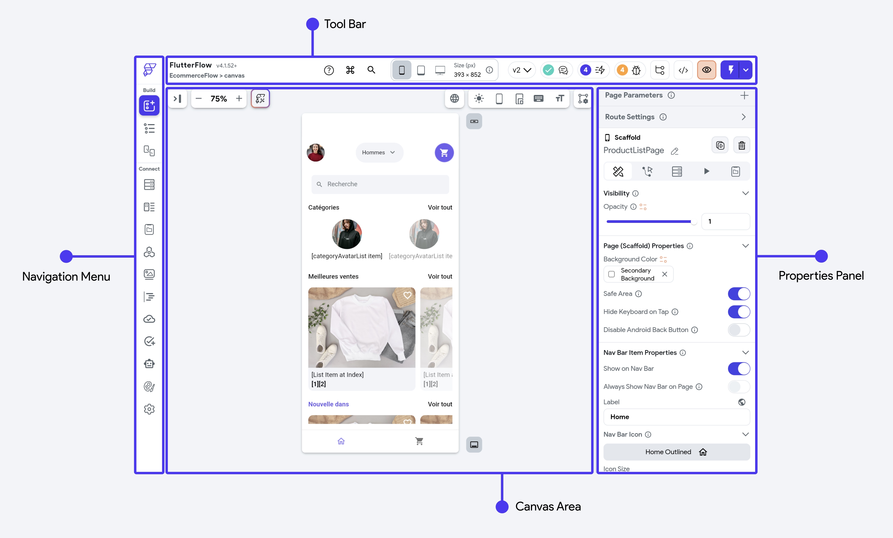
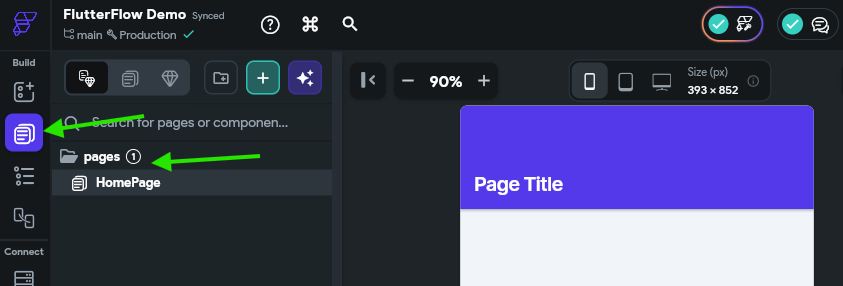
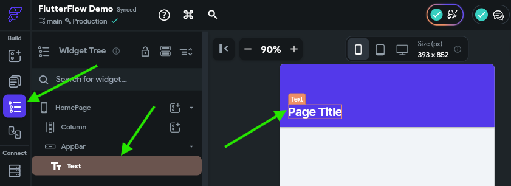
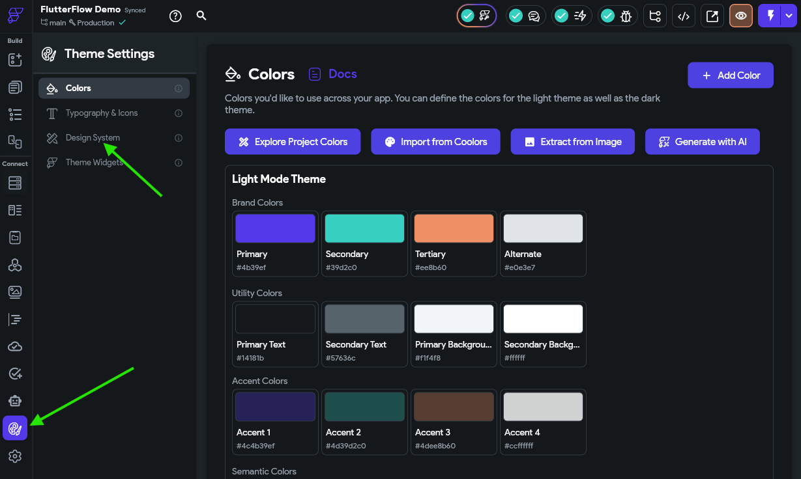
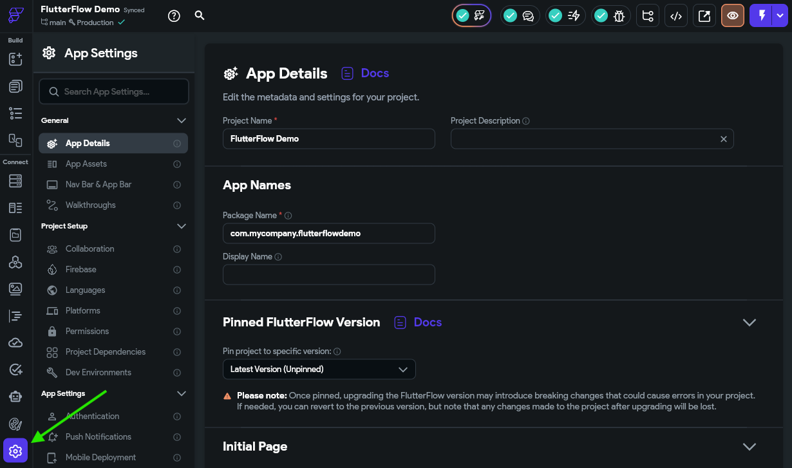



In this project, we'll use the [FlutterFlow](https://www.flutterflow.io/) tool to build a basic mobile application that could be deployed on Android and iOS devices as well as the web, all in one. 

## Under the Hood

Behind the scenes, this tool develops an application using the [Flutter](https://flutter.dev/) mobile application framework, which is built on top of the [Dart](https://dart.dev/) programming language. We'll examine some of the code written by this tool as we go.

It is also possible to use these tools to build mobile applications outside of FlutterFlow, and for large scale projects it may be beneficial to do this. Using low-code tools like FlutterFlow make app development very accessible to a large audience, but often the code they produce is overly complex and difficult to maintain long-term. For this project, we'll lean more on the side of rapid development and prototyping using FlutterFlow, but it is worth knowing that this may not be the best pathway for all use-cases.

There are a large number of other tools available for developing mobile applications:
* [Native Android using Jetpack and Kotlin](https://developer.android.com/get-started/overview)
* [Native iOS using Swift](https://developer.apple.com/ios/get-started/)
* [Native Web & Desktop using Electron](https://www.electronjs.org/docs/latest/)
* [Typescript to Native UI using Nativescript](https://nativescript.org/)

In short, there is no right or wrong way to develop a mobile application, and each approach has pros and cons. So, make sure you evaluate your needs to choose the tools and frameworks that are best for your needs.

## Creating a New Project

To get started in FlutterFlow, you'll need to be invited to an existing team that has an education license already set up, or apply for education pricing yourself as a student. More information can be found on the [FlutterFlow Education Pricing](https://www.flutterflow.io/pricing) page. Reach out to your course instructor if you need any assistance getting your account set up through FlutterFlow itself.

{}

FlutterFlow has a very comprehensive [FlutterFlow Documentation](https://docs.flutterflow.io/) website and [FlutterFlow YouTube Channel](https://www.youtube.com/@FlutterFlow/featured). We recommend bookmarking both of these resources and referring to them in addition to this tutorial; we can only show a small fraction of what FlutterFlow is truly capable of in this tutorial. 

{}

Once you are logged in to FlutterFlow, you should be taken to a project dashboard:

Here, you can see all of your existing projects as well as create projects, teams, and search for marketplace assets and resources. In the screenshot above, we already see a project that has been created, but your dashboard is probably blank. So, we'll start by clicking the {}New Project{} button at the upper-right corner of the screen.

That will open up the dialog for creating a new project, shown below:

As we can see, FlutterFlow includes a large number of free and paid starter project templates that we can choose from. As you consider building other applications using this tool, these templates might be a great starting point to review and see how more complex applications can be built using this tool. However, for this tutorial, we're going to build an app from scratch. So, enter a memorable project name in the **Project name** field at the top of the window and click the {}Start Building{} button to create your project. We'll call our example "FlutterFlow Demo" for this tutorial.

Once we've created our project, we'll be taken to the main interface for the FlutterFlow App Builder:

This page is full of useful features, such as the **Navigation Menu** on the left, the **Tool Bar** at the top, the **Properties Panel** to the right, and the **Canvas Area** in the middle. If you click on the buttons in the **Navigation Menu**, you'll be presented with a number of additional features such as the **Widget Palette**, **Page Selector**, **Widget Tree**, **Storyboard**, and more. 

[^1]

[^1]: Image Source: https://docs.flutterflow.io/flutterflow-ui/builder

The [FlutterFlow Documentation](https://docs.flutterflow.io/flutterflow-ui/builder) has an entire section devoted to the buttons and features available in the UI of the FlutterFlow platform. It is another great resource to have available while building an application.

{}

Before moving ahead in this tutorial, take a moment to open the [FlutterFlow Documentation](https://docs.flutterflow.io/flutterflow-ui/builder) and review the pages describing the layout of its interface. We'll do the best we can to use the same naming conventions as their official documentation, but we will assume you are somewhat familiar with these terms as we go. You can also refer to the video portions of these tutorials linked throughout these pages and follow along there.

{}

## Exploring a Project

Let's take a moment to explore our new project before we start making changes. 

### Page Selector

First, in the **Navigation Menu** on the left side, choose the **Page Selector** button to view the pages in our application. We'll see a `pages` folder, and we can click on that to open the folder and see our default `HomePage` item inside:

We'll use this view to manage the large parts of our application, such as the **Pages** and **Components** that we'll be creating. For now, it just contains the default page created for our project.

### Widget Tree

Next, let's look at the **Widget Tree** by clicking that button in the **Navigation Menu**. It is right below the **Page Selector** button. Once you've opened that panel, use your mouse to hover over the `Text` item at the bottom of the Widget Tree. You should see it highlighted in the **Canvas Area**

This is a great way to explore the overall structure of your individual pages. We'll talk more about the structure of widgets in Flutter later in this tutorial. 

### Theme Settings

Let's also look at the **Theme Settings** by clicking that button near the bottom of the **Navigation Menu**.

Here, you can configure many defaults for your application, such as the color palette, icons and typography settings, and more. You can also click the **Design System** option, highlighted in the screenshot above, to bring in information from an existing design tool such as [Figma](https://www.figma.com/). 

For this tutorial, we'll strictly focus on functionality over design, so we won't make any changes here for now. However, you are welcome to explore this section of FlutterFlow and customize your application as desired. 

{}

Using design tools like Figma are a great way to quickly build a wireframe for a mobile application and explore the desired look and feel before investing any development time. Thankfully, FlutterFlow makes it very easy to import a lot of your design features from Figma directly into this tool.

The full process for building a design system is a bit involved and outside the scope of this tutorial, but may be worthwhile if you've spent a lot of time in Figma building your design. The [FlutterFlow Documentation - Design System](https://docs.flutterflow.io/concepts/design-system) page has a full tutorial for building these design systems and importing them into FlutterFlow. 

{}

### App Settings

Finally, let's take a look at the **App Settings** section by clicking the bottom button on the **Navigation Menu**. 

This interface gives you full access to a large number of settings and configuration options for our application. Feel free to take some time scrolling through these options and reading what is available; often you can learn an awful lot about what your app can do just by seeing what options are available to you.

We'll come back to this page frequently as we build our application and add additional features. 

## Summary

In this section, we covered the basics of creating a mobile app in FlutterFlow and explored some of the important features available in the FlutterFlow user interface. With that knowledge in hand, we can start developing our application!