

Now that we've created a new project in FlutterFlow, let's explore the process of creating our first component by adding some widgets and data.

## The Concept - "To Do" Application

For this tutorial, we're going to build a simple "To Do" application to help us keep track of our tasks. Our application should have the following features:

- [ ] To Do tasks should include a short title and longer description.
- [ ] To Do tasks should track the date it was created and the date it is due.
- [ ] To Do tasks should track whether it has been completed or not.
- [ ] Tasks may optionally have an address associated with the task.
- [ ] To Do tasks should be assigned to different priorities (Low, High).
- [ ] When a task is completed, it should track the date and time when it was completed.
- [ ] Users should be able to create, edit, and delete tasks.
- [ ] Tasks should be sorted according to completion, due date, and priority.
- [ ] Our application should include user accounts so that multiple users can use the app.
- [ ] User accounts should use an email address and password to log in.
- [ ] User data should be stored in the cloud so they can use the app across devices.
- [ ] Each user's data should be stored securely and not accessible by other users.
- [ ] If a task has an address, the application should allow the user to request directions to that address.
- [ ] If the user gives permission, it should also track the location where a task was completed.
- [ ] Our application should track the percentage of tasks completed on-time (before the due date).
- [ ] Users should be able to configure their display name and update their password.
- [ ] Users should be able to delete their account and all associated data.
- [ ] User profile pictures should be visible from [Gravatar](https://gravatar.com/)
- [ ] The app should display a global leaderboard showing the users with the highest on-time completion percentage.

That looks like a long list of features, but we'll slowly work through this list over several steps to build the desired functionality for our application. Our hope is that this list of features will give you enough building blocks to start building your own applications using these features and more!

## Data

Now that we have a basic concept for our application in mind, a great place to start is by thinking about the data our application will need to store. For this initial page we are developing, we'll start with our to do tasks. For many web and mobile applications, data is often stored and communicated in the [JavaScript Object Notation (JSON)](https://www.json.org/json-en.html) format. Thankfully, we don't need to understand all of the details of JSON to use it in our application, and it is fairly easy to read and understand with a bit of programming background.

So, let's start by creating a basic structure for a couple of to do tasks in a JSON format:

```json
[
  {
    "title": "This is a title",
    "description": "This is a longer description for the task",
    "dateCreated": "2026-01-01 00:00:00.000",
    "dateDue": "2026-02-01 00:00:00.000",
    "address": "1701D Platt St., Manhattan KS 66506",
    "isCompleted": false,
    "dateCompleted": null,
    "priority": "Low"
  },
  {
    "title": "This is another task",
    "description": "This is a longer description for the task",
    "dateCreated": "2026-01-02 00:00:00.000",
    "dateDue": "2026-05-01 00:00:00.000",
    "address": null,
    "isCompleted": true,
    "dateCompleted": "2026-03-05 00:00:00.000",
    "priority": "High"
  }
]
```

Looking at the structure above, there are a few important things to notice:
* The overall JSON structure is surrounded by square brackets `[ ]`, which indicate that this JSON structure is storing an **array** of data. 
* Each individual item in the array is surrounded by curly braces `{ }`. These represent **objects** in JSON, but they are very similar to **dictionaries** in other programming languages. Each attribute in the object has a name and a value. 

This structure gives us the basics we need to start scaffolding our application. First, we need to add this as a **Data Type** in our application so it knows what the structure is. To do this, click the **Data Types** option in the **Navigation Menu** to get to that page.

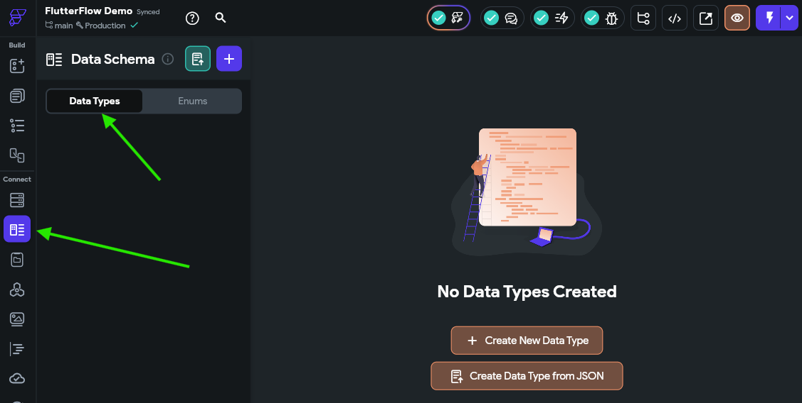

Next, click the {}Create Data Type from JSON{}, and then in the panel that appears, set the name to `ToDoItemType` and paste in a single to do item from the JSON above (from one curly brace `{ }` to another) in the box:

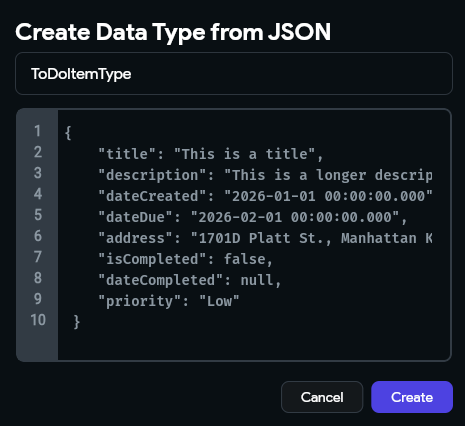

Once that is done, click the {}Create{} button to create that data type. That should create a data type that looks like the one in the screenshot below:

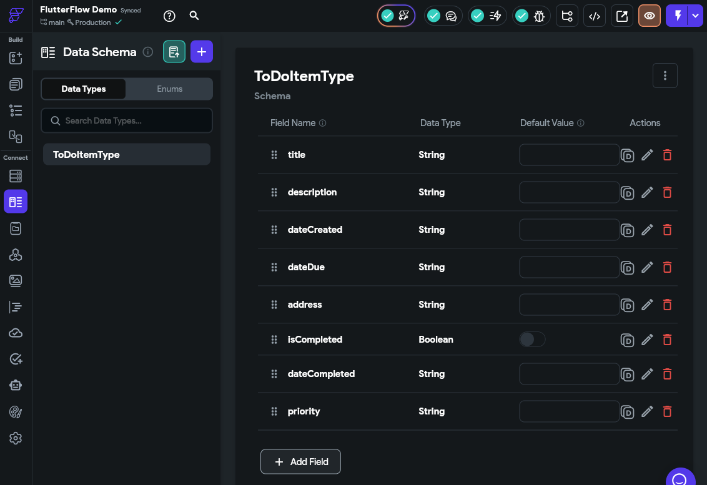

There we go! That tells FlutterFlow about the structure of the data we'll use to represent a single to do task in our application.

Next, let's add this data to our **App Values** by clicking that option in the **Navigation Menu** on the left side of the FlutterFlow window, and then selecting the **App State** option on that page.

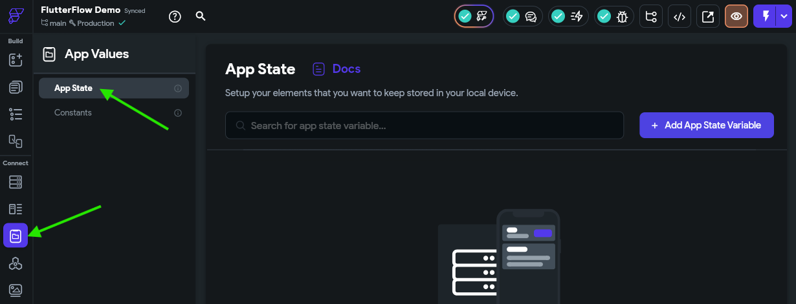

Then, we can click the {}Add App State Variable{} button on the upper right to create a new **App State Variable** for our application. In the popup window, let's call our field `toDoTasks` in the Field Name box, and choose the **Data Type** Field Type. Next, we'll need to select our `ToDoItemType` from the second list that appears. We also want to make sure we checkmark the **Is List** option, since our data type is a list of items. Finally, click the {}Create{} button to create that variable.

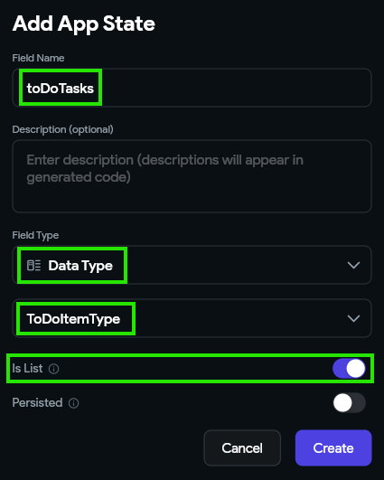

Once we've created our variable, we can add some items to the list by clicking the drop-down arrow in the **Default Value** column and then clicking the {}Add Item{} button.

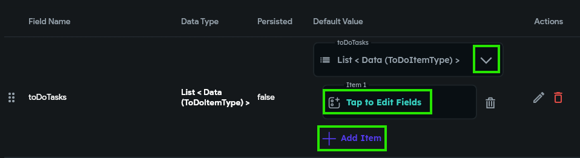

Once that adds a value to the list, we can click the **Tap to Edit Fields** option to add values to each field. We'll use the values for the first to do task item in the JSON structure above.

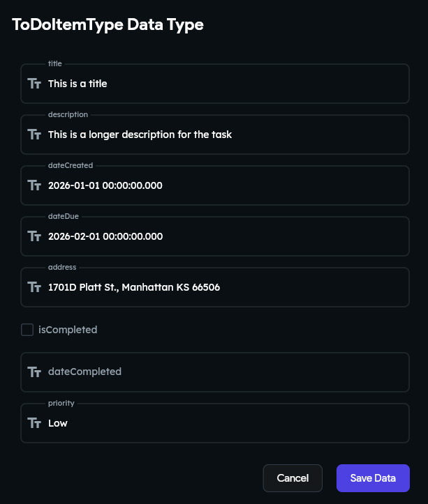

We can repeat that for our other to do task as well, so we'll have 2 values in the list. This allows us to start building components that can display data stored in a list.

## First Component - A To Do Item

Now that we have some data in our application, we can start scaffolding our first component - a way to display a to do item in our application. So, to begin, let's click back on the **Page Selector** option in the **Navigation Menu** to view our existing application.

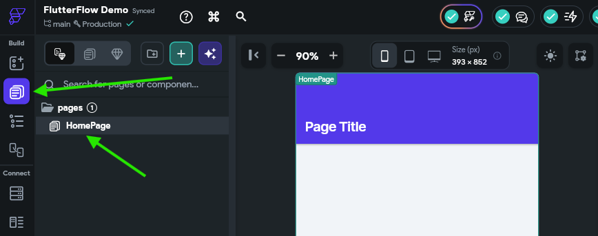

Before we add anything to our page, let's start by creating a new stand-alone component to represent a single to do task. So, at the top of the **Page Tree**, click the {}{} button to create a new component. 

In the popup window, choose the **New Component** option at the top, and then click the **Create Blank** option. We'll name our component `ToDoItemComponent`. 

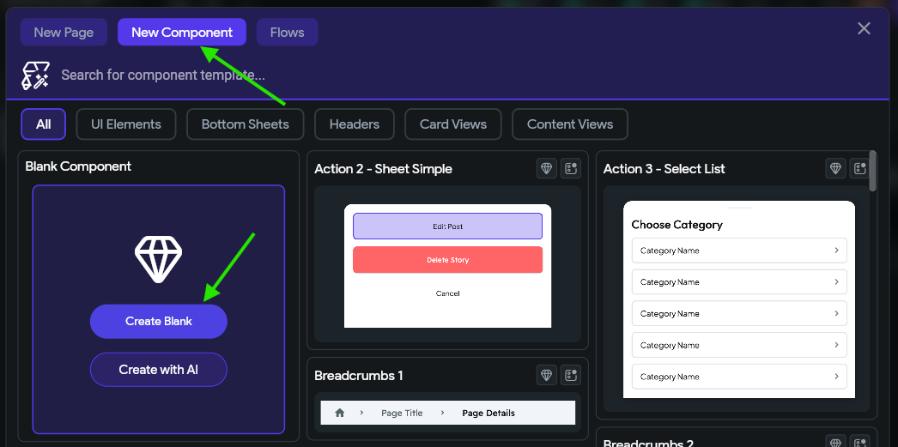

{}

Don't worry - we'll come back here later and use a component template and generate a component with AI. FlutterFlow includes a plethora of useful building blocks to quickly create apps, but we'll start by doing some of the work by hand to get a feel for the basics.

{}

Once it has been created, we'll see it in our **Page Tree** on the left side of the screen:

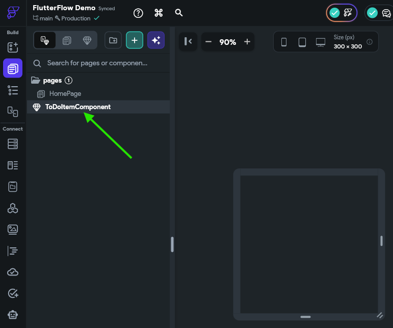

{}

FlutterFlow also allows you to place pages and components into folders for organization. Notice that the `HomePage` page is already inside of a `pages` folder. Feel free to add folders and organization structures as desired as you build your application.

{}

## Widget Tree

Now that we have a basic component, we can start adding widgets to that component. The [FlutterFlow Documentation - UI Building Blocks](https://docs.flutterflow.io/resources/ui/overview) section has a great deep-dive into the fundamental concepts of building user interfaces using Flutter. We recommend reading through the **Overview** and **Widgets > Introduction to Widgets** pages at a minimum to familiarize yourself with these concepts. 

At the core, a page or component will contain a **Widget Tree** that contains the content on the page. Each widget in that tree may be an **Atom**, which is a stand-alone building block for the UI like a **Text** or **Icon** widget, or a **Molecule**, which is a widget that contains other widgets, like a **Row**, **Column** or **List** widget. Below is an example of a **Widget Tree** for a component. 

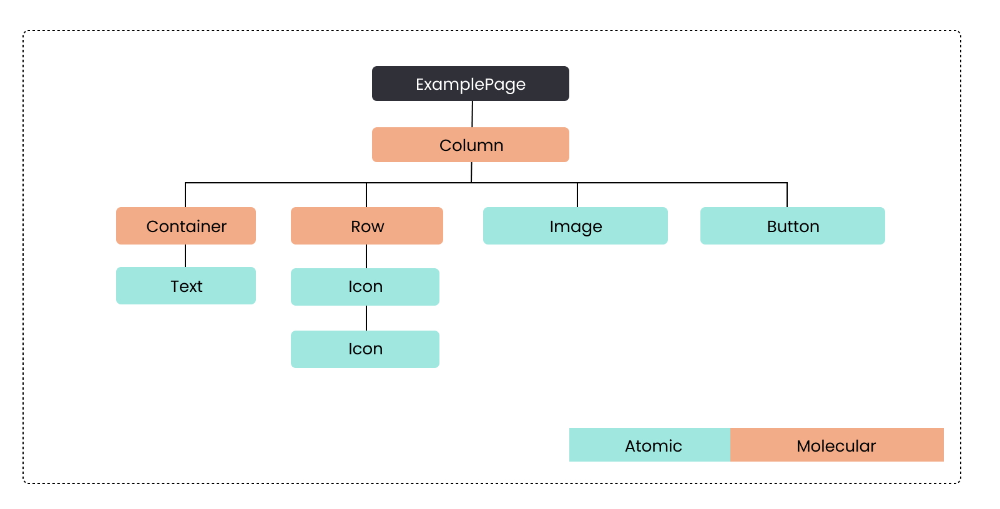[^1]

[^1]: Image Source: https://docs.flutterflow.io/resources/ui/widgets

In FlutterFlow, this **Widget Tree** would be represented in the UI in this way:

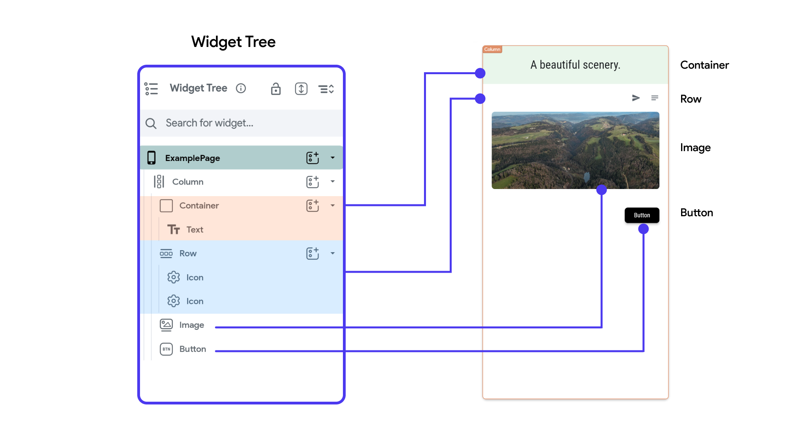[^1]

As you can see, each item in the widget tree matches to an item in the user interface, and the structure of the tree shows how each widget is placed relative to each other in the larger structure of the application.

## Adding a Column

For our component, let's start by adding a **Column** widget as our starting point. So, we'll click on the **Widget Palette** button in the **Navigation Menu** on the left, then we'll find the **Column** widget and drag it into our component. 

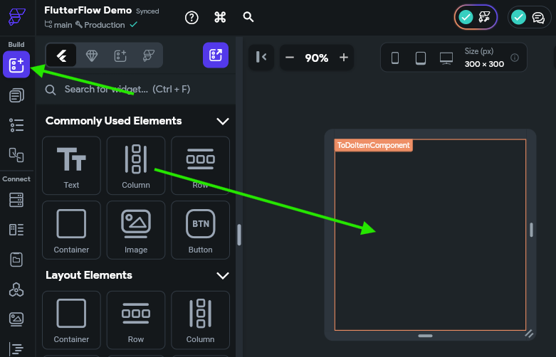

Once we've added that widget to our component, we'll see the **Properties Panel** for the **Column** widget appear on the right side of the page. If it doesn't appear, make sure you select the **Column** widget either on the **Canvas Area** or by clicking the **Widget Tree** option in the **Navigation Menu** and finding it in the **Widget Tree** on the left side of that view. 

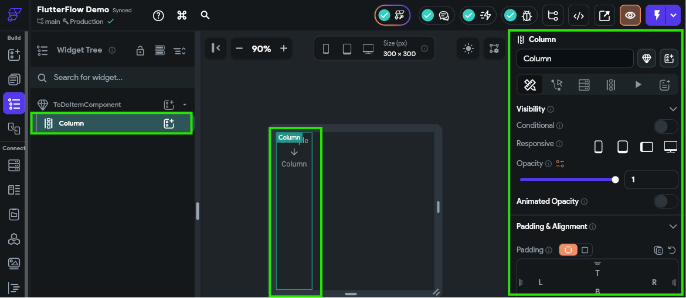

As you can see, there is a large number of settings you can configure for a single **Column** widget in FlutterFlow - this is where the real power of this design system appears. Unfortunately, there are _so many_ options here that it can be difficult to know which ones are important or even to clearly describe which ones to update. 

For now, there is just one option we'll need to modify from the default. You may have to search around a bit to find it by hovering over the options, or refer to the video above for a clear description of where to find it:

* Column Properties -> Main Axis Size -> Choose "Use minimum amount of size on the main axis"

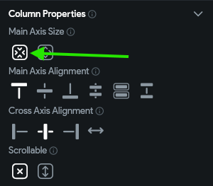

## Adding Rows

Next, let's add a couple of rows to our **Column** widget. So, following the same process as before, add two **Row** widgets to the column widget, but be careful not to put one row inside of another, or place a row in place of the column widget. If done correctly, when looking at the **Widget Tree** we should see two **Row** widgets inside of the **Column** widget as shown below:

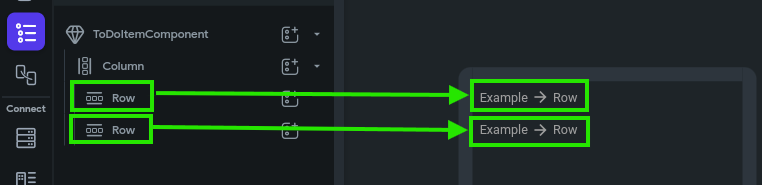

With this structure, we have a framework where each to do task will be displayed with two rows of data! Let's continue onward to add more widgets to this framework to actually display the data. 

## Adding Widgets

In the first row, let's add three more widgets in this order:

* An **IconButton** widget to show the completion status of the task
* A **Text** widget to show the title of the task
* A **Text** widget to show the priority of the task

In the second row, we'll also add two more widgets in this order:

* A **Text** widget to show when the task is due
* An **IconButton** widget to show if the task has an address assigned to it.

We won't worry about changing any of the options for these widgets yet. We'll just focus on getting them into our **Widget Tree** for now. Once you've done that, you should have a **Widget Tree** that looks like this (you can also click the **Toggle App Brightness** icon at the top right of the **Canvas Area** to make it easier to see items if you are working in dark mode):

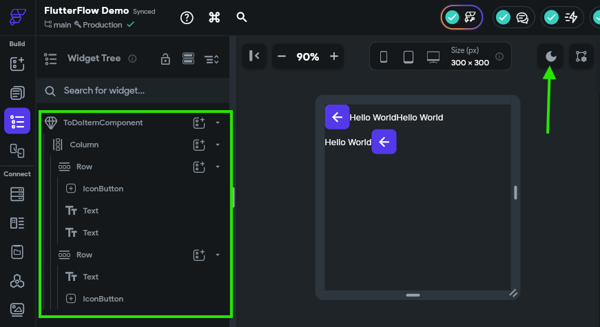

Thats a start! We have the basic building blocks for our component in place. Now let's work on making the design a bit cleaner before moving ahead.

## Managing Design

First, let's add a bit of spacing between our two rows. We can do this by clicking the **Column** widget in the **Widget Tree**, and then finding the **Items Spacing** option in the **Properties Panel** to the right. Let's set this value to 5 for now.

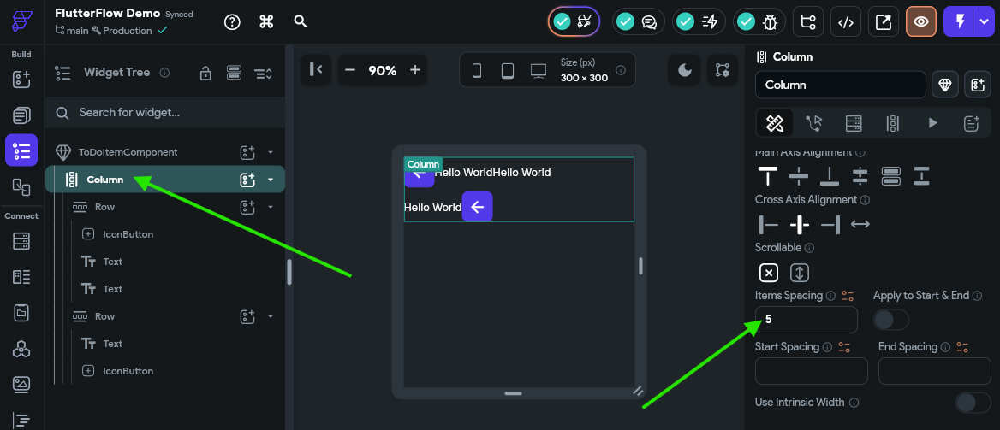

This will add a little gap between the two rows in our component. Next, let's do the same for each **Row** widget, just to make sure there is a little space available there as well. Once we've done that, our **Canvas Area** should show the components with a bit more space between them.

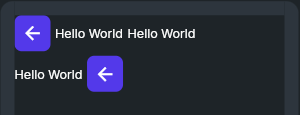

Next, we want to add some flexible space in each row so that the last widget in that row is pushed to the very end of the row, all the way to the right. To do that, we must first configure each row so that it can expand to take up the available space in a container. This can be found in the **Properties Panel** for the row under **Padding & Alignment** - we want to choose the middle **Expansion** option, which is labelled "Flexible." Then, we must also make sure the **Main Axis Size** under **Row Properties** is also set to the second option, which will use the maximum amount of size on the main axis.

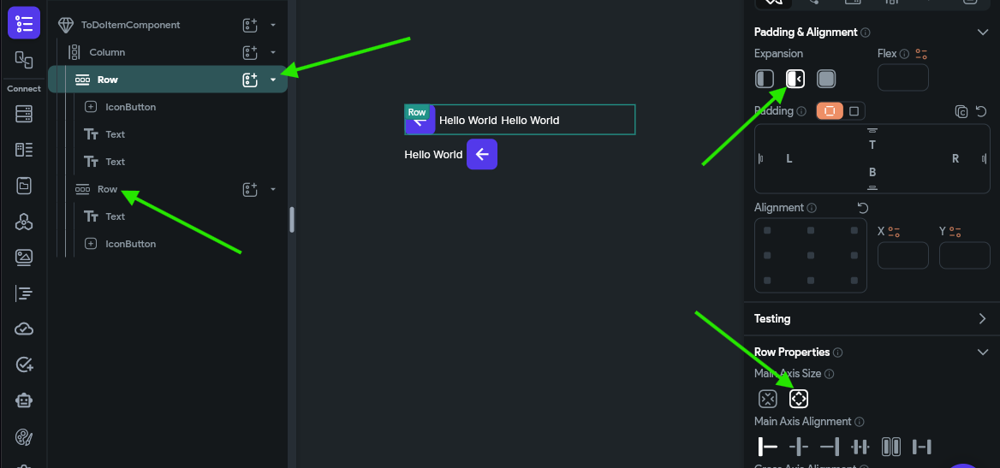

Make sure you set these properties on both **Row** widgets before continuing. 

Then, we can add a **Spacer** widget to each row, right before the last component in the component tree. 

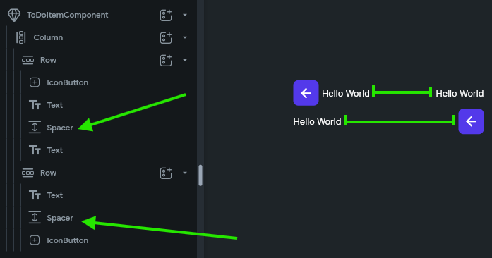

There, with that in place, the last widget on each row will be pushed to the rightmost side, expanding the row to fill the space.

## Naming Widgets

Finally, before moving on, let's quickly rename our widgets so they are easier for us to keep track of. We can do this by clicking each widget in the **Widget Tree** and then entering a name in the box at the top of the **Properties Panel**. Generally, in FlutterFlow it is recommended to name widgets using `PascalCase` (also known as `UpperCamelCase`), and we often want to include the type of the widget in the name, such as `TitleText` or `IsCompletedIconButton`. 

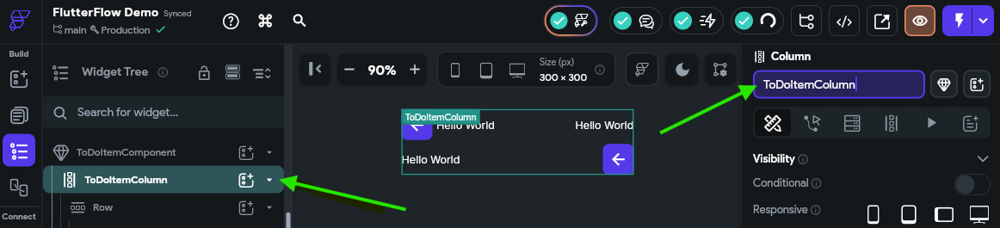

Take a moment to rename some or all of the widgets in your widget tree to something useful. After renaming our widgets, we should see something like this in our **Widget Tree**:

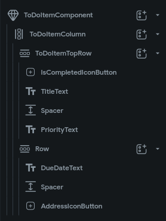

## Summary

There we go! Now we have created our first widget in FlutterFlow. From here, we can start adding data to this widget and building up the interactivity in our application.