

Now that we have a simple component that represents a to do task, let's work on building a list view that shows all of the tasks in our application.

## Component Parameters

First, we need to configure the component parameters for our `ToDoItemComponent` component and wire up all of the fields so they are displayed correctly. So, to begin, make sure you have selected the `ToDoItemComponent` in the **Page Selector** page found in the **Navigation Menu**, but don't click on any of the components inside of it. To the right, we should see the **Properties Panel** contain an entry for **Component Parmeters** at the top. Click the {}{} button to add a new component parameter entry:

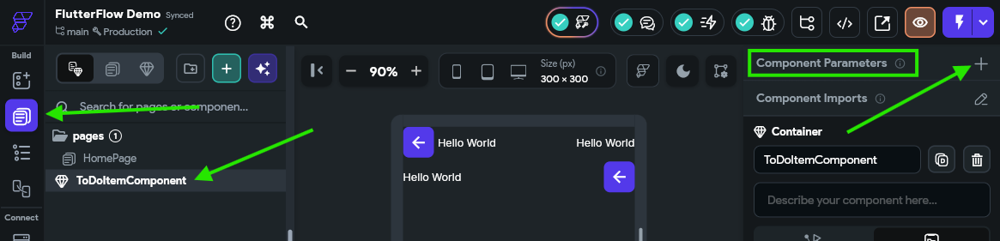

Next, click the {}Add Parameter{} to add a new parameter to the component. 

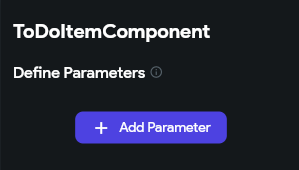

In the panel that opens, enter a memorable name for the parameter (something like `toDoItemParam` since parameter names must be in `lowerCamelCase`) and then set the type to **Data Type** and choose our `ToDoItemType` from the list of data types. We also want to checkmark the **Required** option, but leave the **Is List** option unchecked since we are dealing with a single item in this component.

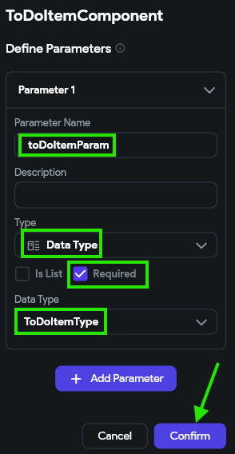

Once the parameter is configured, click the {}Confirm{} button to save the settings. 

## Configuring Data Values

Now that our component has a parameter, we can wire up each widget in the component to display that data. 

### Title and Priority

First, let's handle the easiest ones, which are the title text and priority text widgets on the top row. First, in the **Widget Tree**, click the `TitleText` component (or whichever name you used for that component), and then look for the **Text** option in the **Properties Panel** to the right:

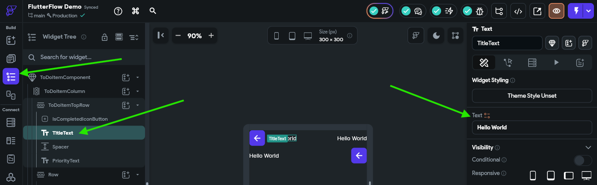

Next to the **Text** title, there is a little orange colored icon that can be clicked to link this text widget to a variable's value. Click that button to bring up the panel to set the value from a variable:

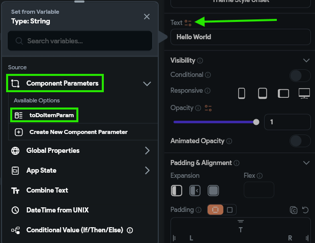

In that panel, choose the **Component Parameters** option, and find the `toDoItemParam` entry. Then, the panel will switch to a second view, where we can choose the specific field we'd like to use in that field. In the first box, we'll choose **Data Structure Field** and then choose the `title` field in the second box. In the third box, we can enter `default` since we really don't care what the default value is, but in the last box, we'll enter some default text like `To Do Item Title` just to appear in our UI builder.

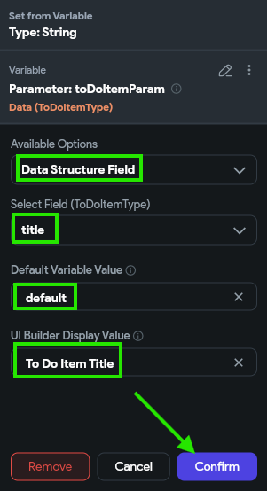

Once we have everything set, we can click the {}Confirm{} button to save our changes. Now, we should see that that text field has the value we configured:

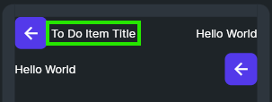

Awesome! That's the first big step toward making our application actually work with our data. Let's continue to set up our other fields. 

Let's do the same process for our priority text field. First, let's set the value to display data from the `priority` field just like we did for the `title` field above. However, this time, we also want the display color to change a bit based on the value. So, we'll scroll down to find the **Text Color** option under the **Text Properties** settings in the **Properties Panel**, and click the little orange icon next to that item to configure it as well:

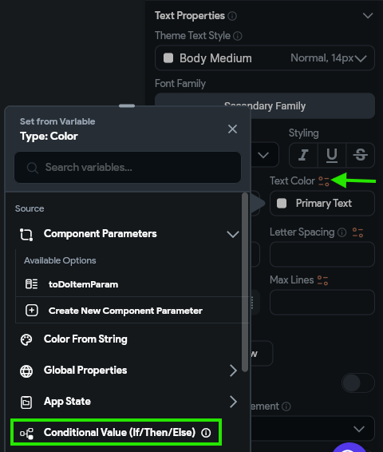

Our goal is to have items with high priority display this text in red, and low priority in white. So, we'll select the **Conditional Value (If/ThenElse)** in the panel as our main option. Then, in the panel that appears, we'll configure the **IF** condition by clicking it and selecting the Inline Function option. In that window, we'll create an argument named `priority` and link the value to the `priority` attribute from our `toDoItemParam`. In the expression, we'll use the following Dart code to check the priority's value:

```dart
priority.toLowerCase() == "high"
```

If everything checks out, we can click the {}Confirm{} button to save that inline function as our conditional. Then, we can click the color box next to the **Then** block and choose the red color **Error** and also click the color box next to the **Else** block and set the color to our **Secondary Text** color. Finally, click the {}Confirm{} button once again to save this value. The full process is shown in the animation below and in the video at the top of this page. 

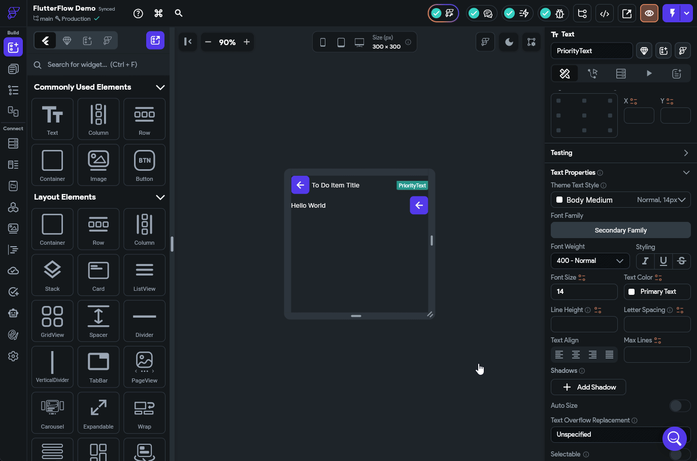

{}

Notice that we set the text colors to the **Error** and **Secondary Text** preconfigured theme values instead of just setting them directly to red and grey/white, respectively? This is because we want our app to be responsive to design changes such as switching between light and dark modes as well as updates to our underlying theme. So, we should always aim to choose colors and fonts from our underlying theme to make things easier to update in the future.

{}

### Due Date

Next, let's configure the text widget displaying the due date, which is in the second row of our component. For this item, we want to do a bit of text parsing to convert the date into a more useful format. Our vision is to have this field display something like "in a few days" instead of the exact due date. Thankfully, FlutterFlow includes by default a library called `timeago` that does exactly that!

To accomplish this in FlutterFlow, we need to write a bit of custom code. So, let's go to the **Custom Code** option in the **Navigation Menu**. Once there, we'll click on the {}{} button at the top to create a new item, and select the **Function** option. 

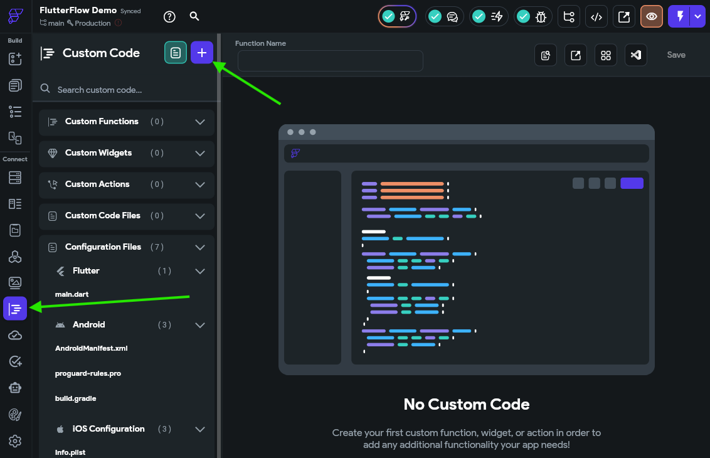

Here, we'll be presented with a simple code editor where we can configure our function. First, in the **Properties Panel** to the right, we'll click the {}Add Arguments{} button and configure an argument named `date` that is of type **String** and make sure both the **Is List** and **Nullable** options are **Unchecked**. Above that, we'll also make sure our **Return Value** is also using the **String** type and both the **Is List** and **Nullable** options are **Unchecked**

In the code area, we'll see a clear section where we should input our code. We'll use the following Dart code as the body of our function:

```dart
  try {
    return timeago.format(DateTime.parse(date), allowFromNow: true);
  } catch (err) {
    return "";
  }
```

Finally, at the top, we'll name our function `dateToTimeAgo`, then click the {}Save Function{} at the top to save our function. 

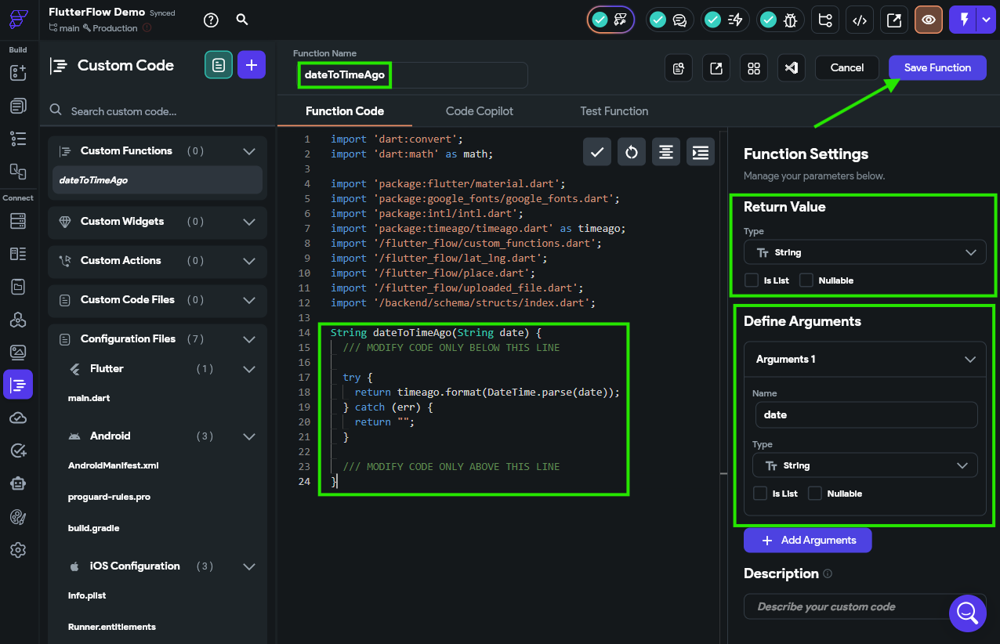

{}

The code in the screenshot is incomplete, so make sure you use the code shown in the code block above!

{}

Once our function has been saved, we should also click the button that appears to check our code for any errors. Thankfully, the project analyzer in the top toolbar of FlutterFlow (the little "bug" icon) also reminds us to do this:

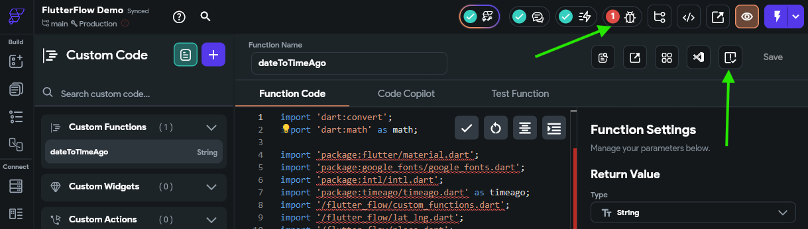

There we go! Now we have a custom function we can use to format a date string in that format. So, we can go back to our **Widget Tree** for our custom component and configure the value of the `DueDateText` widget to use that function. When we open the **Set from Variable** panel, we'll just choose our `dateToTimeAgo` custom function, and set the `date` parameter to be the `dateDue` attribute from our `toDoItemParam` component parameter. We can also add a few default values and UI builder values as well. The full process is shown in the animation below or the video at the top of this page.

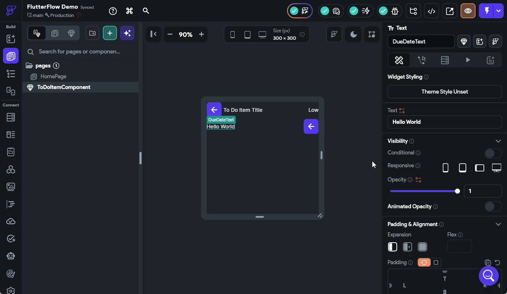

There we go! That should configure our due date to display correctly.

### Address Icon

Next, let's configure the `AddressIconButton` to only appear if the address is set for a task. To do this, click on that widget in the **Widget Tree** and find the **Visibility** option, then turn on the **Conditional** option. Once enabled, click the box below that to configure the visibility. Once again, we'll use a simple **Inline Function** to check that the length of the `address` field in the `toDoItemParam` is greater than 0. 

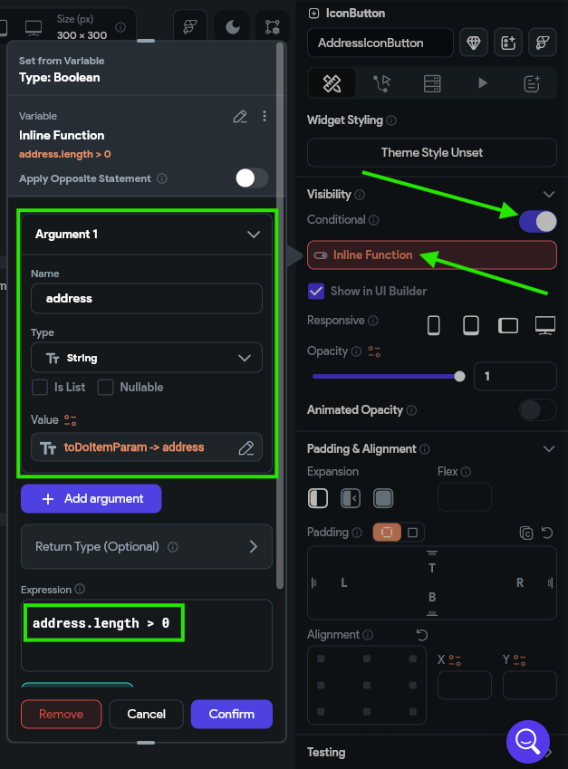

{}

At this point, we'll assume that you are starting to get the hang of using FlutterFlow a bit, so we won't describe every single button and click you need to do to perform these steps. However, if you are stuck or unsure what to do, refer to the video at the top of the page for a full demonstration of the whole process.

{}

We can also scroll down to the **Icon Properties** option in the **Properties Panel** and choose a fitting icon, such as a map pin. 

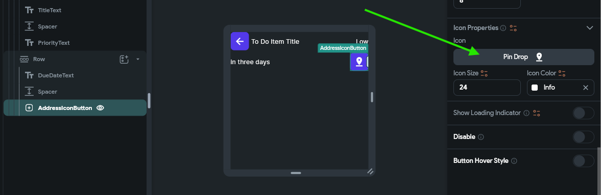

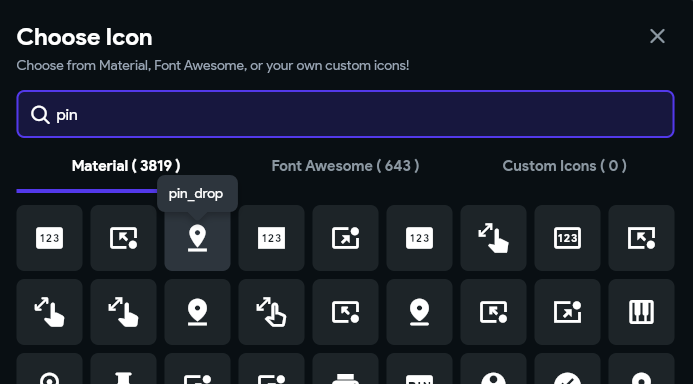

### Completion Status

Finally, let's configure the icon button that shows completion status. As you might guess at this point, we'll set the icon based on the value of the `isCompleted` attribute of our `toDoItemParam` component parameter. However, if we try to do so, we'll quickly realize that the **Icon Button** widget doesn't do that very well. So, let's swap out our **IconButton** widget for a **Switch** instead.

This widget is specifically designed to be something that can be toggled on and off, such as updating the completion status for a task. To configure this widget, we'll scroll to the bottom of the **Properties Panel** and link the **Switch Initial Value** option to the `isCompleted` attribute.

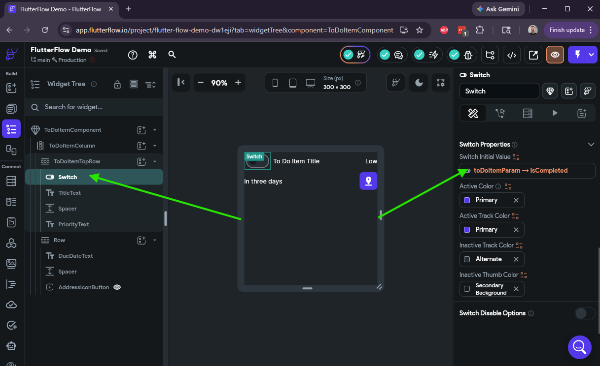

There we go! We've configured our first custom component and linked up all of the widgets to various data values from our component parameter. Now, let's see how we can use it in our app.

## Creating a List

In FlutterFlow, it's finally time to go back to the **Page Selector** and select our `HomePage` that was created for us when we started this project. On this page, we want start by adding a **ListView** widget into the main column space. 

Then, in the **Properties Panel**, we can configure the list to use the **Vertical** axis and add some spacing between each item. 

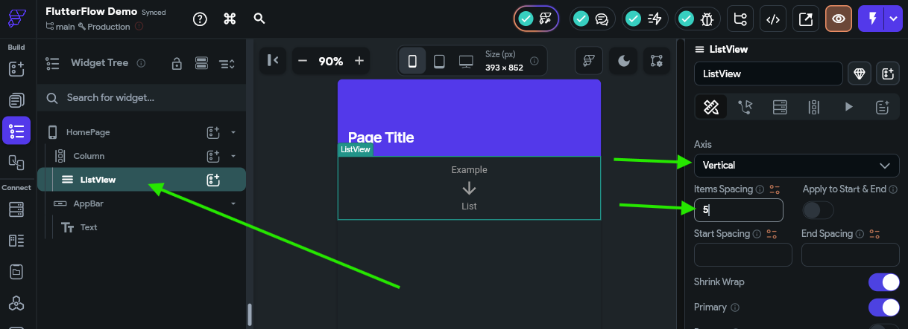

Next, we should click on the **Generate Dynamic Children** option near the top of the **Properties Panel**, and then configure a new variable called `toDoItemList` and set the value to our `toDoTasks` variable found under the App State option. After selecting the value, we'll choose the **No Further Changes** option in the panel that appears, and then click the {}Confirm{} button to save our changes, then click **Save**

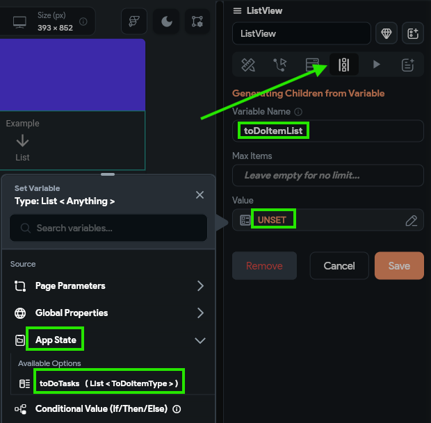

We'll get a pop-up notice reminding us that we simply have to edit the first child of this list to configure how each list element should look. So, let's now add our `ToDoItemComponent` component to our **ListView** component. The simplest way to do this is to click the "Add a child to this widget" button next to our **ListView** widget, then select the option for widgets defined in this project, and then find our `ToDoItemComponent` in the list and select it:

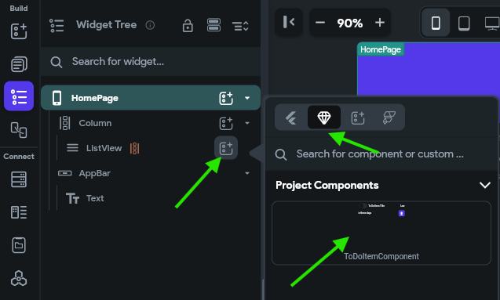

After selecting that component, it will fill our **ListView** with several instances of our custom component. Next, we need to configure the component parameter by finding that option in the **Properties Panel** and set it to the `toDoItemList Item` option, then selecting **No Further Changes** in the second page.

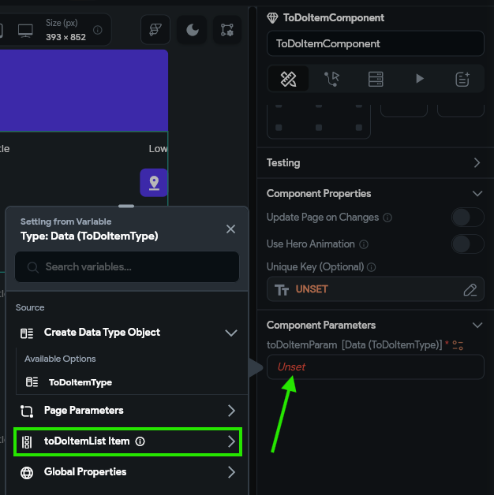

{}

This is a great time to reflect on the importance of making sure we use helpful variable names. By naming our **ListView** widget's list variable to `toDoItemList`, it is clear that we need to select that option instead of things like `toDoTasks` or `ToDoItemType` or any of the other, similarly-named options. By including both a descriptive name and the type of the variable in the name, it is easy to differentiate between them!

{}

## Previewing

Finally, at long last, we are ready to preview our application to see how it actually looks. The easiest way to do this is to quickly publish this project to the web using the FlutterFlow test platform. First, we must configure our project to be publishable on the web in the project settings. Thankfully, we can just click the arrow next to the **Run** button in the upper right and it will take us directly to the settings of our application:

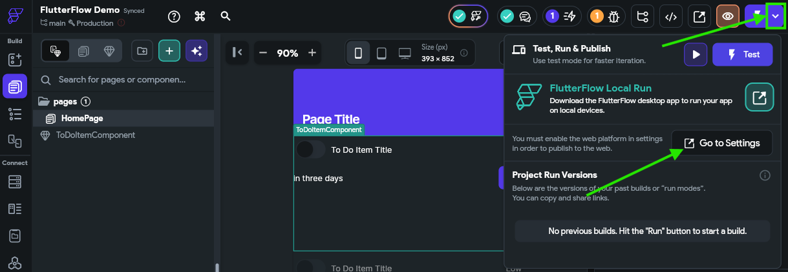

In the settings, you'll be taken to the **Platforms** page. On that page, simply turn on the **Web** option to enable publishing to the web.

Now, we can click the actual **Run** button at the upper right to run our application in test mode. This will open a new browser tab, and in the background it will compile and build your application. It may take a couple of minutes to complete, but once it is done, you'll be shown a web interface that contains your application running in the web!

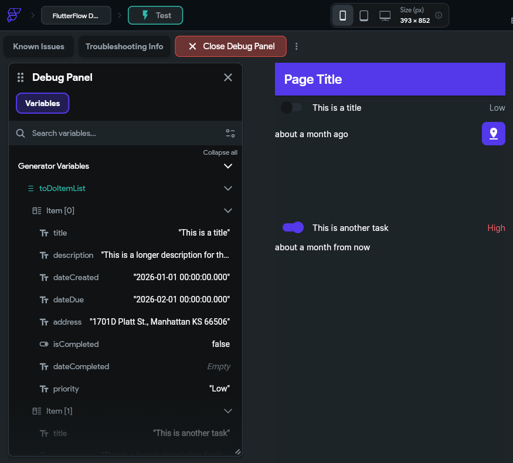

Take a close look at this interface and see if everything looks correct:

* Are the tasks showing the correct completion status? 
* Are the tasks showing the correct priority? Is the text color correct?
* Does the map icon appear for tasks that have an address?
* Does the due date make sense? 
  * Depending on what dates you used, they may be in the past, which is fine for now

You can check the **App State** in the debug panel on the left and make sure that the data shown there matches the user interface on the right.

## Quick Tweak - Container Height

One thing you might quickly notice is that each to do task is shown in a very large block, which isn't quite what we want. So, to fix this, we can go back to our FlutterFlow App Builder tab in our browser and find the **Container** widget that contains each of those items, and remove the default height value from the **Properties Panel**

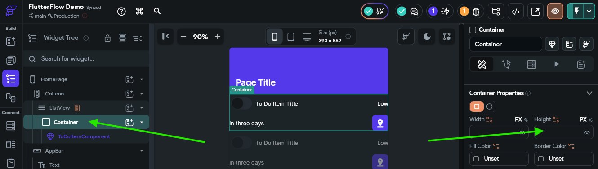

Then, we can jump back to the tab showing our Test Mode view and click the {}Instant Reload{} button to reload our test view with those changes. 

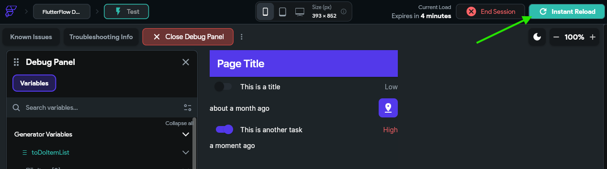

Awesome! Now our app looks like it is coming together nicely.

{}

This is the first major checkpoint for this tutorial. Before moving on, make sure your app works in test mode and looks like you expect it to. We'll add the interactive functionality over the next few pages, but it is important to make sure things look good here first. If you are having any issues getting to this step, contact the course instructors for assistance!

{}

## Summary

At this point, we have configured a basic mobile application that can display to do tasks from the application's internal state. However, this isn't very useful, since the data only lives on the device, and we have no way to edit or update that data. In the next part of this tutorial, we'll add some interactive functionality and explore ways to store our data in the cloud!