

We now have a basic mobile app that displays some data from the app's internal state, but we have no way to modify that data. So, let's explore the basics of making our application interactive by allowing us to edit and create data. 

## Completing Tasks

Let's start with the simplest case - marking a task completed. We already have a **Switch** widget in our `ToDoItemComponent` to represent this data, but now we want to be able to press that switch in our interface and update the underlying data. Before we can do this, we need to pass some additional data in our application.

First, let's go back to our `ToDoItemComponent` and add a new **Component Parameter** called `index` that should contain an integer. We'll use that to keep track of the index of the current to do task in our overall list so we can refer back to it.

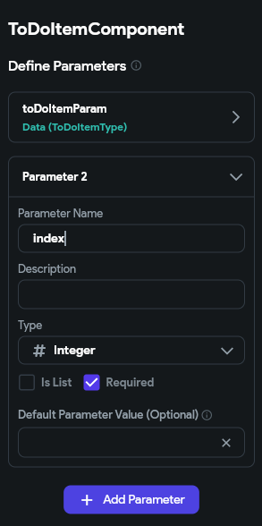

Next, we'll head back to our `HomePage` and configure a couple of options for the `ToDoItemComponent` that is placed inside of our **ListView** widget. Here, we want to set the **Unique Key** to the `toDoItemList Item` option, and then select the **Index in List** option from the available options. 

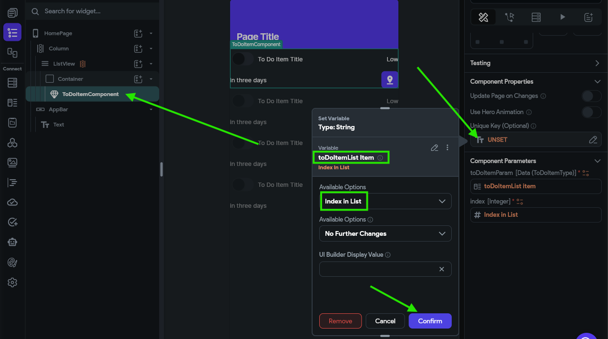

We also want to configure the new `index` parameter to the same value:

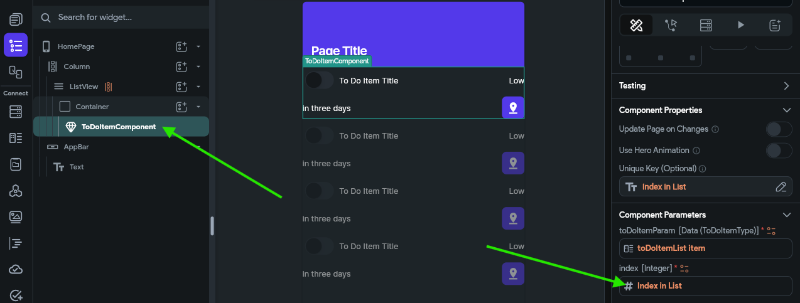

This allows us to access the index of the item in the list from within our `ToDoItemComponent` custom component. We'll need that value to know which task we need to update.

To configure the switch interaction, we first need to find that widget in our **Widget Tree** and then look at the **Properties Panel** to the right. There, we should see a button to configure the actions for this widget.

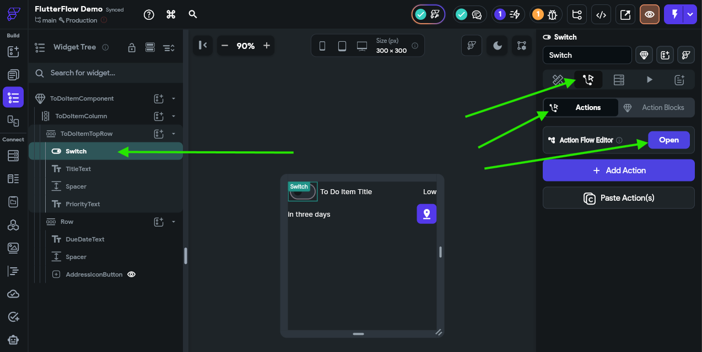

Once on that page, click the {}Open{} button to open the **Action Flow Editor**, which is one of the easiest ways to configure these actions.

In the window that appears, there are two action triggers to choose from. Let's start with the **On Toggled On** trigger. This trigger will fire when the switch is moved from the **Off** state to the **On** state. So, in our data model, we want to mark the underlying task as completed. To do this, we'll click the {}Add Action{} button, then look for the **State Management** actions and choose **Update App State**. 

We'll then be able to click an {}Add Field{} button to indicate which field in our app state we want to update. We'll choose our `toDoTasks` app state variable as our field to update, then we'll set the **Update Type** to **Update Item at Index**. The **Item Index** can be set to the `index` component parameter, and then the **Update Type** under that should be **Update Field(s)**. Finally, we can click the {}Add Field{} button in the popup window and select the `isCompleted` field, and set the value to the `True` value found under the **Constants** list. The full process is shown in the animation below or the video at the top of this page.

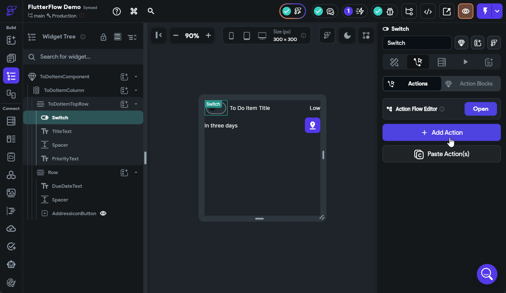

Next, we'll need to do the same process for the **On Toggled Off** trigger, but this time we'll set the value for the `isCompleted` field to `False` instead. The rest of the process is the same. 

Once that is done, we can launch our app in test mode to see if our action is working properly. In the **Debug Panel** on the left, scroll down to find the **App State** section, and watch the data shown there change as you toggle the switches.

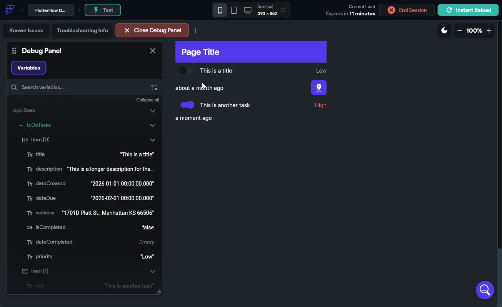

If everything is working correctly, you should see the app state update to match what is shown in the interface!

## Setting Completion Date

We also want our application to keep track of the completion date, so let's go back to those actions we just configured in the `ToDoItemComponent` on the **Switch** widget and add an additional option to update the `dateCompleted` field. When we toggle the switch on, we should set the value to the **Current Time** option found under **Global Properties**, and when we toggle the switch off, we should set that value to the **Empty String** option found under **Constants** instead. The animation below shows that process.

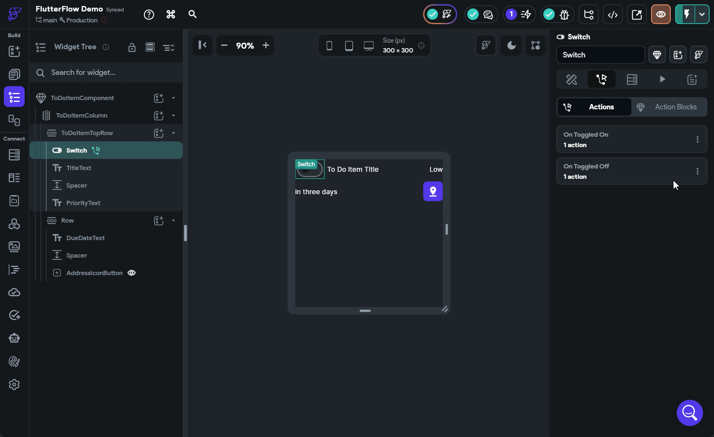

We can now test our application again by clicking the {}Instant Reload{} button if it is still running in the Test Mode tab, and see if our date is now also updating. 

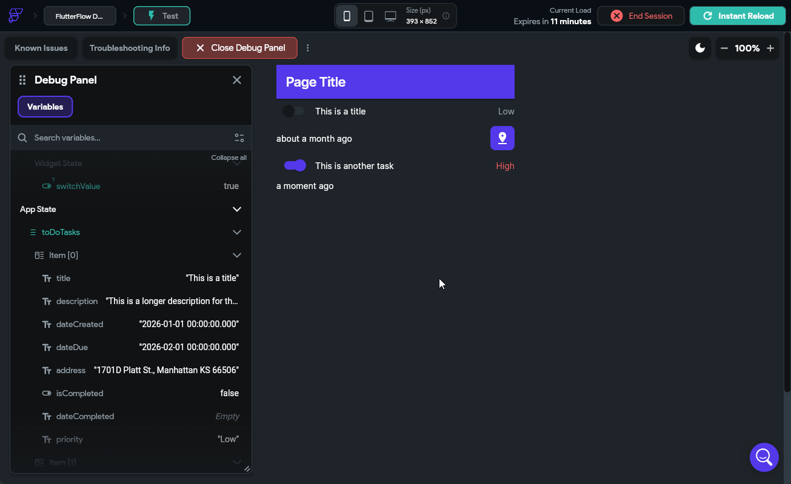

There we go! We can now mark our tasks as done, and when we do, it will even update the `dateCompleted` value along with it. This is really the core concept behind building interactivity in our application.

## Editing Tasks

We can currently mark our tasks as completed, but what if we want to edit a task? That's another big part of this project, so let's create another custom component to edit our tasks. We'll start on the **Page Selector** tab and press the {}{} button to create a new blank component. Let's name this one `EditToDoItemComponent`.

### Component Widgets

In this component, we'll start with a **Column** widget layout, and then place a few widgets in the **Widget Tree** following the diagram below:

```tree
- EditToDoItemComponent
  - Column
    - TextField `TitleField`
    - TextField `DescriptionField`
    - Row
      - Text `DueDateText`
      - Spacer
      - IconButton `DueDateButton`
    - DropDown `PriorityDropDown`
    - TextField `AddressField`
    - Row
      - Button `Cancel Button`
    - Row
      - Button `Save Button`
```

When fully set up, your component should have this layout:

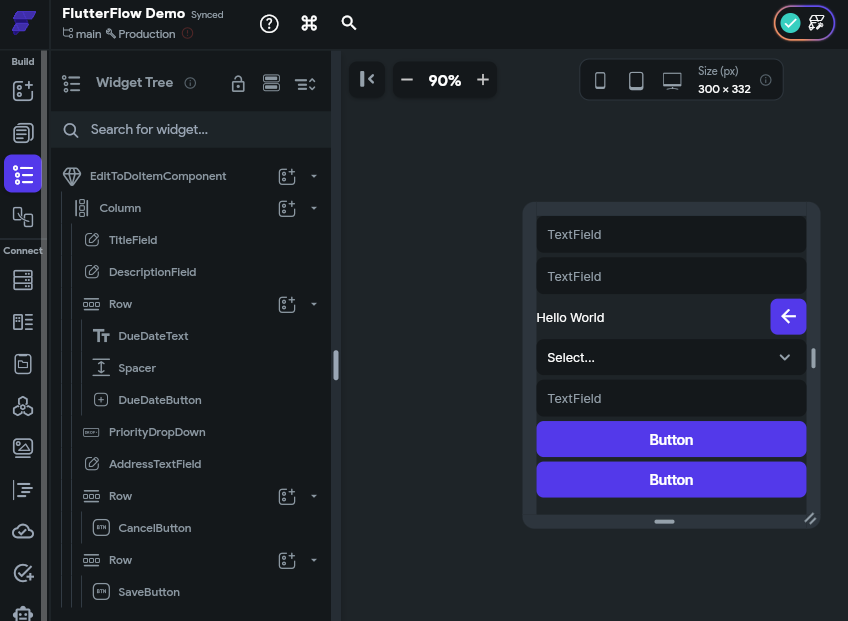

{}

Before moving on, feel free to take a minute to adjust the design of this component by adding spacing between each item, setting or removing item widths, and having items expand to fill the space or use the minimal amount of space required. The examples shown here already have some design changes applied to them, but at this point you should be able to click around and adjust the design as desired!

{}

### Component Parameters

This component will also need to have a couple of parameters. In fact, they will be the exact same parameters we used for the `ToDoItemComponent` earlier, which are `toDoItemParam` using the `ToDoItemType` and an `index` parameter representing the index of the item in the list:

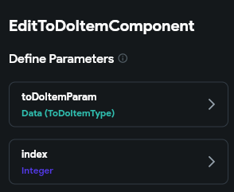

### Widget Values

Now we can connect each widget's display values to the `toDoItemParam` parameter just like we did previously. For **TextField** widgets, we can also set a **Label** value and **Hint** value as well. Below is an example of setting up the `TitleField` **TextField** widget:

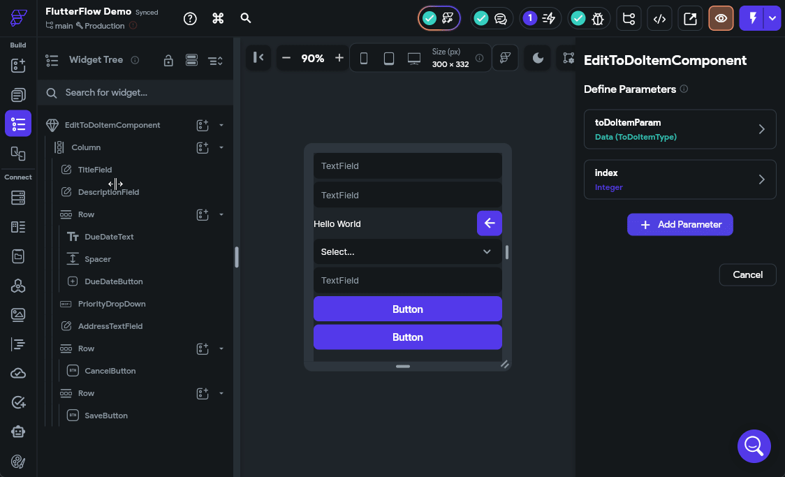

Go ahead and do the same process for the text field widgets displaying the `description` and `address` fields. 

For the `DueDateText` **Text** widget, we'll connect it directly to the `dateDue` field so we can see the complete due date. 

Finally, for the `PriorityDropDown`, we'll set the **Initial Option Value** to be the `priority` field from our `toDoItemParam` parameter, and we can also configure the drop-down to have both `Low` and `High` as options. 

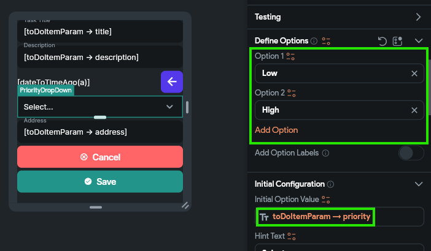

### Widget Buttons

To test out our widget, let's configure both the `CancelButton` and `SaveButton` actions to do the same thing. When creating an action, we'll choose the **On Tap** action, and then look for the **Widget/UI Interactions** section in the list of actions, and choose **Bottom Sheet** and then **Dismiss**. See the animation below for an example of configuring the `CancelButton` with this action. 

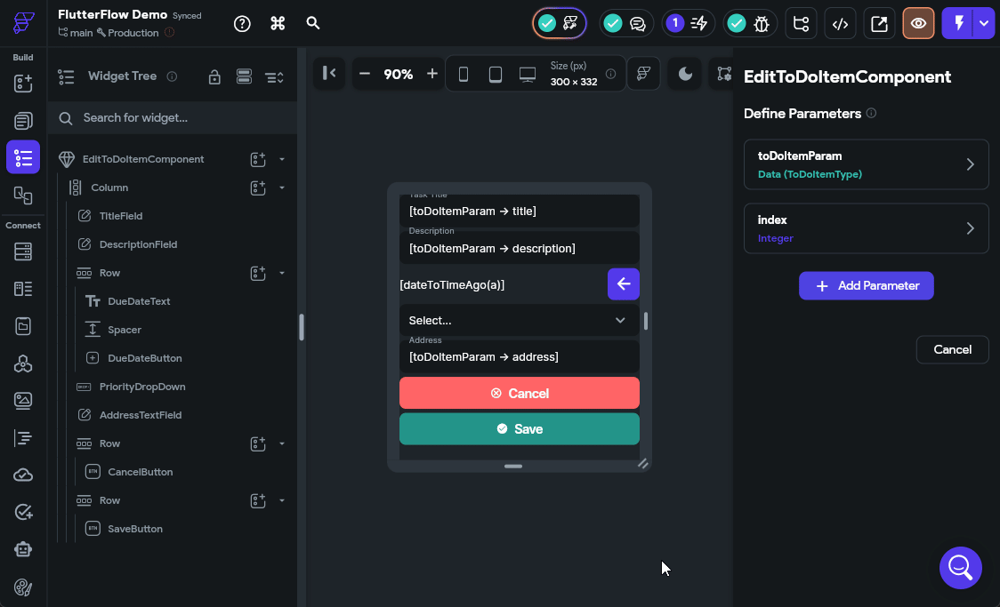

Make sure you configure the `SaveButton` to perform the same action for now. We'll come back and update it later with additional functionality to actually save our changes.

That's a basic component to edit tasks!

## Dynamically Loading a Component 

Now that we have a component available to edit our tasks, let's add some functionality to our interface that allows us to actually edit our tasks. For this, let's add an **IconButton** to our `ToDoItemComponent` at the end of the top row. We'll call this an `EditButton` and configure the design a bit:

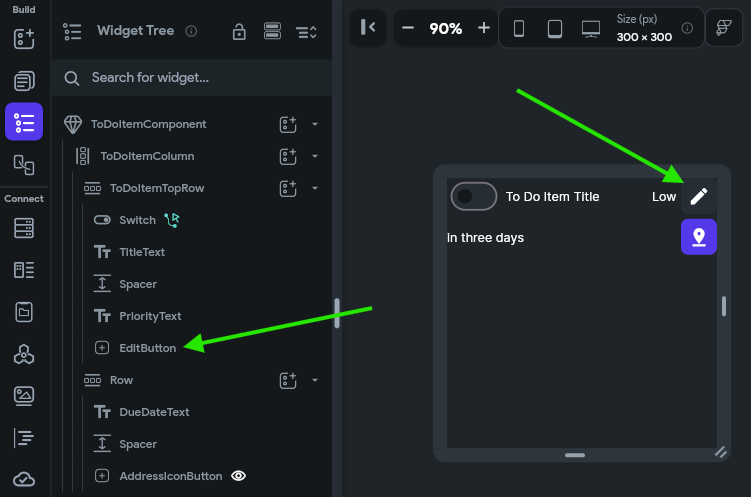

For this button, we'll configure the **On Tap** action to open a **Bottom Sheet** and place our `EditToDoItemComponent` in that area. We'll also link the `toDoItemParam` and `index` parameters to this sheet, and enable the **Safe Area** option just to make sure our interface does not interfere with anything else on the screen. The animation below shows the full process.

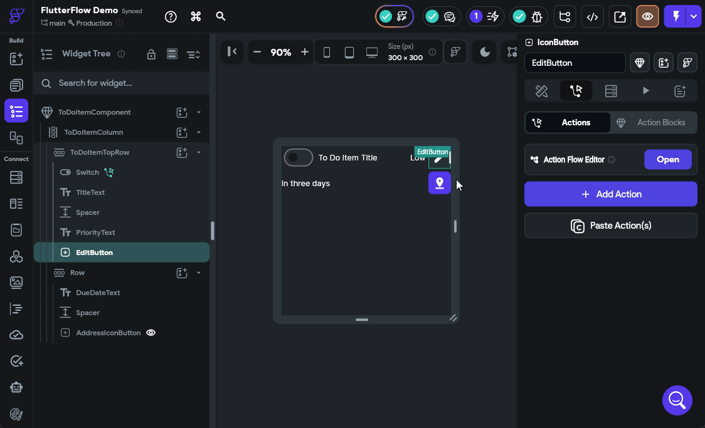

Once we have configured that button, we should be able to launch our application in **Test Mode** and test it out!

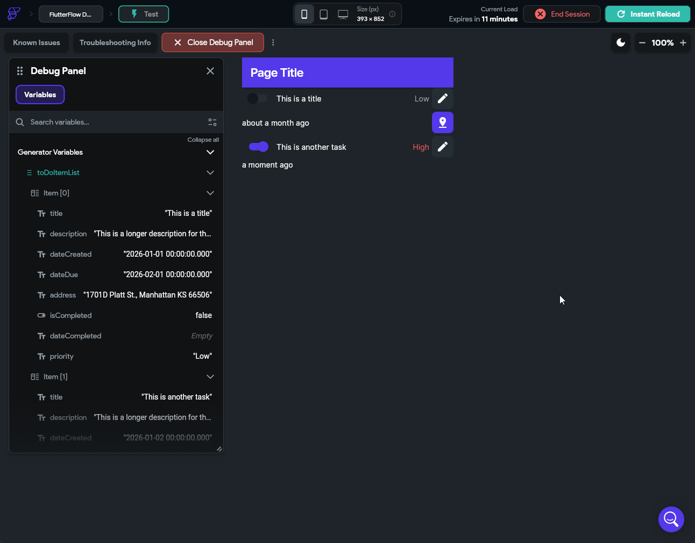

If everything is working correctly, we can click on the Edit button in each of our to do tasks, and we'll see a little pop up on the bottom of the screen showing the settings for that task!

We can place any component in that **Bottom Sheet** area by configuring an action to launch it. 

## Editing Dates

Let's go back to our `EditToDoItemComponent` and configure the `DueDateButton` widget's **On Tap** action to open a **Date/Time Picker** under the **Widget/UI Interactions** section so we can choose a due date. We'll set it to the **Date+Time** type and allow the user to select any valid date and time in the future. 

Once the user has selected a value, we can find that value in the **Widget State** under the **Date Picked** value. So, let's configure the `DueDateText` to use that value if available using a **Conditional Value** configuration to check if a date has been selected. The process is shown in the animation below.

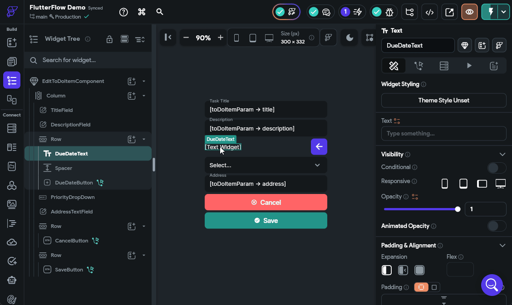

Let's reload our **Test Mode** and make sure that this is working before continuing.

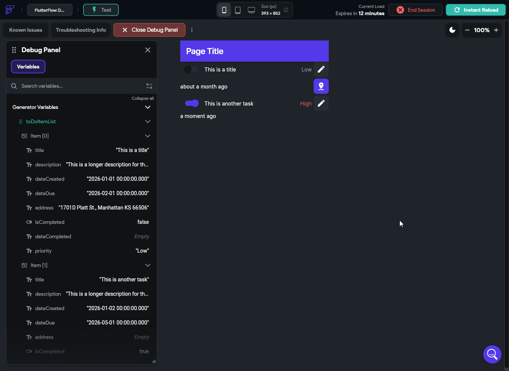

## Saving Data

Finally, let's update our `SaveButton` action to actually save the data. This is very similar to what we did when we configured the **Switch** widget to mark a task as completed.


