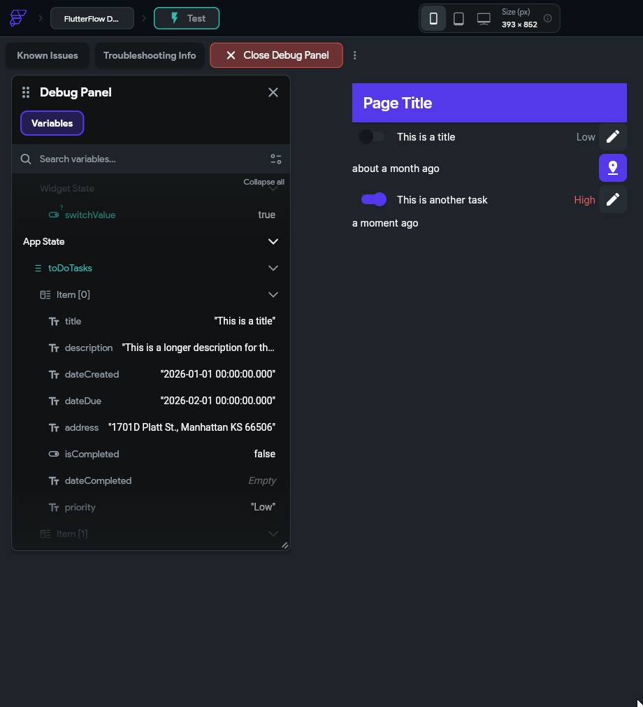
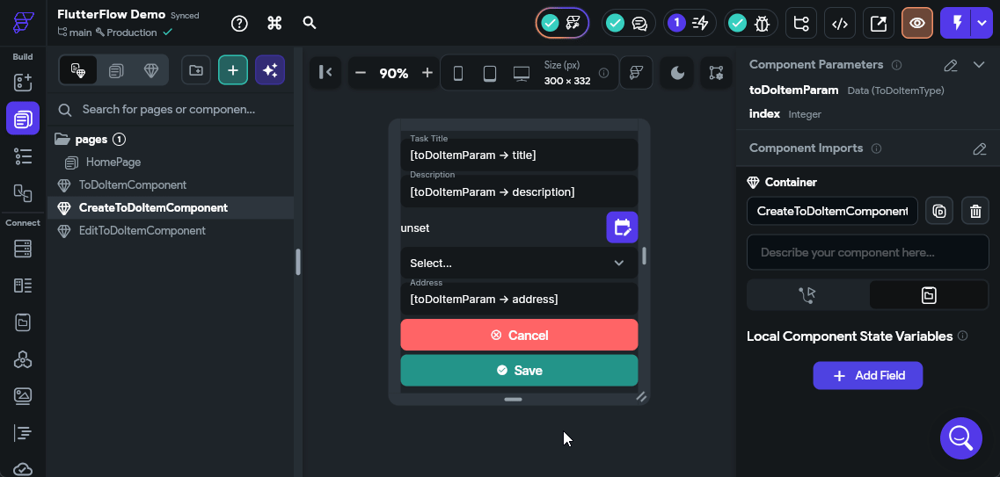
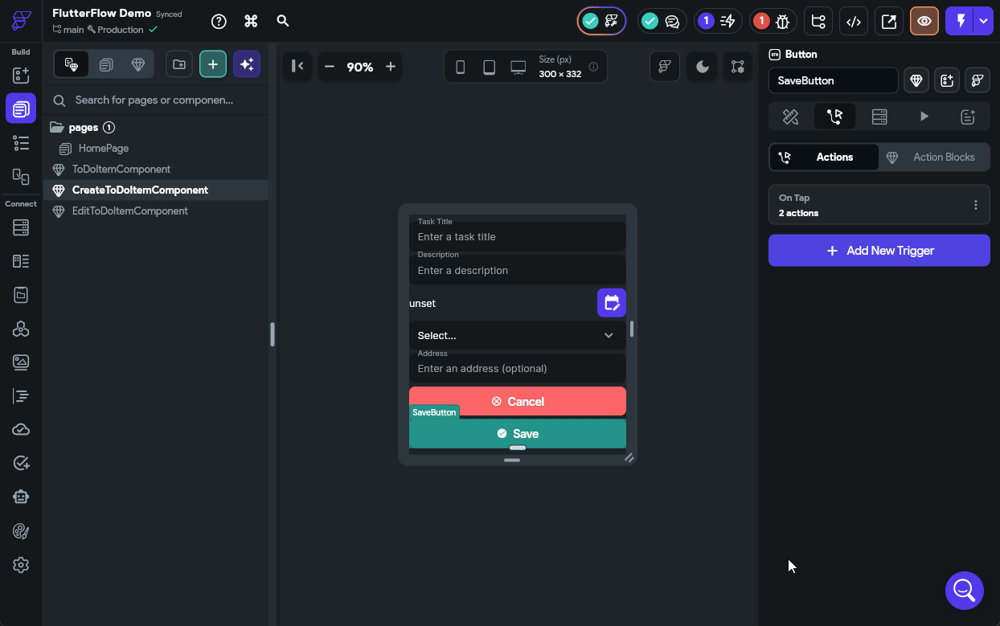
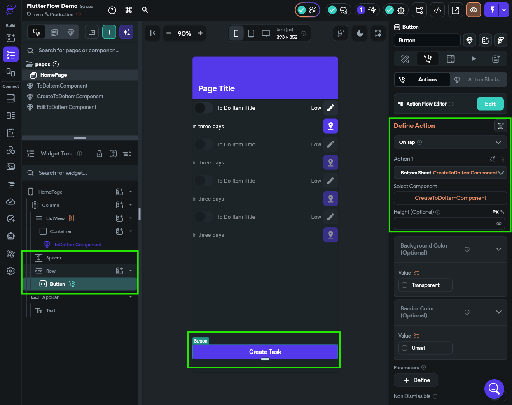
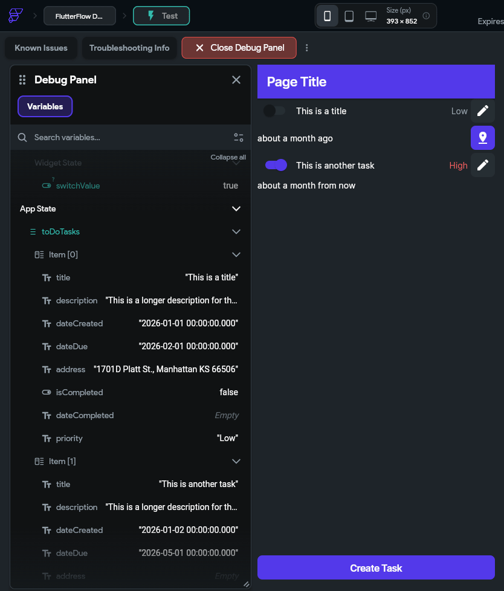
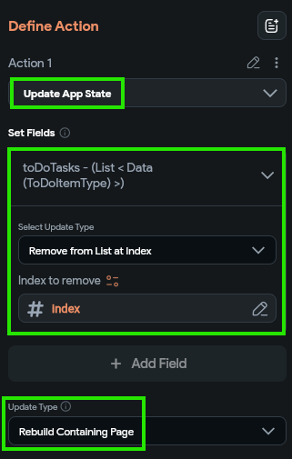
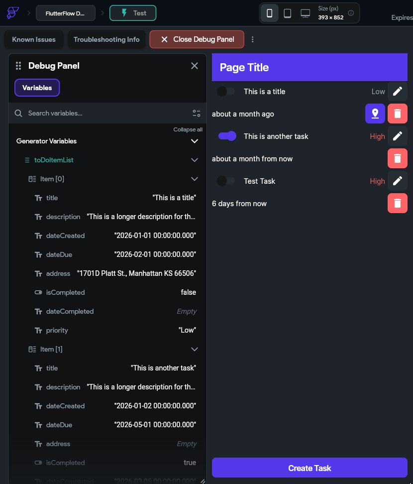



We now have a basic mobile app that displays some data from the app's internal state, but we have no way to modify that data. So, let's explore the basics of making our application interactive by allowing us to edit and create data. 

## Completing Tasks

Let's start with the simplest case - marking a task completed. We already have a **Switch** widget in our `ToDoItemComponent` to represent this data, but now we want to be able to press that switch in our interface and update the underlying data. Before we can do this, we need to pass some additional data in our application.

First, let's go back to our `ToDoItemComponent` and add a new **Component Parameter** called `index` that should contain an integer. We'll use that to keep track of the index of the current to do task in our overall list so we can refer back to it.


Next, we'll head back to our `HomePage` and configure a couple of options for the `ToDoItemComponent` that is placed inside of our **ListView** widget. Here, we want to set the **Unique Key** to the `toDoItemList Item` option, and then select the **Index in List** option from the available options. 


We also want to configure the new `index` parameter to the same value:


This allows us to access the index of the item in the list from within our `ToDoItemComponent` custom component. We'll need that value to know which task we need to update.

To configure the switch interaction, we first need to find that widget in our **Widget Tree** and then look at the **Properties Panel** to the right. There, we should see a button to configure the actions for this widget.


Once on that page, click the {}Open{} button to open the **Action Flow Editor**, which is one of the easiest ways to configure these actions.

In the window that appears, there are two action triggers to choose from. Let's start with the **On Toggled On** trigger. This trigger will fire when the switch is moved from the **Off** state to the **On** state. So, in our data model, we want to mark the underlying task as completed. To do this, we'll click the {}Add Action{} button, then look for the **State Management** actions and choose **Update App State**. 

We'll then be able to click an {}Add Field{} button to indicate which field in our app state we want to update. We'll choose our `toDoTasks` app state variable as our field to update, then we'll set the **Update Type** to **Update Item at Index**. The **Item Index** can be set to the `index` component parameter, and then the **Update Type** under that should be **Update Field(s)**. Finally, we can click the {}Add Field{} button in the popup window and select the `isCompleted` field, and set the value to the `True` value found under the **Constants** list. The full process is shown in the animation below or the video at the top of this page.


Next, we'll need to do the same process for the **On Toggled Off** trigger, but this time we'll set the value for the `isCompleted` field to `False` instead. The rest of the process is the same. 

Once that is done, we can launch our app in test mode to see if our action is working properly. In the **Debug Panel** on the left, scroll down to find the **App State** section, and watch the data shown there change as you toggle the switches.


If everything is working correctly, you should see the app state update to match what is shown in the interface!

## Setting Completion Date

We also want our application to keep track of the completion date, so let's go back to those actions we just configured in the `ToDoItemComponent` on the **Switch** widget and add an additional option to update the `dateCompleted` field. When we toggle the switch on, we should set the value to the **Current Time** option found under **Global Properties**, and when we toggle the switch off, we should set that value to the **Empty String** option found under **Constants** instead. The animation below shows that process.


We can now test our application again by clicking the {}Instant Reload{} button if it is still running in the Test Mode tab, and see if our date is now also updating. 


There we go! We can now mark our tasks as done, and when we do, it will even update the `dateCompleted` value along with it. This is really the core concept behind building interactivity in our application.

## Editing Tasks

We can currently mark our tasks as completed, but what if we want to edit a task? That's another big part of this project, so let's create another custom component to edit our tasks. We'll start on the **Page Selector** tab and press the {}{} button to create a new blank component. Let's name this one `EditToDoItemComponent`.

### Component Widgets

In this component, we'll start with a **Column** widget layout, and then place a few widgets in the **Widget Tree** following the diagram below:

```tree
- EditToDoItemComponent
  - Column
    - TextField `TitleField`
    - TextField `DescriptionField`
    - Row
      - Text `DueDateText`
      - Spacer
      - IconButton `DueDateButton`
    - DropDown `PriorityDropDown`
    - TextField `AddressField`
    - Row
      - Button `Cancel Button`
    - Row
      - Button `Save Button`
```

When fully set up, your component should have this layout:


{}

Before moving on, feel free to take a minute to adjust the design of this component by adding spacing between each item, setting or removing item widths, and having items expand to fill the space or use the minimal amount of space required. The examples shown here already have some design changes applied to them, but at this point you should be able to click around and adjust the design as desired!

{}

### Component Parameters

This component will also need to have a couple of parameters. In fact, they will be the exact same parameters we used for the `ToDoItemComponent` earlier, which are `toDoItemParam` using the `ToDoItemType` and an `index` parameter representing the index of the item in the list:


### Widget Values

Now we can connect each widget's display values to the `toDoItemParam` parameter just like we did previously. For **TextField** widgets, we can also set a **Label** value and **Hint** value as well. Below is an example of setting up the `TitleField` **TextField** widget:


Go ahead and do the same process for the text field widgets displaying the `description` and `address` fields. 

For the `DueDateText` **Text** widget, we'll connect it directly to the `dateDue` field so we can see the complete due date. 

Finally, for the `PriorityDropDown`, we'll set the **Initial Option Value** to be the `priority` field from our `toDoItemParam` parameter, and we can also configure the drop-down to have both `Low` and `High` as options. 


### Widget Buttons

To test out our widget, let's configure both the `CancelButton` and `SaveButton` actions to do the same thing. When creating an action, we'll choose the **On Tap** action, and then look for the **Widget/UI Interactions** section in the list of actions, and choose **Bottom Sheet** and then **Dismiss**. See the animation below for an example of configuring the `CancelButton` with this action. 


Make sure you configure the `SaveButton` to perform the same action for now. We'll come back and update it later with additional functionality to actually save our changes.

That's a basic component to edit tasks!

## Dynamically Loading a Component 

Now that we have a component available to edit our tasks, let's add some functionality to our interface that allows us to actually edit our tasks. For this, let's add an **IconButton** to our `ToDoItemComponent` at the end of the top row. We'll call this an `EditButton` and configure the design a bit:


For this button, we'll configure the **On Tap** action to open a **Bottom Sheet** and place our `EditToDoItemComponent` in that area. We'll also link the `toDoItemParam` and `index` parameters to this sheet, and enable the **Safe Area** option just to make sure our interface does not interfere with anything else on the screen. The animation below shows the full process.


Once we have configured that button, we should be able to launch our application in **Test Mode** and test it out!


If everything is working correctly, we can click on the Edit button in each of our to do tasks, and we'll see a little pop up on the bottom of the screen showing the settings for that task!

We can place any component in that **Bottom Sheet** area by configuring an action to launch it. 

## Editing Dates

Let's go back to our `EditToDoItemComponent` and configure the `DueDateButton` widget's **On Tap** action to open a **Date/Time Picker** under the **Widget/UI Interactions** section so we can choose a due date. We'll set it to the **Date+Time** type and allow the user to select any valid date and time in the future. 

Once the user has selected a value, we can find that value in the **Widget State** under the **Date Picked** value. So, let's configure the `DueDateText` to use that value if available using a **Conditional Value** configuration to check if a date has been selected. The process is shown in the animation below.


Let's reload our **Test Mode** and make sure that this is working before continuing.


## Saving Data

Finally, let's update our `SaveButton` action to actually save the data. This is very similar to what we did when we configured the **Switch** widget to mark a task as completed. We'll start by going back to our `EditToDoItemComponent` and then clicking the `SaveButton` and editing the Actions applied to it. In the **Action Flow Editor**, we need to add a second action that will save the data before dismissing the bottom sheet. So, we can click the **Plus** button at the bottom of that action and create a new action. In that action, we'll look for the **State Management** option and find **Update App State**, then click the {}Add Field{} button to choose our `toDoTasks` **App State** field. Then, just like before, we'll select the **Update Item at Index** option and set the **Item Index** to our `index` variable, then we can set the individual fields by matching them to either the text fields and drop down fields on our component or the **Date Picked** state from our **Widget State** for the due date if it has been selected, using a **Conditional Value** similar to what we did before. The full process is shown in the animation below or the video above.


Once that is done, we can reload our app in **Test Mode** and make sure that the edits we make are properly saved in the app state that is shown in the **Debug Panel** on the left side.



There we go! We can now update our state easily!

## Creating Data

The process to create a component for creating a new to do task is very similar. Let's look at that process and see how it differs.

First, let's create a duplicate of our `EditToDoItemComponent` - we'll call it `CreateToDoItemComponent` to follow our existing naming scheme. You can duplicate a component by right-clicking it in the **Page Selector** and selecting **Duplicate Component**. Once it is created, we can rename it to the appropriate name.

Next, we can remove the two component parameters from this component since they aren't needed at all. So, choose the component in the **Page Selector** and find the **Component Parameters** section of the **Properties Panel** and remove the `toDoItemParam` and `index` parameters from that list.



We'll also need to update the **Initial Value** settings for each of our fields since they are no longer relevant. They can just be completely removed for now. Remember to update the three **Text Field** widgets as well as the **Drop Down** widget for priority and the else case in the **Text** widget for the due date (it can be set to the **Empty String** constant).

Finally, we need to modify the `SaveButton` action to **Add to List** instead of **Update Item at Index**. The process of matching up the fields is the same as before, but with a few important changes:
1. Since we are creating a new entry, all fields should be specified and set to default values
2. The `dateCreated` can be set to the **Current Time** option found under **Global State**
3. The `dateDue` can be directly set to the **Date Picked** option under **Widget State**
4. All other fields should have values set by the widgets or reasonable defaults

The full process for editing that action is shown below.



Finally, let's quickly add a **Button** widget to the bottom of our `HomePage` to allow us to create a new task. The **On Tap** action for that button will be to open the `CreateToDoItemComponent` as a bottom sheet. For the example, we chose to add that at the bottom of the **Column** widget in a new **Row** widget so it could expand to fill the whole width, and we added a **Spacer** widget as well.



Once again, at this point we can open our app in **Test Mode** to confirm that we can actually add new items to our **App State**. 



Awesome! It looks like it is working!

{}

One of the major topics we aren't covering in this tutorial is **Form Validation**. For example, what if the user doesn't enter a title? Or what if the user forgets to select a due date? Our current application will allow this (the widget will still work and just show default values), but in practice we may not want to. FlutterFlow includes a **Form** widget that we can use to add validation logic to our form fields. More information can be found in the [FlutterFlow - Form Validation](https://docs.flutterflow.io/resources/forms/form-validation/) documentation.

{}

## Deleting Data

Finally, let's add another button that allows users to delete data. This is actually quite simple - we just add a new button to our `ToDoItemComponent` and set the action to **Update App State** then choose the **Remove From List at Index** option and select the `index` parameter. However, this time we also want to set the **Update Type** at the bottom to **Rebuild Containing Page** since we are updating the app state beyond this component. By setting this option, it will refresh the entire list and remove this component once the underlying **App State** is updated.



With that in place, we should also be able to delete items from our application.



## Summary

Let's take a minute to go back to that initial list of features and check off the ones we have already implemented:

- [X] To Do tasks should include a short title and longer description.
- [X] To Do tasks should track the date it was created and the date it is due.
- [X] To Do tasks should track whether it has been completed or not.
- [X] Tasks may optionally have an address associated with the task.
- [X] To Do tasks should be assigned to different priorities (Low, High).
- [X] When a task is completed, it should track the date and time when it was completed.
- [X] Users should be able to create, edit, and delete tasks.
- [ ] Tasks should be sorted according to completion, due date, and priority.
- [ ] Our application should include user accounts so that multiple users can use the app.
- [ ] User accounts should use an email address and password to log in.
- [ ] User data should be stored in the cloud so they can use the app across devices.
- [ ] Each user's data should be stored securely and not accessible by other users.
- [ ] If a task has an address, the application should allow the user to request directions to that address.
- [ ] If the user gives permission, it should also track the location where a task was completed.
- [ ] Our application should track the percentage of tasks completed on-time (before the due date).
- [ ] Users should be able to configure their display name and update their password.
- [ ] Users should be able to delete their account and all associated data.
- [ ] User profile pictures should be visible from [Gravatar](https://gravatar.com/)
- [ ] The app should display a global leaderboard showing the users with the highest on-time completion percentage.

We are already nearly one third of the way through the list! At this point we have an app that has quite a few interesting features. Next, we'll work on connecting this app to the cloud and adding user accounts.