

At this point, we have the basic concept of a mobile application that helps a user track to do tasks. However, currently our data is only stored in the local application state, which is only accessible on a single device. In addition, at any time a user could choose to clear the application's cache, and all data would be lost. So, let's explore adding a cloud service to our application that will store our user's data for us. In addition, we'll use this service to manage our user accounts and authentication.

## Firebase

For this tutorial, we're going to use Google's [Firebase](https://firebase.google.com/) as our chosen cloud database. There are many options available, and we could even choose to build our own backend for storing user data (and many large applications do), but Firebase is fairly common and easy to use so it makes a great choice for our application. However, as we'll see in this tutorial, there are some important concepts we need to understand when using Firebase to avoid exposing our users' data to malicious actors on the internet.

{}

We encourage you to take a look at the [Firebase Documentation](https://firebase.google.com/docs) and bookmark that link for easy access in the future. Specifically, you may want to review some of the basic concepts in the [Understand Firebase Projects](https://firebase.google.com/docs/projects/learn-more) section of the documentation before continuing.

{}

At its core, Firebase is a cloud database that we can use to store and retrieve data within our application. Unlike traditional relational databases that use Structured Query Language (SQL) and have a defined structure, Firebase is a [Document Database](https://en.wikipedia.org/wiki/Document-oriented_database) that is designed to store and retrieve JSON-style documents, just like what we created earlier when defining our to do tasks. 

{}

Before beginning, make sure you can log in with your Google Account on the [Firebase Console](https://console.firebase.google.com/). This ensures that your Google Account is properly configured to use Firebase. Contact the course instructors if you have any issues getting access to Firebase.

{}

## Adding Firebase to FlutterFlow

Once we have confirmed that our Google Account is working with Firebase, we can add it to our mobile app in FlutterFlow. To find this setting, go to the **Settings and Integrations** page found on the **Navigation Menu**, and then find the **Firebase** settings under **Project Setup**. 

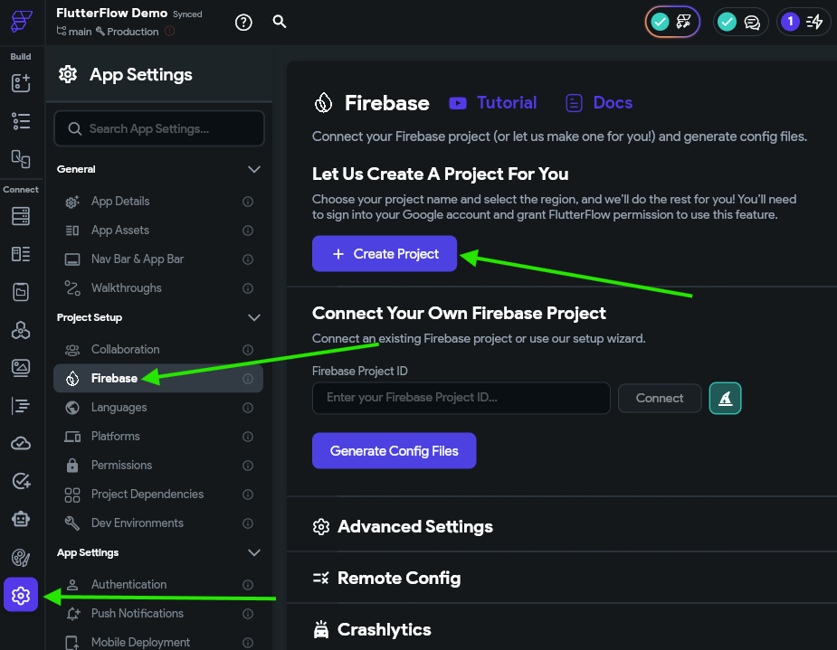

Here, we can click on the {}Create Project{} to have FlutterFlow create a new project for us in Firebase. Then, in the window that appears, we can give our project a helpful name and ID, and also choose the region. For the region, it is often best to choose a location closest to you. Once configured, click the **Sign in with Google** button to connect FlutterFlow to your Google Account and start the setup process.

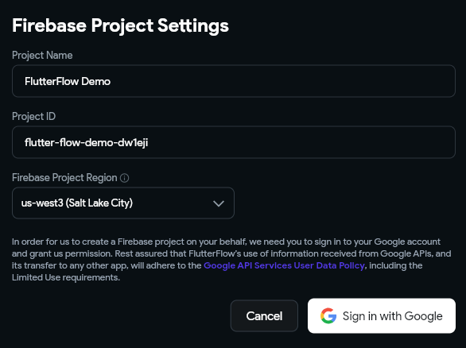

{}

As part of this process, we are giving FlutterFlow access to our Google Account and allowing that tool to make changes to our Firebase configuration. While this is great for a demo application, it can also be a security concern later on if you plan on releasing this application. 

For example, what if FlutterFlow's app platform or your FlutterFlow account is compromised? Hackers could use that to gain access to your entire app's database on Firebase and more. 

A more secure option would be to configure your Firebase project separately and give FlutterFlow the existing Project ID. You can also refer to the [FlutterFlow Docs - Firebase](https://docs.flutterflow.io/integrations/firebase/connect-to-firebase/) and [FlutterFlow Tutorial - Firebase Setup](https://www.youtube.com/watch?v=o7qTUzw2-UQ) for additional information about this process.

{}

Once the setup process is complete, you'll see the **Firebase Project ID** populated in your FlutterFlow settings, and also some additional options to enable features such as Authentication and Storage. We'll come back to these options later.

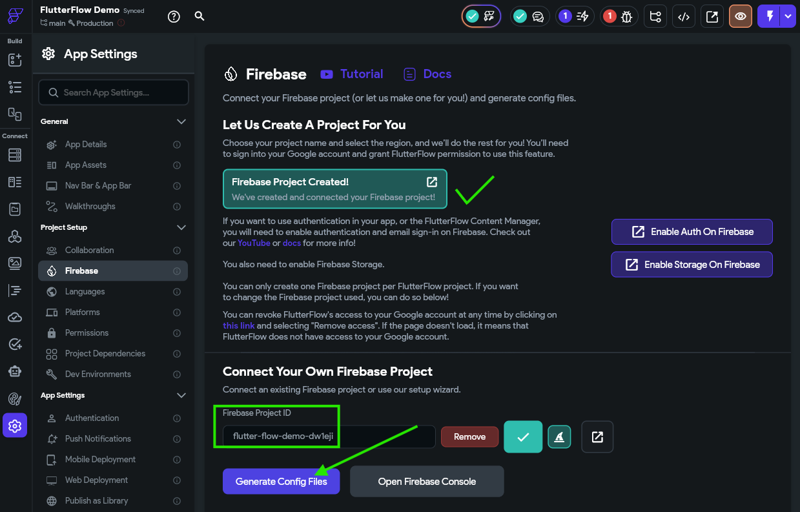

At this point, we'll just click the {}Generate Config Files{} button to generate the required configuration files for our application to use Firebase. When we do so, we'll be prompted to enter a **Package Name** for our application. This package name is generally our application's online domain name reversed (for example, `myapp.example.com` becomes `com.example.myapp`). For this example we'll use a domain name unique to our course and our K-State eID, such as `edu.ksu.mc565.<your_eid>.demoapp`. 

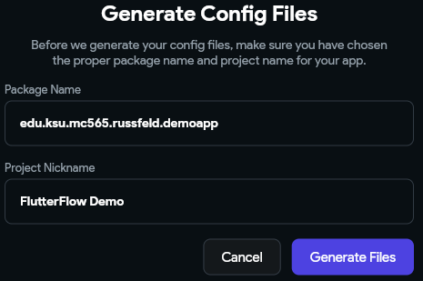

Once we click the {}Generate Files{} button, FlutterFlow will generate some configuration files for our application so it can fully use Firebase. Once it is done, we should see a message appear on the settings page.

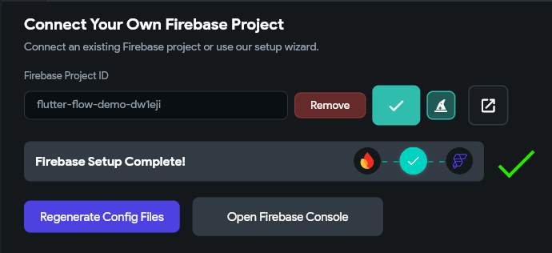

There we go! Now our application is configured to use Firebase as the cloud database for our application. Next, let's work on reconfiguring our app to use it.

## Configuring Firebase

### Creating Collections

First, we need to configure our collections in Firebase. A collection is just a list of documents that all have a similar data structure, such as a list of user accounts or a list of to do tasks. To accomplish this, click the **Firestore** option on the **Navigation Menu** in FlutterFlow. Here, we can click the {}Create Collection{} button to create a new collection.

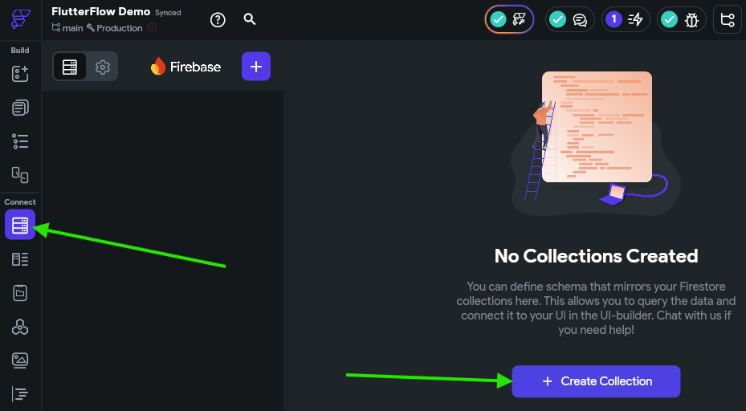

In the window that appears, we'll create a collection named `to_do_tasks` (Firebase prefers variable names in `lower_snake_case` with underscores) and click the {}Create{} button. Then, instead of choosing a template collection, we'll just select the {}Start from scratch{} option to build our own structure. 

Here, we'll simply need to duplicate the structure of our to do tasks from earlier. Below is a JSON listing of a single task to remind us of what it should look like:

```json
{
  "title": "This is a title",
  "description": "This is a longer description for the task",
  "dateCreated": "2026-01-01 00:00:00.000",
  "dateDue": "2026-02-01 00:00:00.000",
  "address": "1701D Platt St., Manhattan KS 66506",
  "isCompleted": false,
  "dateCompleted": null,
  "priority": "Low"
}
```

Once this process is completed, we should see the following schema:

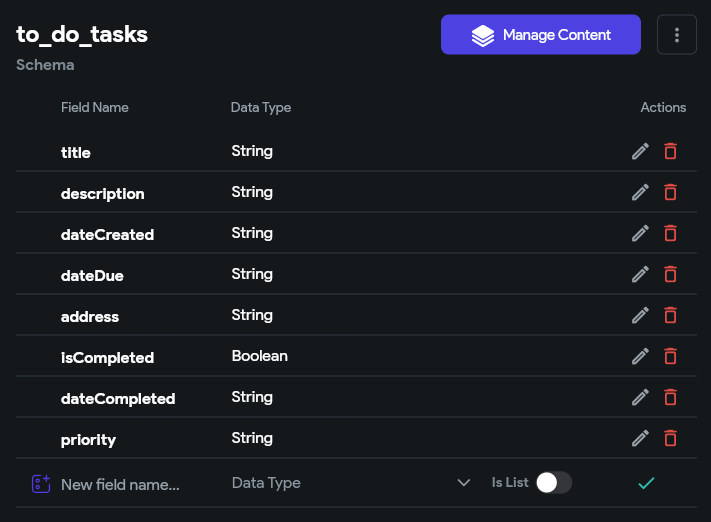

Now we are ready to start using this in our application!

{}

You might notice that Firebase has a `DateTime` option in the list of data types, but we chose to use `String` instead for items that represent a date. This is because often the `String` data type is more convenient since it allows us to store `null` or `""` (empty string) values, which may be useful in our application. However, it does mean that our application is constantly converting between `String` and `DateTime` formats, which may be a bit inefficient. Feel free to experiment with data types in your applications to see what works best for your uses!

{}

{}

Unfortunately, FlutterFlow does not allow us to simply reuse the `ToDoItemType` that we created earlier as the data type for our Firebase collection. Instead, each Firebase collection defines its own data type. This is because Firebase collections do not support all of the data types available in FlutterFlow. So, we'll end up reconfiguring a few items as we go to match that structure. 

{}

### Updating Settings

Next, click the **Settings** button at the top of the **Firestore** page to see some of the important settings for our Firebase setup.

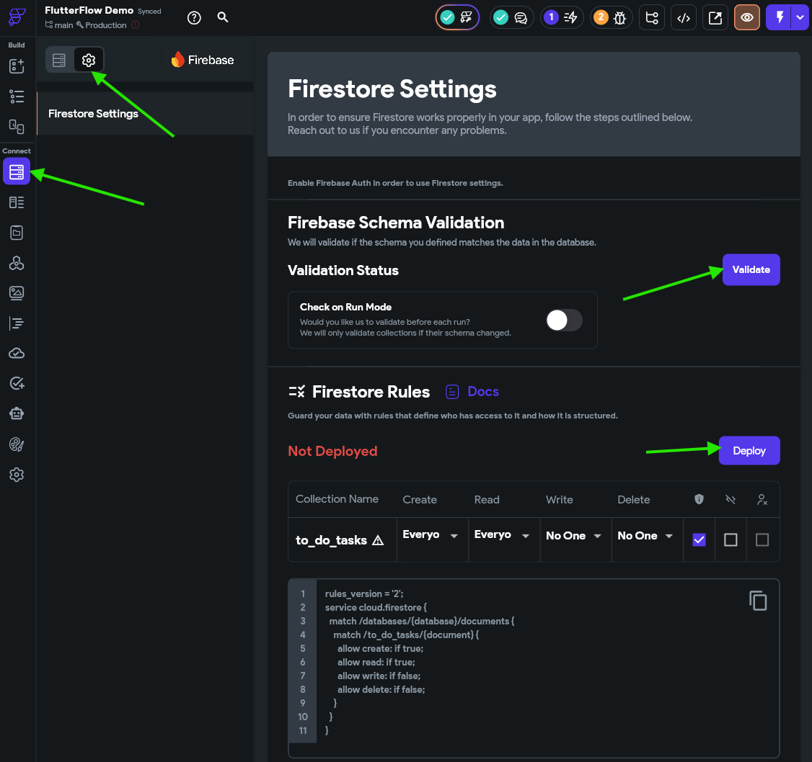

Here, we'll click the {}Validate{} button to validate our schema, then the {}Deploy{} button to deploy a set of access rules for our Firestore collections to Firebase. In the window that appears, you can review the changes being made to the existing rules in Firebase. Click the {}Deploy Now{} button to deploy the changes. 

{}

Right now we are deploying a set of insecure rules to Firebase for testing. We'll discuss security later in this tutorial. For now, just remember that everything is insecure and you should definitely review the later section n security before deploying this app.

{}

## Updating our List View

First, let's update the List View on our application's `HomePage` to show the data from Firestore instead of our **App State**. To do this, we'll go back to the `HomePage` on the **Page Selector**, then find the **ListView** widget in the **Widget Tree** and look for the **Backend Query** tab in the **Properties Panel**

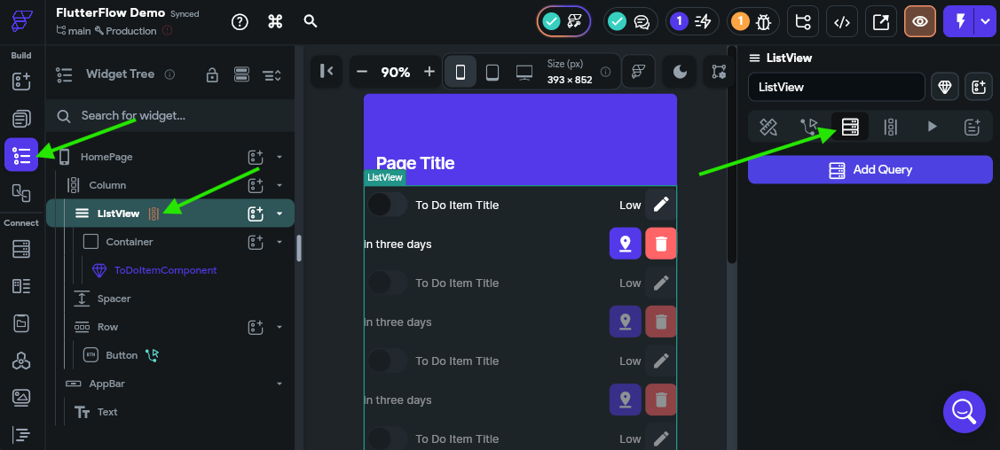

Here, we can click the {}Add Query{} to add a new Firebase query to our component. In the **Query Type**, we can choose **Query Collection**, and then choose our `to_do_tasks` collection. The internal **Query Type** will be **List of Documents** with no limit defined.

We'll also leave the **Filters** alone for now, but we'll come back to that later.

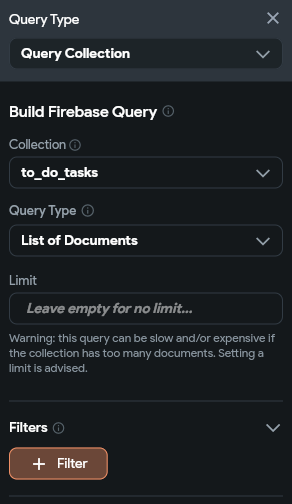

Below, let's add an **Ordering** to our query. We want to sort our tasks by completion, priority, and due date in that order. The `isCompleted` value should be sorted in decreasing value (so the unchecked values will be shown before the checked ones), but the others should be sorted in increasing value.  

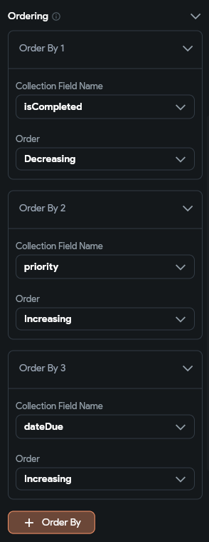

Finally, we'll want to make sure we leave the **Single Query** and **Infinite Scroll** options **Unchecked** at the bottom. This allows our application to automatically update itself as we make changes. 

Finally, we can click the {}Confirm{} button to save our query. This will replace the **Generate Dynamic Children** settings we set previously. 

## Updating Parameters

Next, since our list view just uses our own `ToDoItemComponent`, we just have to update the parameters we are passing to that component. First, let's go to that component and update the expected parameters.

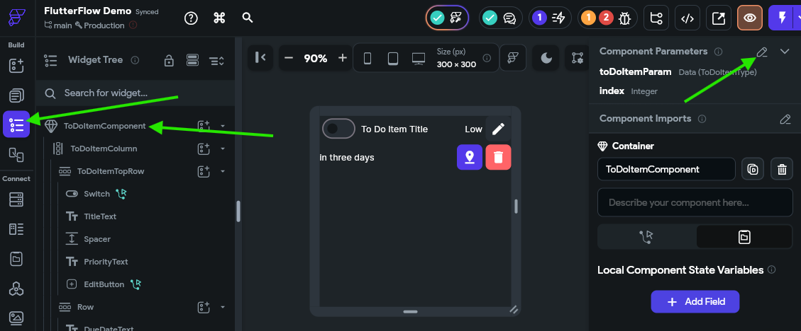

Here, we'll remove the `index` parameter, and also update the type of the `toDoItemParam` to be the **Document** type, and choose the `to_do_tasks` **Collection Type**

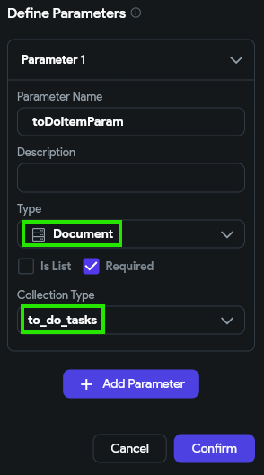

Once we do that, we'll need to update all of our UI widgets to connect to the correct values. The screenshot below shows an example of updating the `TitleText` widget:

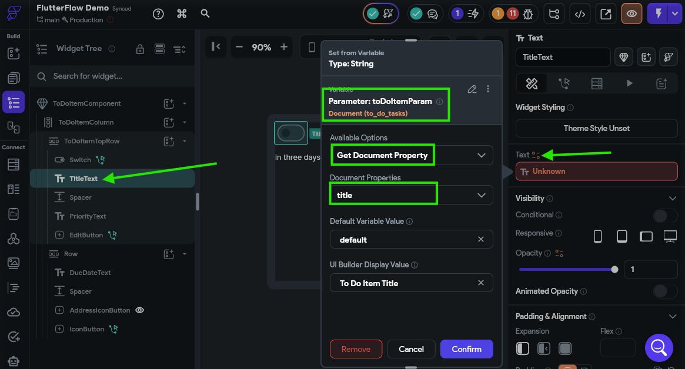

We'll need to go through and update all the widgets on this component to display the correct data. Remember to update the conditionals for the `PriorityText` and `AddressIconButton` as well. We'll come back here to update the buttons a bit later.

Once that is updated, we'll go back to our `HomePage` and find the `ToDoItemComponent` in our **Widget Tree** and find the settings at the bottom that need updated. 

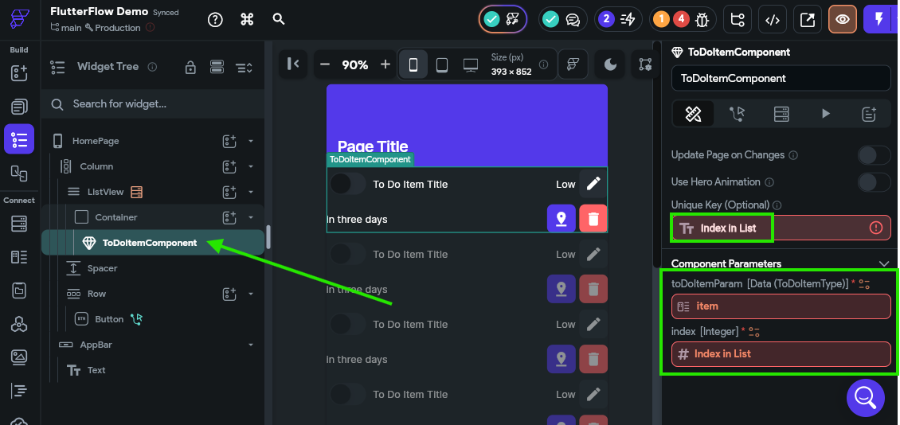

Now, when we look at our available variables, we'll see a new `to_do_tasks Document` option that represents the current document in our collection of to do tasks that are queried from Firestore. So, we'll set the **Unique Key** to the `to_do_tasks Document`'s `Document ID` option. We'll also update the `toDoItemParam` to be the `to_do_tasks Document`'s `Document` option. 

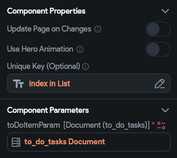

There we go! Now that list view should display tasks from Firebase instead our internal **App State**. However, we still need to update a few things to be able to create, edit, and delete tasks.

{}

Since we are now sorting the list in our query, the index of each item in the list will change as it is updated. Because of this, we can no longer assume that value will be the same for each item as it is updated. So, when working with Firebase, it is always best to use either the document reference or the document's unique ID instead of it's index in the list to uniquely identify it.

{}

## Creating Tasks

Let's take a look at the `CreateToDoComponent` next. This component is easy to update since it doesn't require any parameters. All we have to do is update the action on the `SaveButton` to create a new document in Firestore instead of a new item in our **App State**. The process for matching up each field to a **Widget State** or **Variable** is very similar to what we've done before. The full process is shown in the animation below.


## Editing Tasks

Next, we need to update our `EditToDoItemComponent` to accept an updated parameter just like we did above for the `ToDoItemComponent`, but this time we also want to update the `index` parameter to be a `ref` instead, and we'll set the type to **DocumentReference** and choose the same collection:

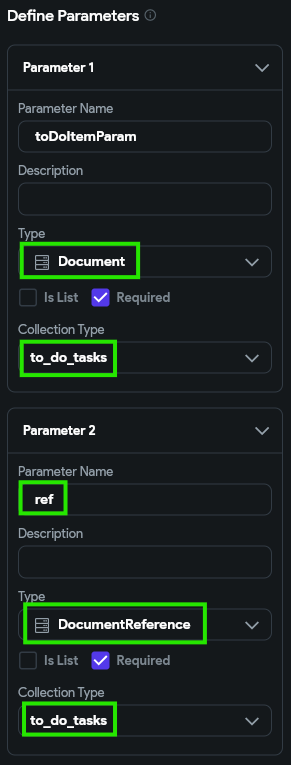

This allows us to actually access both the underlying document in Firestore and the data it contains. 

Next, we'll have to go through each widget in our interface and update the **Initial Value** to read the correct items from our new `toDoItemParam`. Below is a screenshot showing the process for updating the `TitleField` widget:

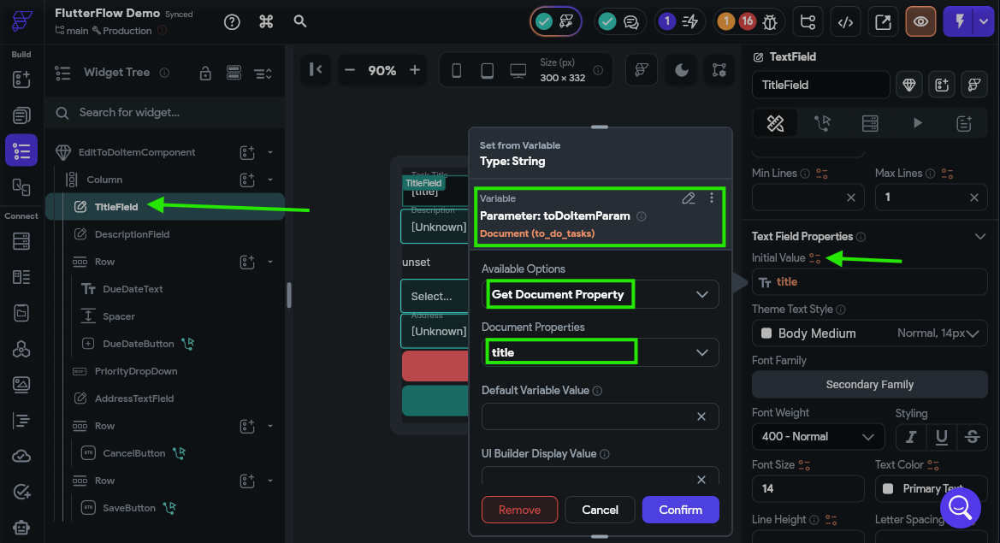

Finally, we'll need to update the `SaveButton` action. This time, we'll choose the **Backend/Database** > **Firestore** > **Update Document** option from the list of actions, and choose our `ref` parameter as the **Reference to Update** option. 

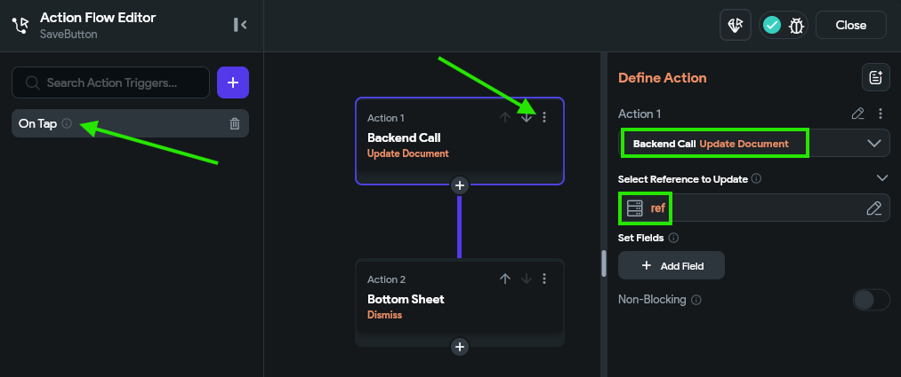

Then, we'll just need to go through and add all the fields to this action, just like we did above. See the animation above for updating the `CreateToDoItemComponent` component for the full process, but remember to use a **Conditional** statement for the `dateDue` just like we did before. 

## Updating Buttons

Finally, let's go back to the `ToDoItemComponent` and update the `EditButton`. As you might guess, we just need to update the parameters passed to the `EditToDoItemComponent` as shown below:

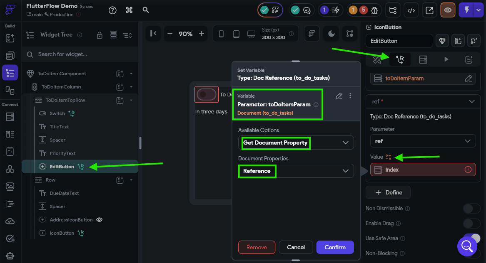

Likewise, we'll need to update the `DeleteButton` to delete the document from the underlying Firestore collection:

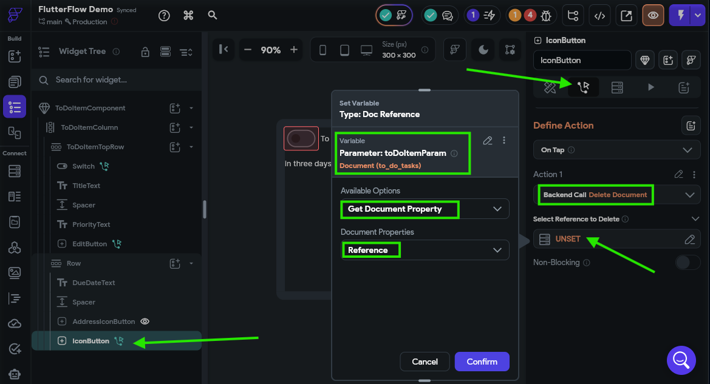

Finally, we need to update the **Switch** widget to properly mark the task as completed or incomplete. The process is similar to what we've already done above.

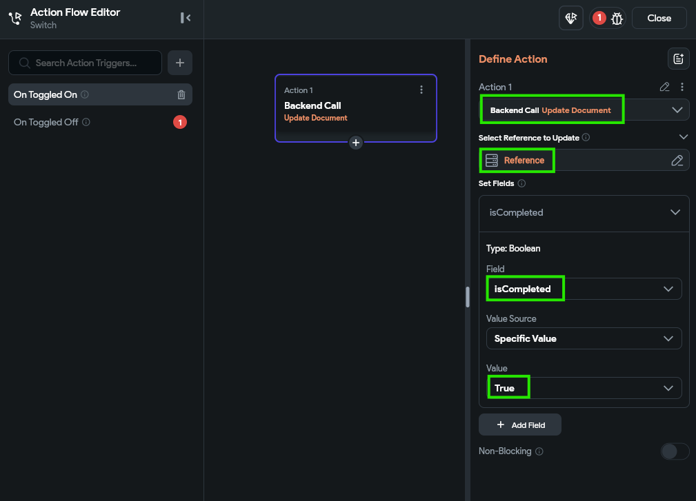

Remember to update both the **On Toggled On** and **On Toggled Off** action triggers.

There we go! That should be all of the updates we need to make on our application to configure it for Firebase!

{}

At this point, you should check the **Project Issues** option at the top of the FlutterFlow app designer:

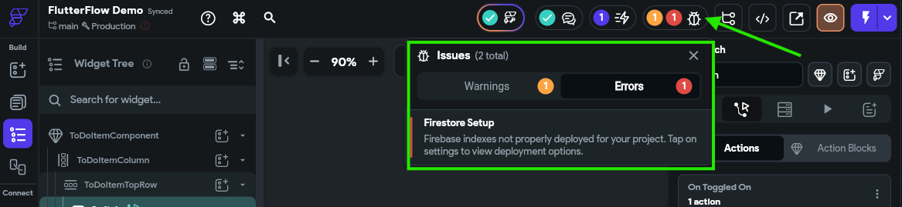

At this point, you should have 1 warning about Firebase rules and 1 warning about Firebase indexes, but no other errors. If you still are seeing errors here, it is probably because you missed updating a particular UI element. Click the error to be taken to the source of the error in your application. This is a great point to reach out to the course instructors if you are having issues getting everything updated.

{}

## Updating Firebase Indexes

Before we can test our application, we must do one more step to update our Firebase indexes. This is because we are querying our Firestore database in our application and asking it to sort the data using a few different fields, so Firebase needs to create an underlying index for those fields. 

To update this, click on the **Firestore** option in the **Navigation Menu**, and then click the **Settings** button at the top of that page. Look for the **Firestore Indexes** section, and click the {}Deploy{} button to update them.

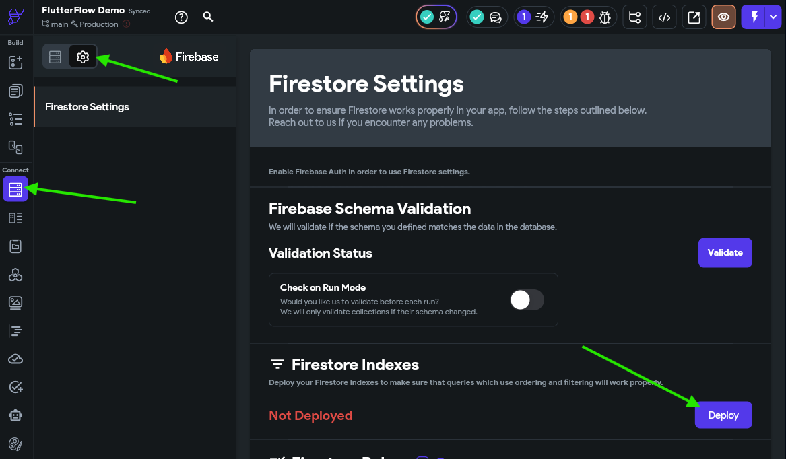

Thankfully, FlutterFlow will remind us anytime we need to update our indexes via the **Project Issues** button at the top of the page, so keep an eye on that anytime things are not working in your application.

{}

Once you click the button to deploy your Firestore indexes, you must wait a little bit before starting your app. It can take a few minutes to build a new Firestore index, and you'll receive errors in your app if you try to load data while the indexes are still building.

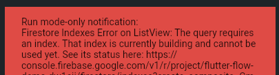

You can check the status of your indexes in the [Firebase Console](https://console.firebase.google.com/)

{}

## Testing Firebase

Finally, we are ready to run our app in **Test Mode**. So, let's check it out!

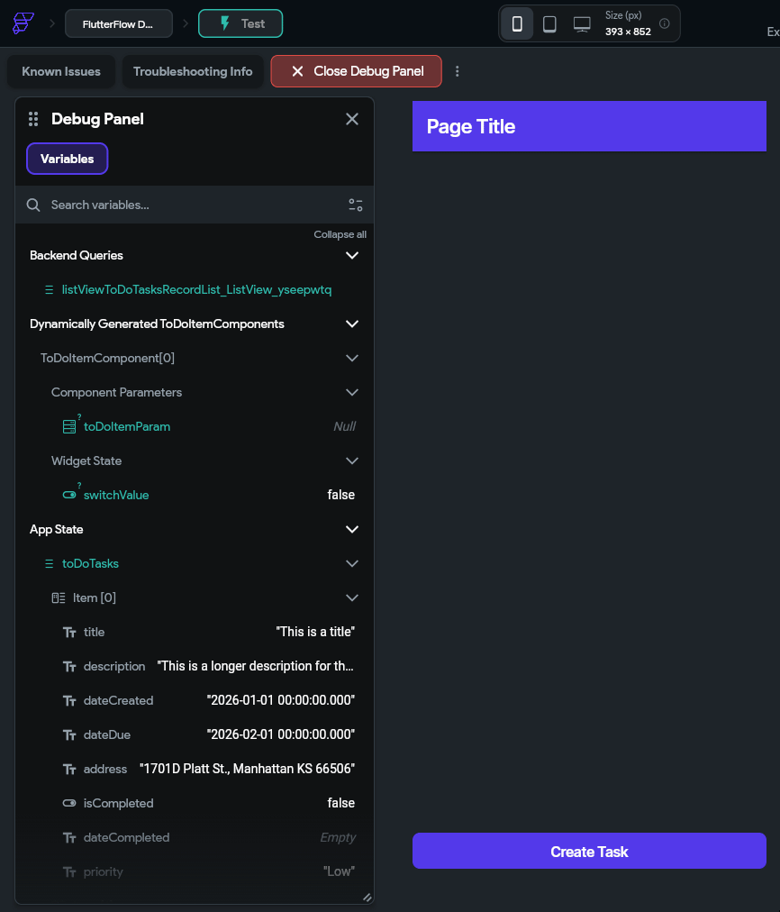

If everything works correctly, we should be able to create a task and have it appear in our list. However, if we leave some fields blank, such as `dateDue` and `priority`, it may not appear due to our sorting rules. 

We can also go to our [Firebase Console](https://console.firebase.google.com/) and view the data there as well:

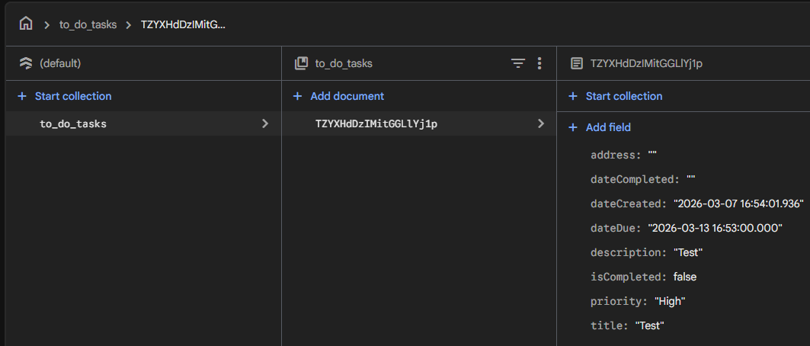

This view will update in real time as you make changes within the app. So, give it a try and see if everything is working!

## Summary

We've now successfully connected our application to cloud database so our data will synchronize across different devices. In the next section, we'll add user accounts and user authentication to our app, and explore how to properly secure our data. 