

Now that we have a working application that is synched with a cloud database, it is time to add user authentication and user accounts to our project. Thankfully, Firebase already includes all of the functionality we need to add authentication directly into our application, and FlutterFlow includes some scaffolded UI elements to make this a breeze. Let's dive in!

## Authentication

First, it is important to remember what authentication is. Recall that authentication is the process of determining that a user of an application is the person they claim to be, usually through the use of one or more **authentication factors** such as a username, password, email address, phone number, or biometrics. However, authentication is different from authorization, which determines whether that user should have access to the data; put succinctly, _authentication does not automatically imply authorization_. In this part of our tutorial, we'll only focus on authentication, and we'll deal with authorization in the next section.

## Login Pages

To begin, let's add some new pages to our FlutterFlow application. Up to this point, we've been primarily focused with just the main page that contains our to do tasks in a list. However, most useful applications consist of many pages, such as a login page, a main page, a settings page, and more. Thankfully, we can use some of the most powerful features of FlutterFlow to make this process quick and easy.

{}

Much of this process is also covered in the [Introduction to Flows](https://www.youtube.com/watch?v=UH0kFxncRgE) YouTube video from FlutterFlow. Feel free to refer to that as well as this guide!

{}

First, go to the **Page Selector** in the **Navigation Menu**, and then click the {}{} button at the top to add new content to our application.

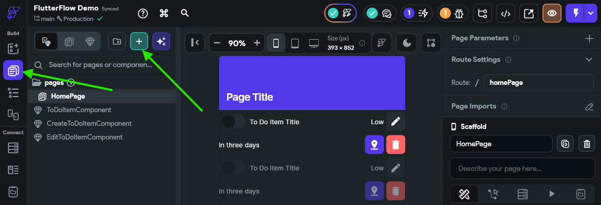

In the pop up window that appears, this time we'll select the **Flows** option at the top, and then the **Auth** filter below that. Look for the flow titled **Account & Profile Creation** in the list of available flows, and click **Add to Project** at the bottom of that flow:

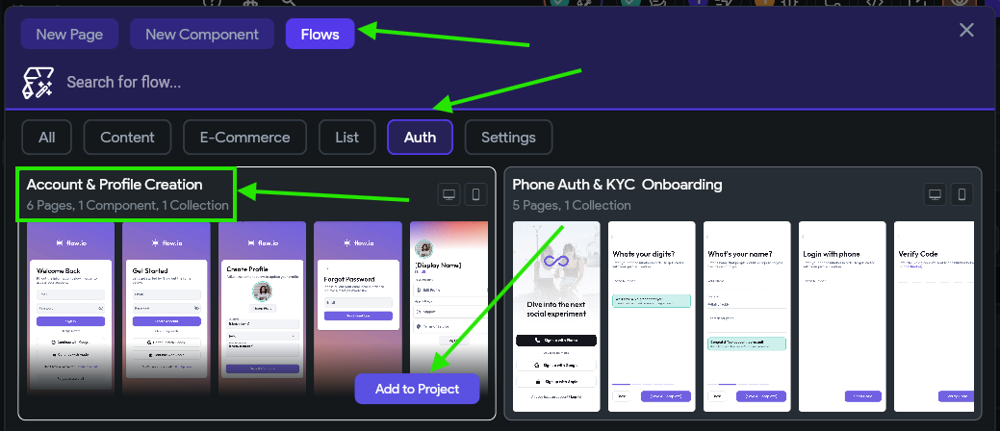

{}

FlutterFlow includes many pre-built components, pages, and flows to choose from. Over the next few parts of this tutorial, we'll shift from building our own UI elements to using some of the pre-built elements available in FlutterFlow. This helps us quickly add loads of common functionality to our application in a short amount of time. As you start developing your own apps, take a look at the available options here to get ideas of other items you might want to add to your application or to get inspiration for additional features to implement.

{}

When we select that option, we'll see another popup window that lists the items we'll be adding to our application, as well as the underlying data collections and other options that will be enabled for us.

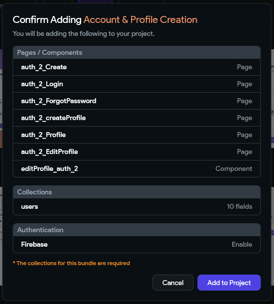

As we can see, this flow includes 6 new pages and a new component that will be added to our application. In addition, notice that it will handle adding a `users` collection to our Firestore cloud database as well as enable authentication via Firebase in our application. Click **Add to Project** again to add all of these items to our project.

In the next window that appears, we can give our flow a name. We'll stick with the default `AccountProfileCreation` for now. Finally, click **Create Flow** to create it in our application.

After a few moments, we should see all of the new content appear in our application. You may have to click the `AccountProfileCreation` folder in the **Page Selector** to see all of the new items.

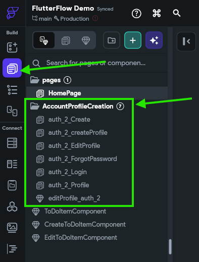

Before we start configuring those pages, let's look at some of the settings that were enabled for us in the background.

## Authentication Settings

First, in FlutterFlow, let's go to the **Settings and Integrations** option in the **Navigation Menu**, and then we'll look for the **Authentication** settings under **App Settings** in the list on the left.

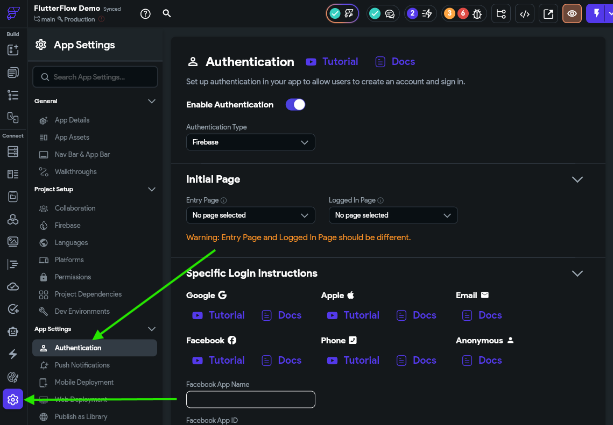

Here, we can see that the **Enable Authentication** option has already been enabled, and **Firebase** is selected as our authentication provider. This was done for us when we added the **Account & Profile Creation** flow earlier. 

However, we do need to configure our initial pages for our app. These settings tell our app where to send users when they arrive at the application, and change depending on whether the user is authenticated (or "logged-in") or not. So, let's set the **Entry Page** to the new `auth_2_login` page, and the **Logged In Page** to our `HomePage` we created earlier:

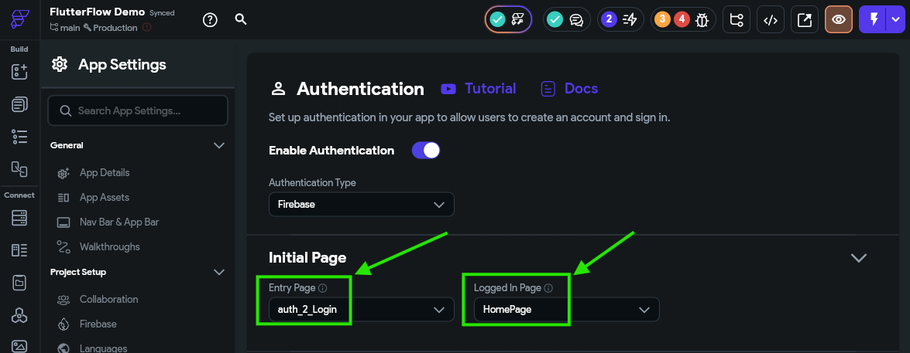

There we go! Now our app has some default pages set up.

## Firebase Settings

Next, we need to go to the [Firebase Console](https://console.firebase.google.com/) and enable authentication there. To do this, find your project in the list of projects, and then go to the **Security** -> **Authentication** page:

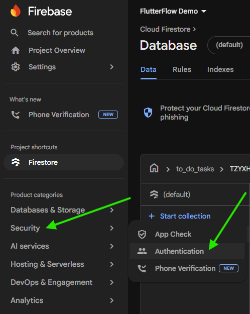

On the page that opens, click the **Get Started** button to start configuring authentication for your Firebase project. Then, under the **Sign-in method** tab, choose the **Email/Password** option

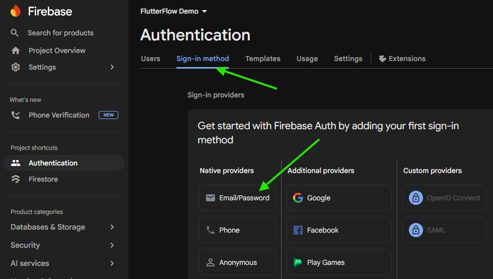

Under that option, choose the **Enable** option to enable that authentication method, then click **Save** to save that setting. 

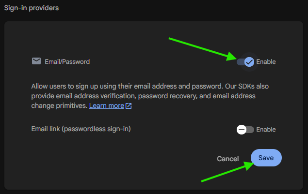

There we go! That is the basic setup for authentication in Firebase. However, keep this tab open since we'll need to come back to it later when we start testing our application.

{}

In this tutorial, we'll only use the **Email/Password** option, but Firebase supports many other authentication providers such as Google, Facebook, Apple, GitHub, Microsoft, and more. They are all relatively easy to implement, but you'll want to refer to the documentation and ensure that you understand how they work before using them. 

{}

## Login Page

Now, let's go back to FlutterFlow and look at our new Login page, which can be found on the **Page Selector** named `auth_2_login`:

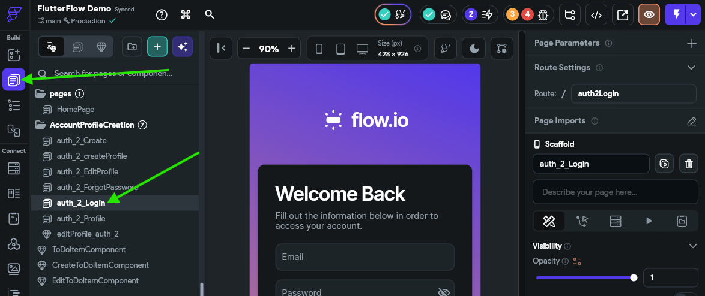

This page already includes a lot of the functionality we need to log into our application. For example, if we click the **Sign In** button and look at the **Actions** for that button, we can see that it is already configured to authenticate our user using the **Auth** -> **Log In** action:

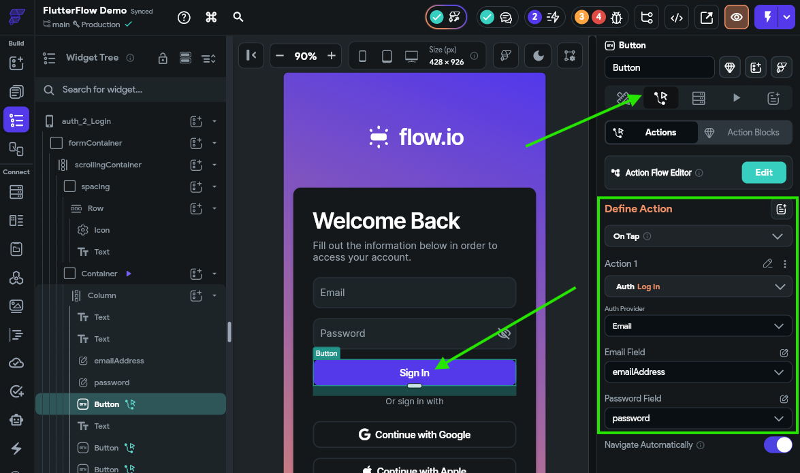

So, it looks like a lot of the functionality for our application is already configured for us! This one of the major advantages of using the built-in flows in FlutterFlow - it does a lot of the heavy lifting for us. In fact, we can even go to the **Storyboard** option on the **Navigation Menu** to see an overall layout for our application:

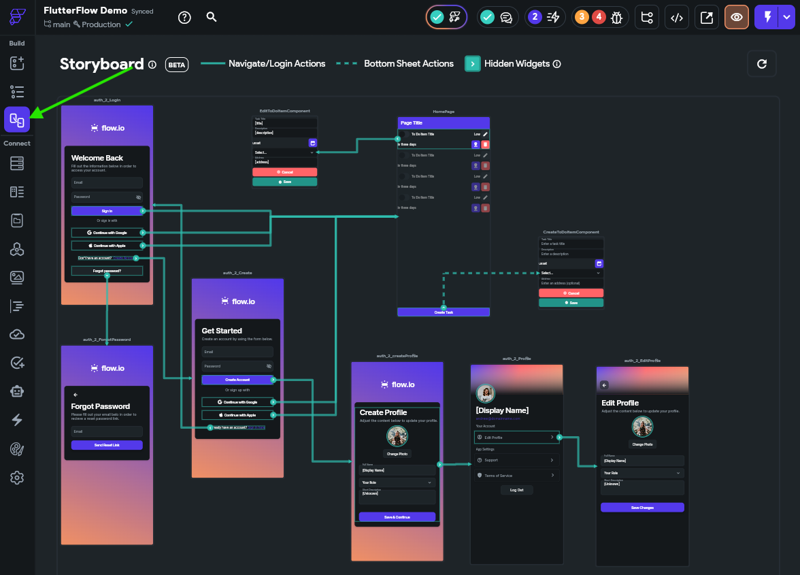

{}

Your layout may look a bit different than the one shown here. That's ok - we have adjusted our layout for this tutorial to make it a bit easier to see in a screenshot. You can click and drag pages and components in this storyboard layout to organize it however you want!

{}

As we can see, our application already has a lot of functionality built into it from that pre-built flow! We'll test it shortly, but for now we need to update a couple of things.

## Create a User Document

First, we need to configure the application to actually create a document in our Firestore `users` collection when a new user is created. To do this, we'll go to the **Page Selector** and find the `auth_2_Create` page, and click the **Create Account** button and look for it's actions:

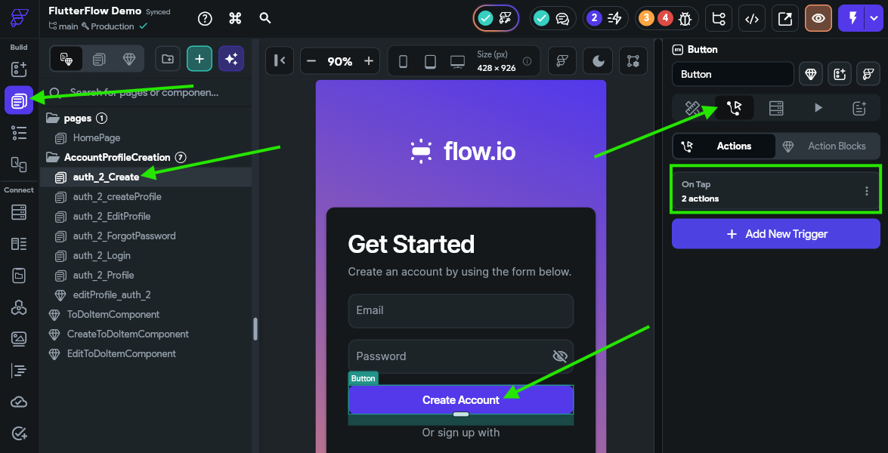

Click the button to open the **Action Flow Editor** and find the **Auth** -> **Create Account** action. Here, we need to checkmark the **Create User Document** option:

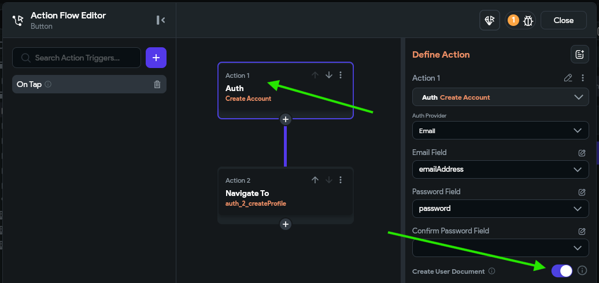

Below that, we'll select the `users` collection, and then we can configure any desired fields. For example, we'll set the `email` and `display_name` fields to use the `emailAddress` widget state, and we'll also set the `createdTime` to match the current time on the device. 

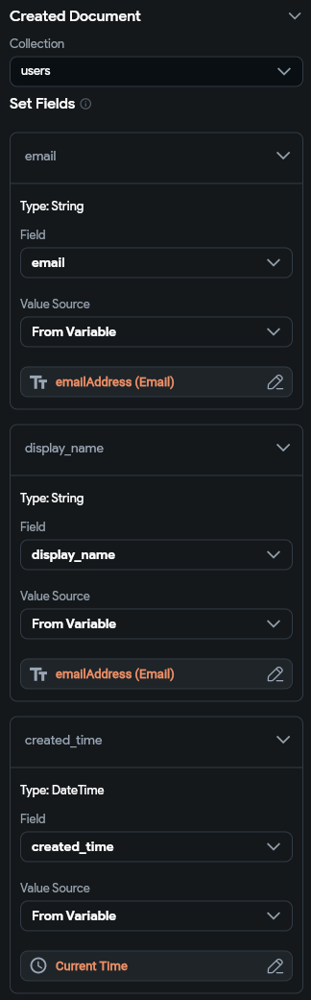

Finally, we need to make sure that we turn off the **Navigate Automatically** option at the bottom of that list:

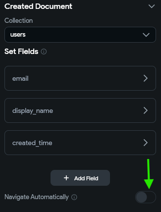

This is because we cannot automatically navigate in our application if we are creating a user document, but thankfully this action already has a second step to handle navigation for us, so we are all set!

Once configured, we can click the **Close** button at the top to save those changes. Now, when a user account is created, it will create a matching document in the `users` collection in Firestore for that user. We can use that document to store additional information about our users!

## Remove the Change Photo Options

Next, we need to remove the ability for users to upload their own profile pictures. We'll reconfigure this option later on in this tutorial, but for now we'll just remove it.

{}

Unfortunately, the free Firebase account does not include support for Firebase Storage, so we aren't able to use it in this tutorial. However, it is a quick and easy way to allow users to upload files and data to your application and store them in the cloud. So, if you do want to build an app with that support, you can easily switch to a paid Firebase account to enable support for Firebase Storage. 

{}

To do this, find the `editProfile_auth_2` component in the **Page Selector**, and then click the **Change Photo** button in that component and simply remove it. 

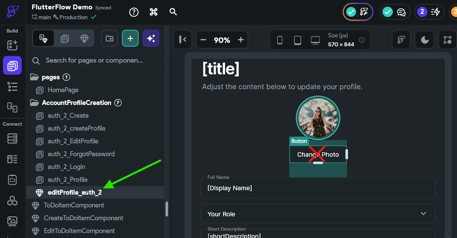

Next, find the `Button-Login` widget, and update the action to remove the `photo_url` from the list of fields to be updated.

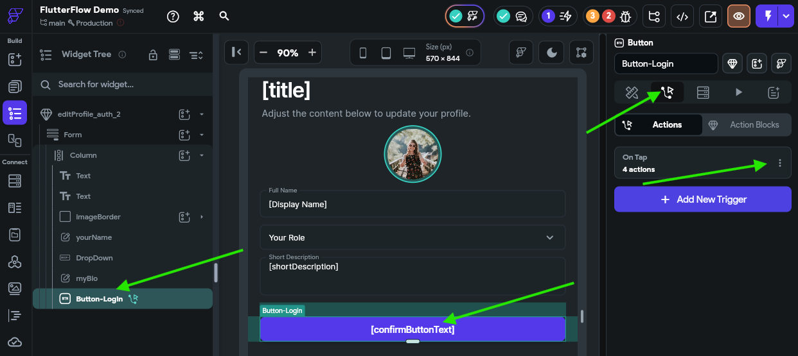

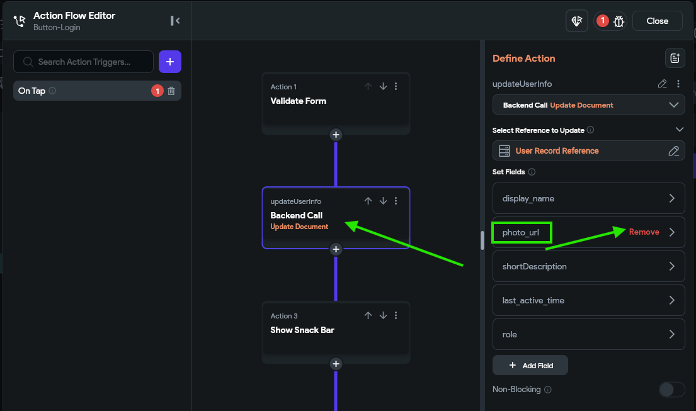

Finally, we need to remove the **Path** from the `uploadedImage` widget since we don't have a way to display user images currently:

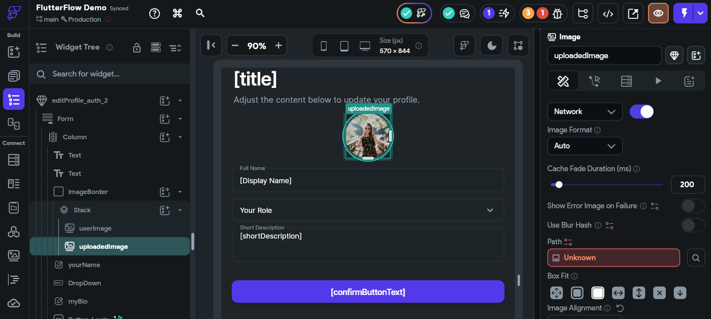

We can set this to a blank value for now. It may replace that with a default image from the Unsplash stock image site, which is great for now!

## Testing Authentication

At this point, we should no longer see any errors at the top of our application in the **Project Issues** area, just a few warnings about Firestore Rules:

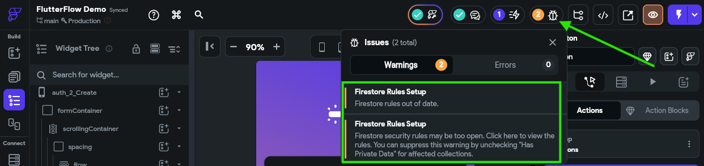

{}

If you are seeing other errors or warnings here, see if you can resolve them by clicking the error and editing the item you are taken to. If you run into any errors you cannot resolve, contact the course instructors for assistance!

{}

At this point, click on the first option that warns us that our "Firestore rule out of date." That will take us to our Firestore settings, which we can also find by going to the **Firestore** option in the **Navigation Menu** and then clicking the **Settings** gear icon at the top:

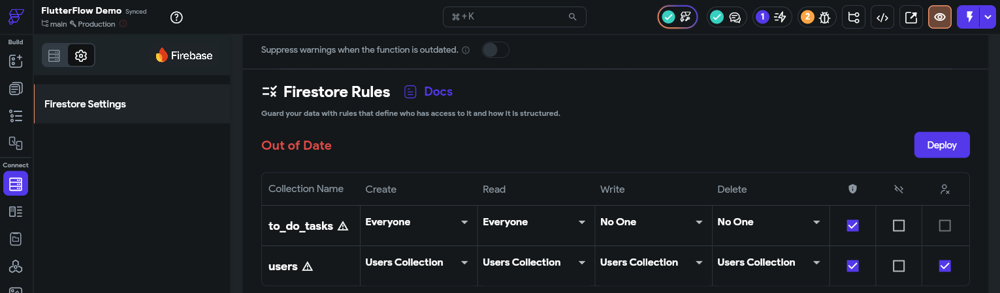

For now, just click the {}Deploy{} button to deploy the new Firestore rules.

{}

We will still have a warning stating that our Firestore rules may be too open. We'll ignore that for now, but come back to it later in this tutorial.

{}

At long last, we can click the button to run our app in **Test Mode** and see if it works!

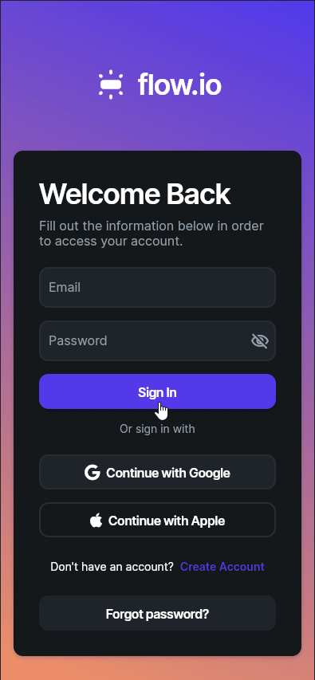

In this animation, we see that we can go through the entire process of creating an account in our application!

Behind the scenes, we can go back to the [Firebase Console](https://console.firebase.google.com/) and see that our user account has been created successfully:

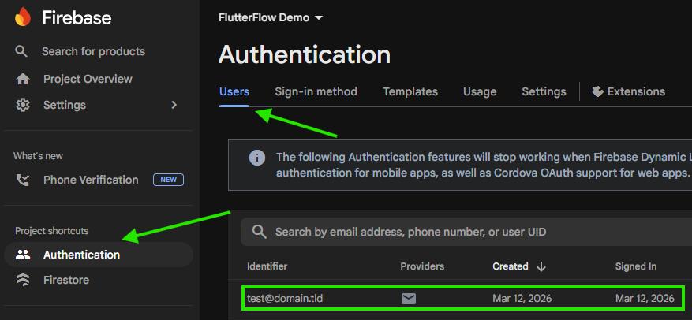

We can also see that the corresponding `user` document was created as well:

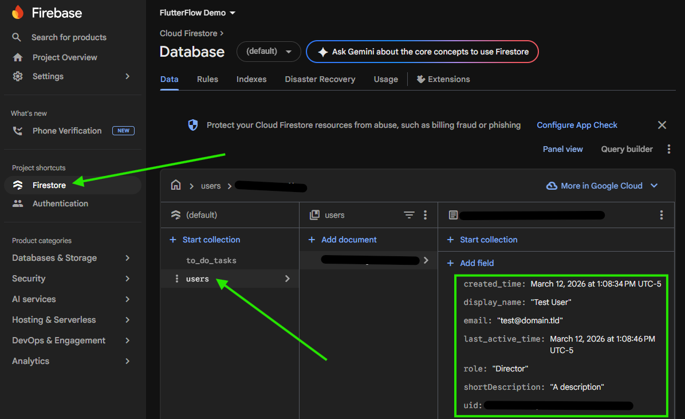

{}

In Firebase, each individual user is assigned a unique user ID that matches the document ID assigned to their user account. Since those user IDs control access to secure data, it is always a good practice to redact them and not include them in any screenshots, documentation, or log files. So, in the screenshot above, we are following best practices and redacting that sensitive item!

{}

Unfortunately, we might quickly notice that it is difficult to navigate in our application since we haven't provided a clear way to get back to the `HomePage` where our list of to do tasks is kept, and once on that page, we don't have any easy way to get back to the user profile page and the logout button. So, let's configure some navigation options in our application to make things easy to use!

## Configure Navigation

Thankfully, it is very easy to configure some basic navigation options for our application. First, we need to enable the Nav Bar in our **Project Settings** on the **Nav Bar & App Bar** page:

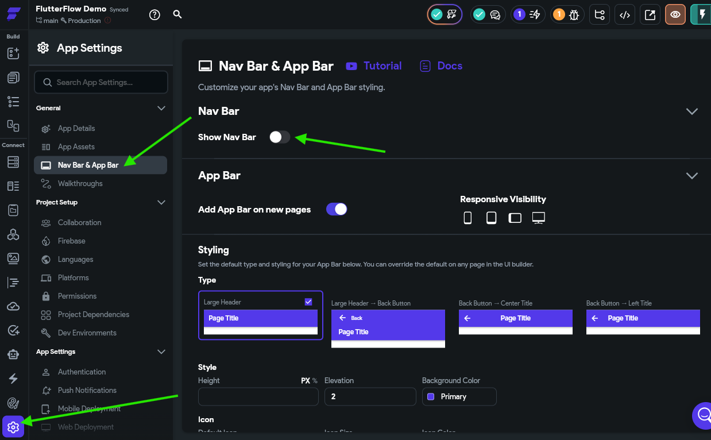

Next, we can add pages to our Nav Bar by finding the `HomePage` in our **Page Selector** and then looking at the **Nav Bar Item Properties** at the bottom of the **Properties Panel**

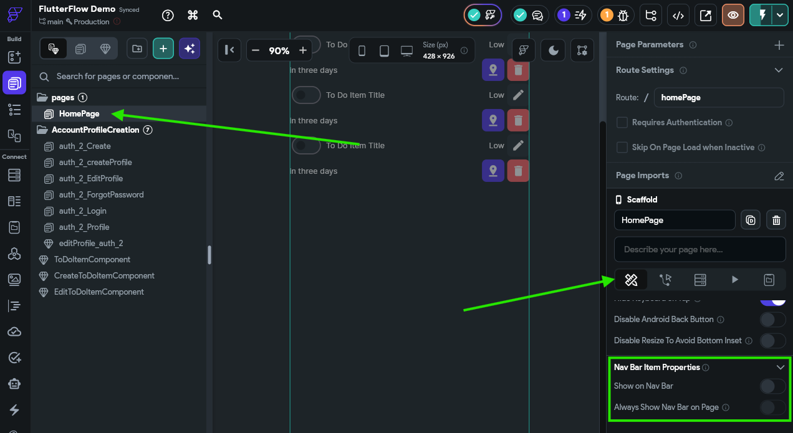

Here, we'll turn on the **Show on Nav Bar** option. Below, we can set the name and icons used for the page as well:

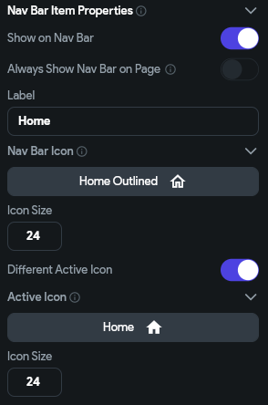

We can also do the same for the `auth_2_Profile` page to add it to the list as well:

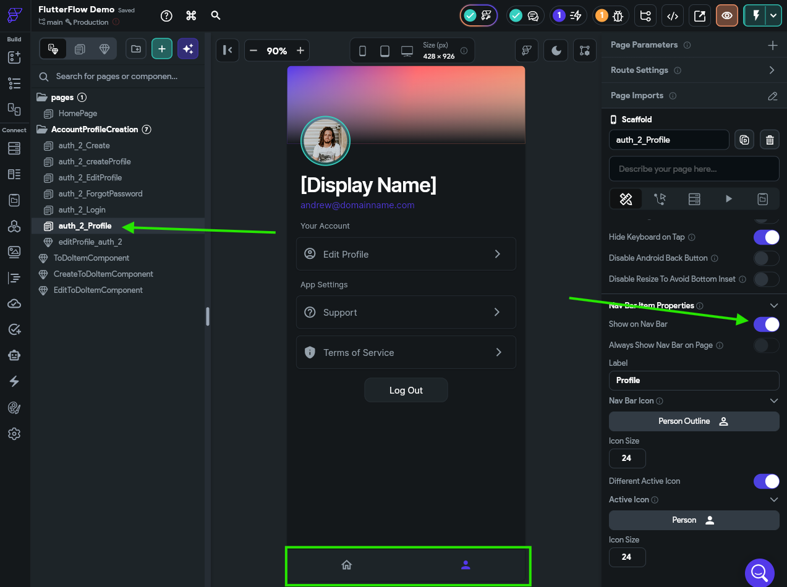

Notice that we can now see our application's Nav Bar at the bottom of the screen? Now, we can reload our application in **Test Mode** and explore our new Nav Bar! We can even log out and log back in and see that everything is working!

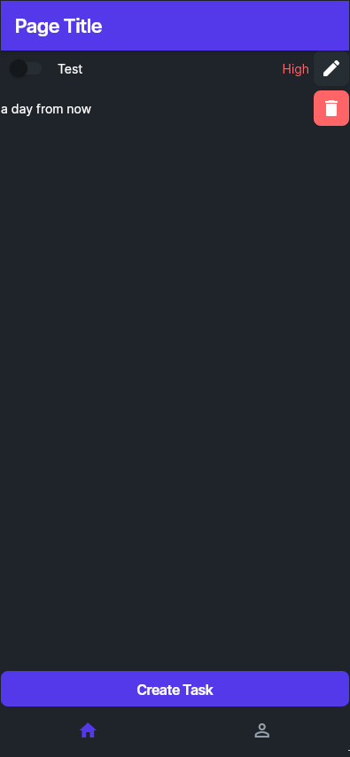

At this point, take a moment to click through the application and confirm that everything is working as intended. 

## Summary

Once again, let's go back to our list of features and see how we are doing:

- [X] To Do tasks should include a short title and longer description.
- [X] To Do tasks should track the date it was created and the date it is due.
- [X] To Do tasks should track whether it has been completed or not.
- [X] Tasks may optionally have an address associated with the task.
- [X] To Do tasks should be assigned to different priorities (Low, High).
- [X] When a task is completed, it should track the date and time when it was completed.
- [X] Users should be able to create, edit, and delete tasks.
- [X] Tasks should be sorted according to completion, due date, and priority.
- [X] Our application should include user accounts so that multiple users can use the app.
- [X] User accounts should use an email address and password to log in.
- [X] User data should be stored in the cloud so they can use the app across devices.
- [ ] Each user's data should be stored securely and not accessible by other users.
- [ ] If a task has an address, the application should allow the user to request directions to that address.
- [ ] If the user gives permission, it should also track the location where a task was completed.
- [ ] Our application should track the percentage of tasks completed on-time (before the due date).
- [ ] Users should be able to configure their display name and update their password.
- [ ] Users should be able to delete their account and all associated data.
- [ ] User profile pictures should be visible from [Gravatar](https://gravatar.com/)
- [ ] The app should display a global leaderboard showing the users with the highest on-time completion percentage.

We're over halfway there! Next, we'll look at how we can properly secure our user's data in Firebase!