

Our application is currently storing both our user's data in the cloud as well as our to do tasks. However, we have yet to properly configure the Firestore Rules for our application, and that creates a major security flaw. Before we look at how to fix this, let's take a minute to explore the flaw and truly understand why it is so important to fix correctly.

## Firebase Configuration

One of the key security concepts to keep in mind when developing applications (both mobile applications as well as web applications) is that we can never trust _anything_ that is in control of the user. This includes their device, their web browser, or any other tool that they use to interface with our application. A user could modify the contents of their device, inspect its memory, change settings, send back malicious data, and generally do anything they want. So, we have to take that into account when developing the security settings in our applications. In short, we must enforce security in a location that is not accessible to the user.

As we've seen, Google Firebase is a cloud database that can be accessed directly without going through any other service. This means that _everything_ needed to access data in Google Firebase has to be stored directly in our application, which would eventually be installed on user's phones. This means that any relatively skilled user could open up the memory in our application and find all of that information. In fact, it is stored directly in a `firebase_config.dart` file inside of the code for our FlutterFlow application, the code of which is shown below

```dart {title="lib/backend/firebase/firebase_config.dart"}
import 'package:firebase_core/firebase_core.dart';
import 'package:flutter/foundation.dart';

Future initFirebase() async {
  if (kIsWeb) {
    await Firebase.initializeApp(
        options: FirebaseOptions(
            apiKey: "AIzaSyDR7S<redacted>",
            authDomain: "flutter-flow-demo-<redacted>.firebaseapp.com",
            projectId: "flutter-flow-demo-<redacted>",
            storageBucket: "flutter-flow-demo-<redacted>.firebasestorage.app",
            messagingSenderId: "1086985<redacted>",
            appId: "1:1086985<redacted>:web:640e1e74f5a<redacted>"));
  } else {
    await Firebase.initializeApp();
  }
}
```

{}

Of course, some items have been `<redacted>` because they would compromise the security of the actual demo application being built for this tutorial!

{}

So, if a user can export those settings, what can they do with it? Let's find out!

## Using Firebase in Code

For this demo, we used Google Copilot to quickly create a demo application in JavaScript that uses the standard client libraries to access Google Firebase. This is the _exact same process_ a web application written in a JavaScript framework, such as React or Vue, would use. 

In just a few seconds, we are given this piece of code:

```js {title="index.js"}
import { initializeApp } from 'firebase/app';
import { getFirestore, collection, getDocs } from 'firebase/firestore';

// Initialize Firebase
const firebaseConfig = {
  apiKey: "AIzaSyDR7S<redacted>",
  authDomain: "flutter-flow-demo-<redacted>.firebaseapp.com",
  projectId: "flutter-flow-demo-<redacted>",
  storageBucket: "flutter-flow-demo-<redacted>.firebasestorage.app",
  messagingSenderId: "1086985<redacted>",
  appId: "1:1086985<redacted>:web:640e1e74f5a<redacted>"
};

const app = initializeApp(firebaseConfig);
const db = getFirestore(app);

// Fetch and print to_do_tasks collection
async function getTasks() {
  try {
    console.log('Fetching to_do_tasks collection from Firebase...');
    const querySnapshot = await getDocs(collection(db, 'to_do_tasks'));

    if (querySnapshot.empty) {
      console.log('No tasks found in the collection.');
      return;
    }

    const tasks = [];
    querySnapshot.forEach((doc) => {
      tasks.push({
        id: doc.id,
        ...doc.data(),
      });
    });

    console.log('\n=== TO-DO TASKS ===');
    console.log(JSON.stringify(tasks, null, 2));
  } catch (error) {
    console.error('Error fetching tasks:', error);
  }
}

// Run the function
getTasks();
```

As you can see, it includes the exact same configuration that was found in our FlutterFlow application. When we run this code, we see the following output:

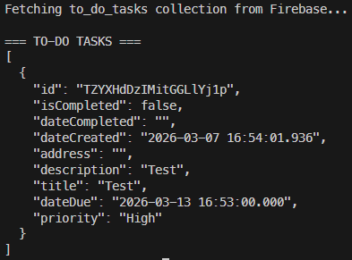

Yikes! As we can see here, we were able to access the entire contents of the `to_do_tasks` collection from Firestore with just that configuration. We didn't have to log in, we didn't have to create a user account, _we didn't even have to do anything except borrow a few settings from our app_!

What if we try to do the same to the `users` collection? Let's try that:

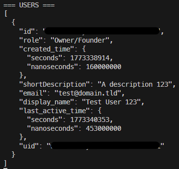

Super yikes! We can even get a list of all of the users in our application! **This is a major security flaw!** Effectively, this means that anyone who downloads our application can see all of this data, and they can start trying to guess individual user's passwords or worse.

{}

A quick search for "firebase data breach" will turn up a number of case studies and news articles referencing this issue:

* [Nearly 300M Chat & Ask AI user messages spilled by Firebase misconfiguration](https://www.scworld.com/brief/nearly-300m-chat-ask-ai-user-messages-spilled-by-firebase-misconfiguration)
* [Numerous Applications Using Google’s Firebase Platform Leaking Highly Sensitive Data](https://cybersecuritynews.com/numerous-applications-using-googles-firebase-platform/)
* [Misconfigured Firebase instances leaked 19 million plaintext passwords](https://www.bleepingcomputer.com/news/security/misconfigured-firebase-instances-leaked-19-million-plaintext-passwords/)
* [Tea app leak worsens with second database exposing user chats](https://www.bleepingcomputer.com/news/security/tea-app-leak-worsens-with-second-database-exposing-user-chats/)

Sadly, Firebase security misconfigurations are shockingly common errors, often made by inexperienced application developers who don't understand the security aspects of storing data in the cloud. Before releasing an app publicly, it is important to do a full security review and ensure data is properly protected.

{}

## Firestore Rules

Thankfully, Firebase has a solution available in the form of it's **Firestore Rules**, which allow us to define the requirements users must meet in order to access data in our database. Let's look at our current rules, which can be found in the [Firebase Console](https://console.firebase.google.com/):

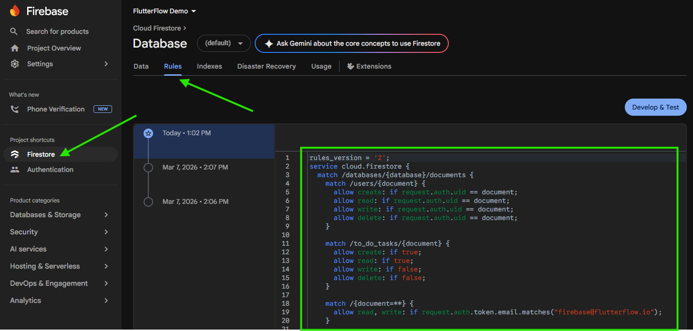

Here are the current rules that are defined for our demo application:

```cloud-firestore-security-rules
rules_version = '2';
service cloud.firestore {
  match /databases/{database}/documents {
    match /users/{document} {
      allow create: if request.auth.uid == document;
      allow read: if request.auth.uid == document;
      allow write: if request.auth.uid == document;
      allow delete: if request.auth.uid == document;
    }

    match /to_do_tasks/{document} {
      allow create: if true;
      allow read: if true;
      allow write: if false;
      allow delete: if false;
    }

    match /{document=**} {
      allow read, write: if request.auth.token.email.matches("firebase@flutterflow.io");
    }

    match /{document=**} {
      // This rule allows anyone with your database reference to view, edit,
      // and delete all data in your database. It is useful for getting
      // started, but it is configured to expire after 30 days because it
      // leaves your app open to attackers. At that time, all client
      // requests to your database will be denied.
      //
      // Make sure to write security rules for your app before that time, or
      // else all client requests to your database will be denied until you
      // update your rules.
      allow read, write: if request.time < timestamp.date(2026, 4, 6);
    }
  }
}
```

While we won't go too deeply into all of the details in this setup, we should hopefully see a couple of things jump out automatically:
  * The bottom rule includes a large comment describing it, but basically it allows **ALL** requests to our database during the first 30 days for testing. So, we don't even _have_ any active security rules in effect right now. 
  * The rule above that allows any actions made by FlutterFlow through their `firebase@flutterflow.io` account

So, before we do anything else, let's remove both of those rules so that it looks like this:

```cloud-firestore-security-rules
rules_version = '2';
service cloud.firestore {
  match /databases/{database}/documents {
    match /users/{document} {
      allow create: if request.auth.uid == document;
      allow read: if request.auth.uid == document;
      allow write: if request.auth.uid == document;
      allow delete: if request.auth.uid == document;
    }

    match /to_do_tasks/{document} {
      allow create: if true;
      allow read: if true;
      allow write: if false;
      allow delete: if false;
    }
  }
}
```

Once we are satisfied, we can click **Publish** to save our changes:

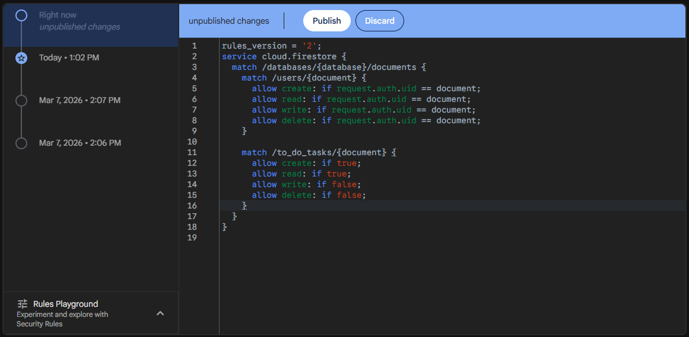

Now that we have deployed those rules, we'll try to read the users from the `users` collection again and see if that works:

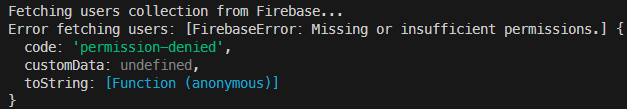

Great! As we can see, we can no longer access all the user accounts in our application. However, if we try to access the `to_do_tasks` collection, we see that it still works:


So, we need to modify our rules a bit to secure our to-do tasks.

## Secure Access in FlutterFlow

To configure the security in FlutterFlow, let's go back to the **Firestore** page and look at the **Firestore Settings** again. Here, we can see the **Firestore Rules** section that we can configure for our application:

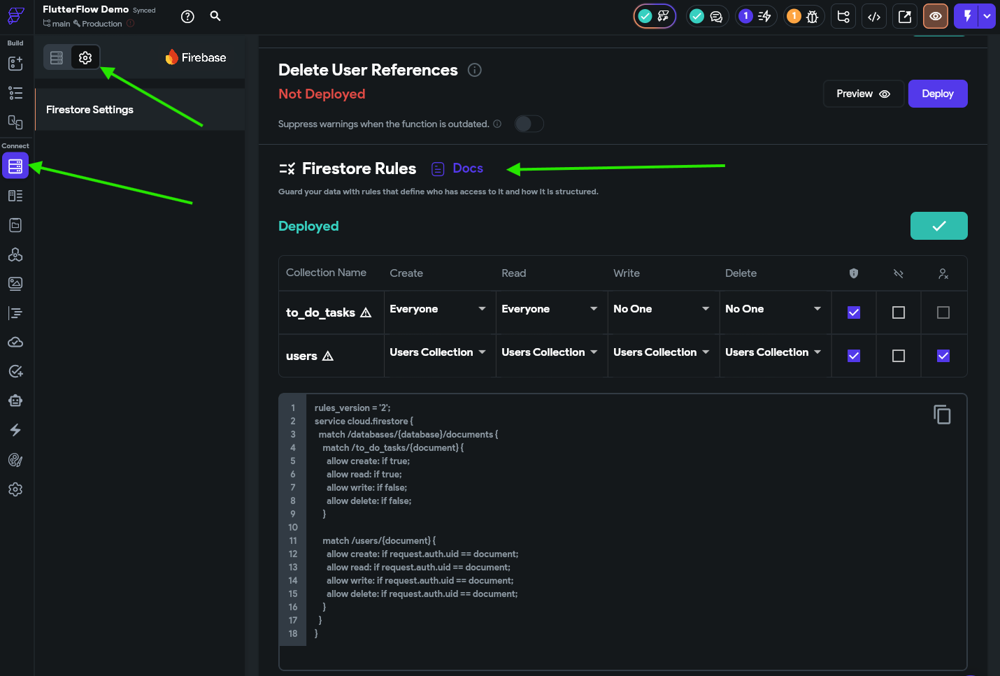

Here, we can see that some of the rules are pre-configured for us. First, let's look at the `users` collection. It already has all of its options set to **Users Collection**, which, in the Firestore rules code, looks like `allow <action> if request.auth.uid == document`. This option basically means that a user can only perform and action on it's own document in the `users` collection. So, this prevents any other user from accessing or modifying that data. This is what we want!

Now, let's look at the `to_do_tasks` collection. Right now we see that everyone can create documents and read documents, but with the current rules, no one can write to existing documents or delete them. Before we can update that, however, we need to configure our `to_do_tasks` collection to store a user's ID along with the task.

## Adding a UID to a Task

So, back on the **Collections** tab, let's add a new field called `uid` to the collection, and give it the type **String**. We'll use this to store the user's unique ID in the database. 

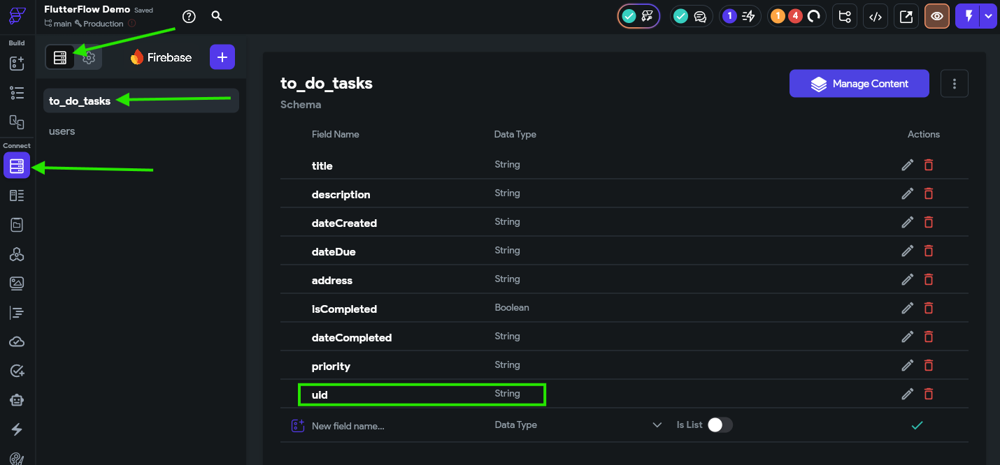

Next, on the `CreateToDoItemComponent`, we need to modify the **Save** button action to set that field to the **User ID** field under **Authenticated User**:

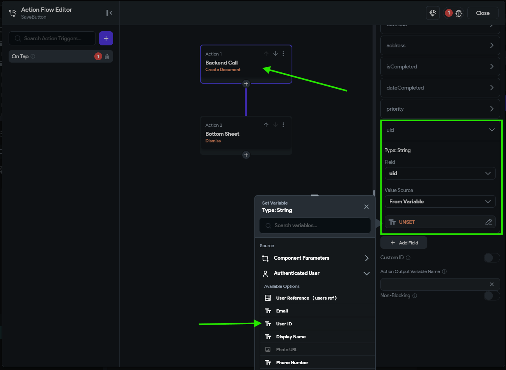

Finally, in our Backend Query for the **ListView** widget on our `HomePage`, we need to add a **Filter** that checks that the `uid` should be equal to the authenticated user's User ID:

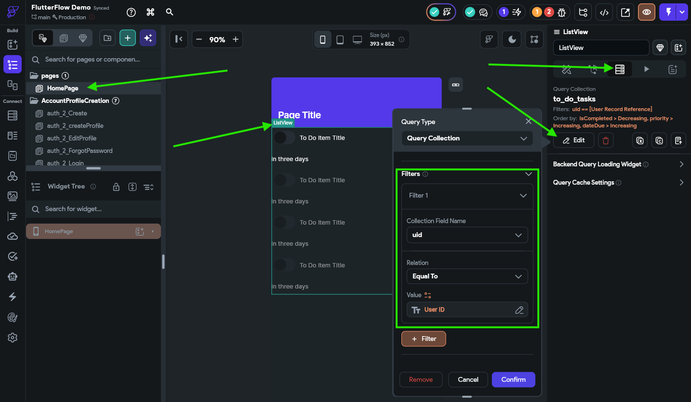

With those changes, we are making sure that a newly created task will include the user's ID, and that our list of tasks will only show those tasks that are assigned to that user.

{}

Once the Firestore rules are configured, a filter is required on any backend query that is accessing the data, and it must match or be more strict than the rules that are configured. So, if we don't add a filter here, Firebase will return an error even though there may be items that the user can view.

{}

## Updating Firestore Rules

Now, back in our Firestore Rules, we can set the **Read**, **Write**, and **Delete** actions on the `to_do_tasks` collection to only allow tagged users to access them, and reference the `uid` field as the tag that identifies the user:

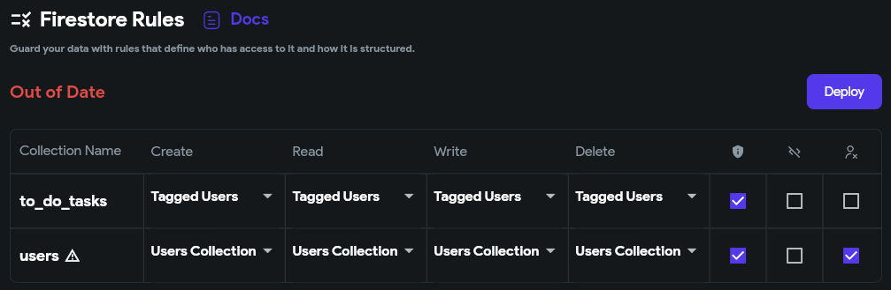

Below that, we should see rules similar to this:

```cloud-firestore-security-rules
rules_version = '2';
service cloud.firestore {
  match /databases/{database}/documents {
    match /to_do_tasks/{document} {
      allow create: if request.auth.uid == request.resource.data.uid;
      allow read: if request.auth.uid == resource.data.uid;
      allow write: if request.auth.uid == resource.data.uid;
      allow delete: if request.auth.uid == resource.data.uid;
    }

    match /users/{document} {
      allow create: if request.auth.uid == document;
      allow read: if request.auth.uid == document;
      allow write: if request.auth.uid == document;
      allow delete: if request.auth.uid == document;
    }
  }
}
```

Notice that the top section of rules now includes the code `allow <action> if request.auth.uid == resource.data.uid` for most actions? This ensures that only the user tagged in the task is able to create, read, edit, or delete those tasks. 

Once we have made those changes, we can click on the {}Deploy{} to deploy these rules to Firebase. 

Also, since we made changes to our Firebase `to_do_tasks` collection and the backend queries, we should also scroll up to the **Firestore Indexes** section and click {}Deploy{} there as well. 

{}

Once you click the button to deploy your Firestore indexes, you must wait a little bit before starting your app. It can take a few minutes to build a new Firestore index, and you'll receive errors in your app if you try to load data while the indexes are still building.

{}

With all of that in place, let's test our app in **Test Mode** and see if it works. For the demo animation below, we already created a second user account and populated it with some data, but now we should be able to see how each user stores their own data.

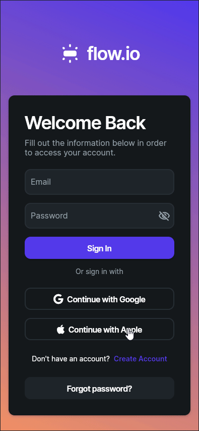

There we go! It looks like it is working correctly.

{}

At this point, our app has enough features, functionality, and security that we could start letting some users test it out. There are still many features to add, but it is a good start. Before that, however, it is always a good idea to fully test all features of your application, and if you aren't confident working with Firebase security, consult with an experienced developer to have them review your app's settings and see if they spot any errors. Finding and fixing data leaks and security breaches is an important part of developing any app that is entrusted with a user's data.

{}

{}

Another commonly used method for protecting data in Firebase is to store a user's data inside of a list directly within their user document (in the `users` collection in our tutorial). This can be a bit simpler since we don't need to tag each task with a users `uid` and we can simply use the **Authenticated User** document in FlutterFlow to access that list without a backend query. In fact, this may even be an easier way to accomplish the same task!

For the purposes of this tutorial, we chose to separate the tasks into their own collection to have a deeper discussion and understanding of Firebase security and Firestore rules. This is purely a design decision on our part, and as we'll see later in this tutorial, it enables some more advanced features later on.

{}

## Summary

Now we have created an application that stores data in the cloud and even includes proper security rules to prevent unauthorized access to the data. Next, we can focus on adding even more useful features to our application!


