

Now that we have a mobile application with most of the basic features implemented, let's go through a quick process to implement some additional features that we included in our specification that are relatively easy to add.

As a reminder, here is our current progress on our application:

- [X] To Do tasks should include a short title and longer description.
- [X] To Do tasks should track the date it was created and the date it is due.
- [X] To Do tasks should track whether it has been completed or not.
- [X] Tasks may optionally have an address associated with the task.
- [X] To Do tasks should be assigned to different priorities (Low, High).
- [X] When a task is completed, it should track the date and time when it was completed.
- [X] Users should be able to create, edit, and delete tasks.
- [X] Tasks should be sorted according to completion, due date, and priority.
- [X] Our application should include user accounts so that multiple users can use the app.
- [X] User accounts should use an email address and password to log in.
- [X] User data should be stored in the cloud so they can use the app across devices.
- [X] Each user's data should be stored securely and not accessible by other users.
- [ ] If a task has an address, the application should allow the user to request directions to that address.
- [ ] If the user gives permission, it should also track the location where a task was completed.
- [ ] Our application should track the percentage of tasks completed on-time (before the due date).
- [ ] Users should be able to configure their display name and update their password.
- [ ] Users should be able to delete their account and all associated data.
- [ ] User profile pictures should be visible from [Gravatar](https://gravatar.com/)
- [ ] The app should display a global leaderboard showing the users with the highest on-time completion percentage.

Let's start working on a few of these!

## Request Directions

One quick feature we can add is the ability to request directions to a location stored in the task if one is present. To do this, let's go to our **ToDoItemComponent** and add an action to the **AddressIconButton** widget. In the Action flow editor, we'll start by adding a **Conditional Action** to to the **On Tap** action to check if the application is running on the web using the **Is Web** entry under the **Global Properties** list. 

On the **TRUE** branch, we'll use the **Launch URL** action found under the **Share** option. Then, we'll create a quick **Inline Function** that uses the `address` field as a parameter and includes this code:

```dart
"https://www.google.com/maps/search/?api=1&query=" + Uri.encodeComponent(address)
```

This will construct a Google Maps URL that will search for that address on the web.

On the **FALSE** branch, we can find the **Launch Map** action under the **Widget/UI Interactions** section, and then set the **Place Type** to **Address** and then link it to the `address` field in our task.

The full process is shown in the animation below:

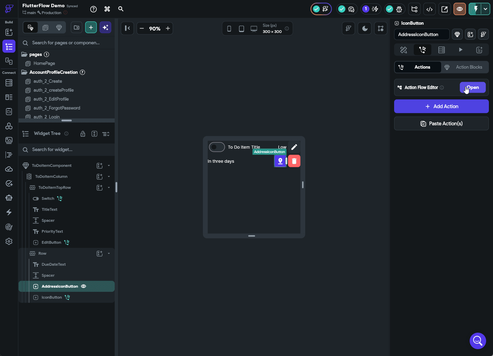

Once that is done, we can test it out in **Test Mode** to confirm that it works!

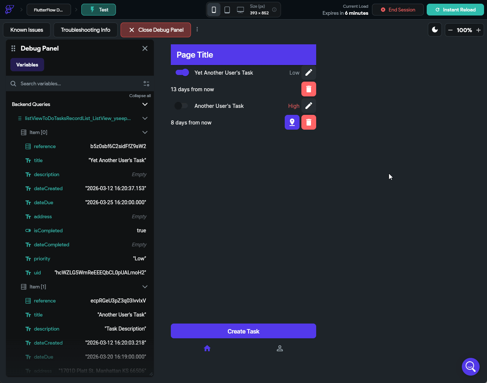

As we can see, many of these more complex actions can be handled directly by FlutterFlow!

## Location Tracking

Another feature we should include in our application is the ability to track the location where a task was completed. To enable this, we first must go to the **Settings** page and look for the **Permissions** section under **Project Setup**, and then enable the **Location** permission. When we install our application on a device, this will request access to the device's location so we can use it in our application.

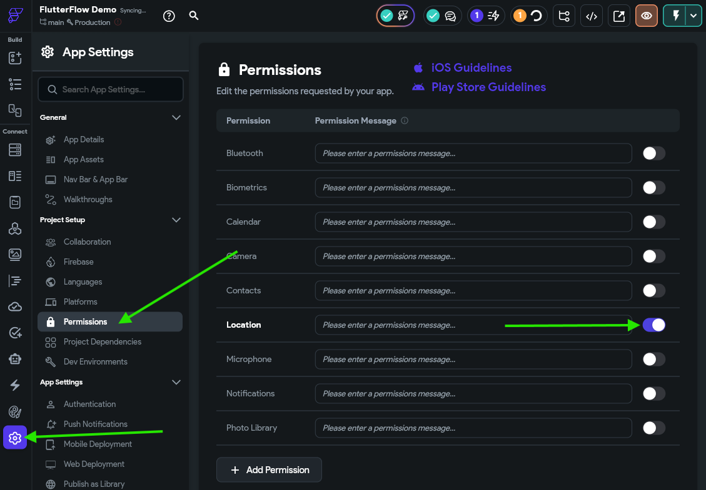

{}

When publishing an application to an app store, it must abide by guidelines concerning the data collected and how it is stored and processed. As a developer, it is our job to make sure we read, understand, and adhere to those guidelines. Thankfully, there are helpful links at the top of the **Permissions** settings page where we can find the current guidelines for each app store.

{}

We can also add a new `locationCompleted` field using the **Lat Lng** data type (short for "Latitude Longitude") to our `to_do_tasks` collection in Firestore to store this data:

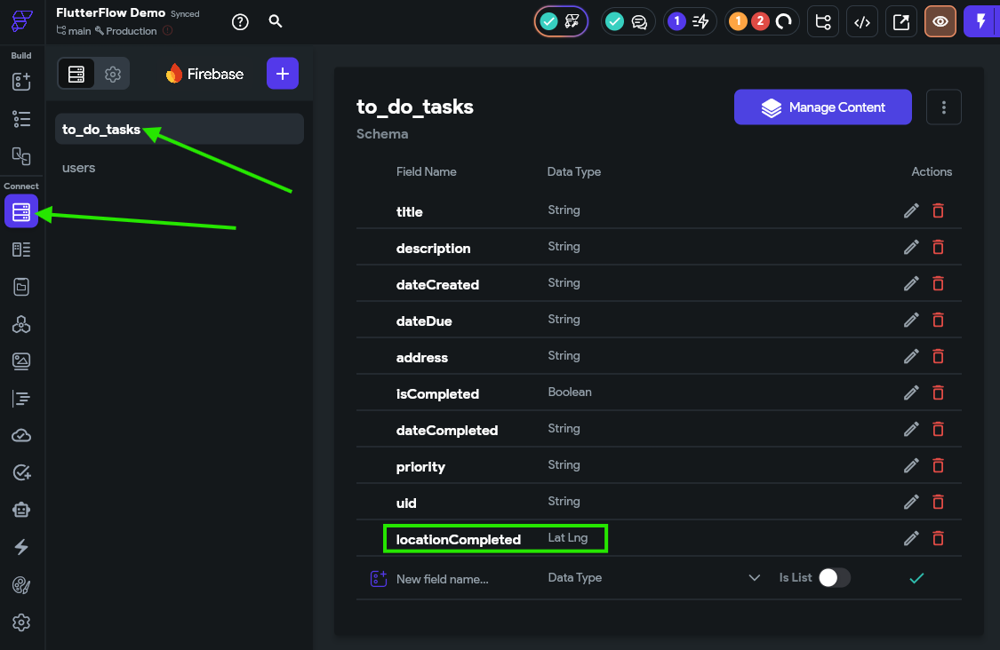

Now that we've enabled that setting, we can update the **On Toggled On** action attached to our **Switch** widget in the **ToDoItemComponent** to also set the `locationCompleted` field to the value in the **Current Device Location** option under **Global Properties**

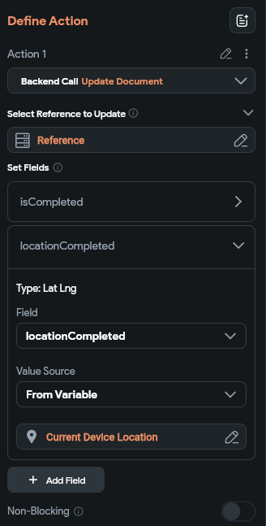

We may also want to make a similar change to the **On Toggled Off** action that clears the `locationCompleted` field.

Now, when we run our app in **Test Mode**, we should see our application try to store the location where a task is completed via the [Firebase Console](https://console.firebase.google.com/)

{}

Unfortunately, the FlutterFlow **Test Mode** does not support actually loading the user's current location through the web browser, so we'll only see the coordinates `[0° N, 0° E]` stored in Firebase. On a real device, this location would be read from the phone's settings.

Of course, this assumes that the user has allowed the application to read the device's location, and that location services are enabled. A more advanced app would include some logic here to check if the location is enabled and available first, and if not it can prompt the user to enable it. 

{}

## Change Password

We already have a place where user's can update their profile's display name and other settings, but we don't currently have a way for users to change their password. So, let's change that!

First, we need a component that we can load to prompt the user to change their password. While we _could_ build this component by hand, let's try some of the AI assisted features in FlutterFlow to see how they work.

First, we'll go to the **Page Selector** and then click the **Generate with AI** button at the top to add new content to our application.

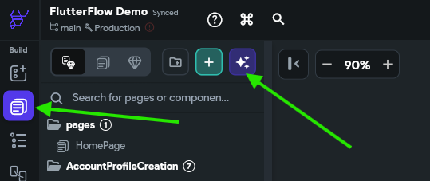

In the window that appears, let's provide an easy to follow prompt for the system. The prompt we'll use is

> Generate a component to be loaded as a bottom sheet to allow the user to edit their password. It should include two password text fields, as well as save and cancel buttons. The design should follow the standard theme used throughout the application with helpful colors and icons. 

Finally, click the **Component** button at the bottom, then click the **Up Arrow** button to let the AI start generating. At the top, you'll see a new icon start spinning while the AI is working in the background, and after a minute or so, you should be able to click on it and see the newly generated component. Here's what our example looked like:

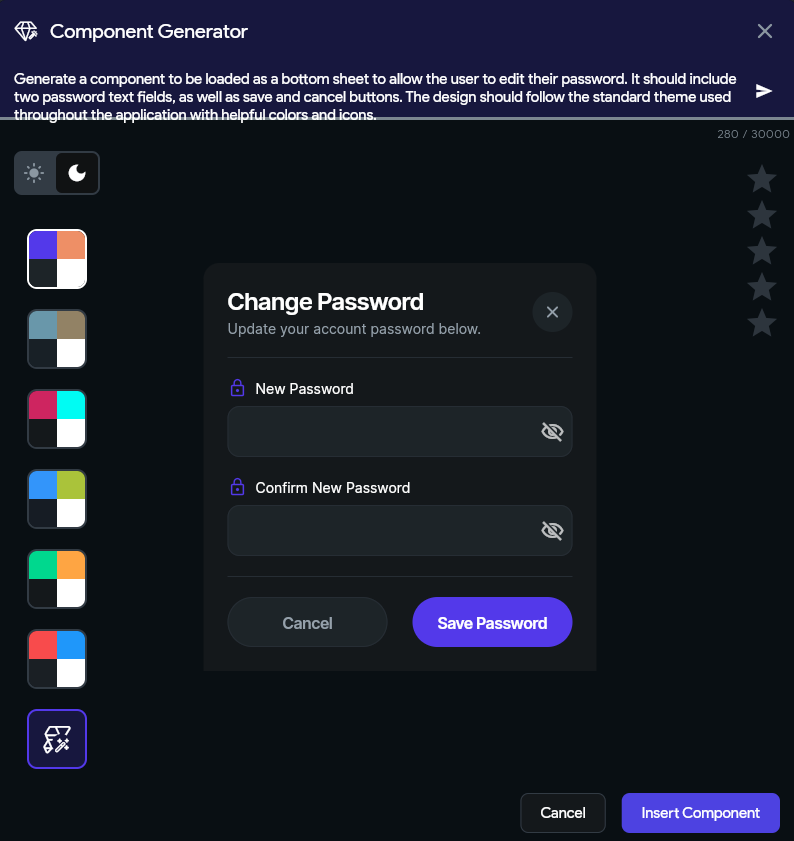

In this view, we can customize our prompt, set some color schemes, and more. If we are satisfied, we can click the {}Insert Component{} button at the bottom to add that component to our application.

Now, let's go to our `auth_2_Profile` page and add a new button to allow users to change their password. We'll just quickly duplicate the **Content View** widget used for the `Edit Profile` button and tweak it a bit to match our needs. Remember that you can duplicate a widget simply by right-clicking on it and choosing **Duplicate**.

Once it is customized, we'll set the **On Tap** action to load our new component in a bottom sheet:

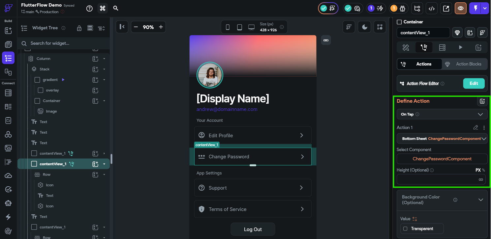

Finally, on our new component, we need to configure the **Cancel** button to dismiss the bottom sheet:

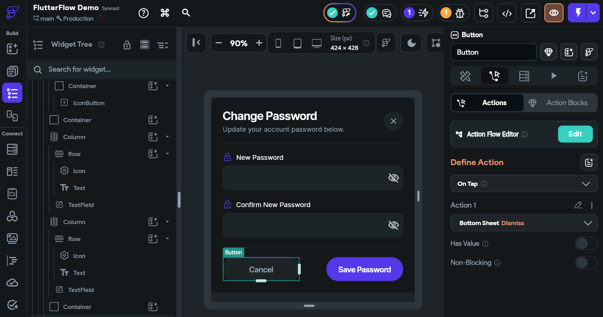

Likewise, we need to configure the **Save Password** button to actually update the user's password using a the **Update Password** action as shown in the animation below:

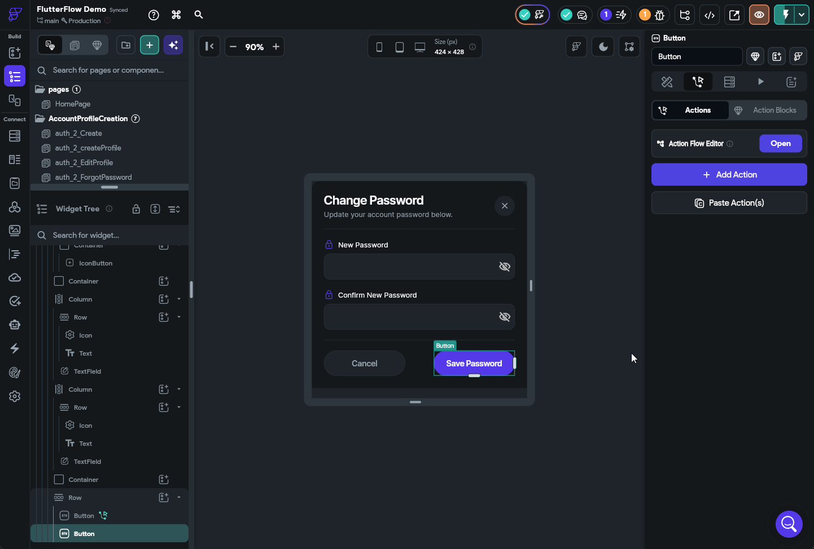

Once that has been updated, try the application in **Test Mode** and see if you can update your password!

{}

As a security measure, Google Firebase requires a recent authentication in order to change a user's password. A simple way to do this is log out and log back in before trying to change the password.

In a real application, often we would add additional functionality to ask the user to input their current password again to perform a new authentication first, then show the interface for updating the password. 

{}

## Delete Account and Data

Next, let's go through the process of deleting data for a user account. Many apps today are required to provide this functionality to comply with various privacy laws, and it is always a good feature to have implemented in case a user wants to stop using the application. Thankfully, doing so is very simple with Google Firebase.

Once again, we're going to add a new button to our `auth_2_Profile` page by duplicating an existing button and tweaking a bit just like we did above. 

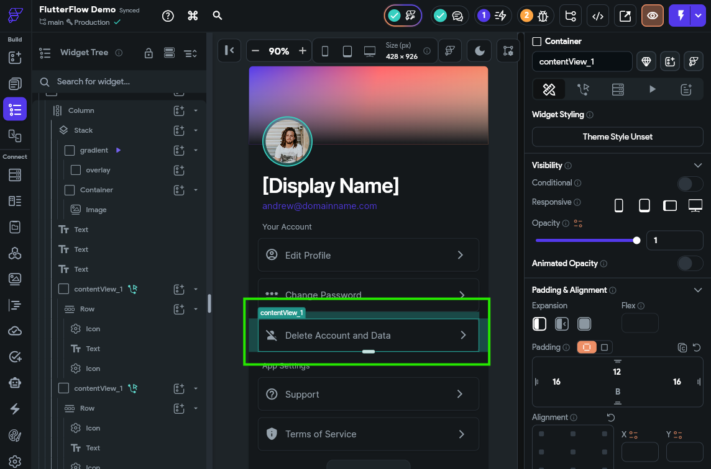

Then, choose the action for that button and look for the **Delete User** action that can be found under the **Backend/Database** options within the **Firebase Authentication** list. 

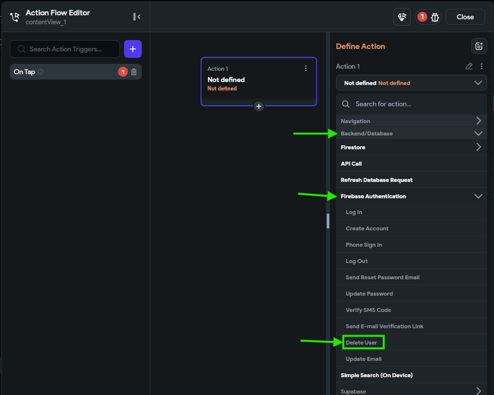

Once that is configured, we must go back to our **Firestore Settings** to configure the collections that have data which must be deleted when a user is deleted. To do that, we just checkmark the last column in the list of collections under **Firestore Rules** to flag the records which should be deleted.

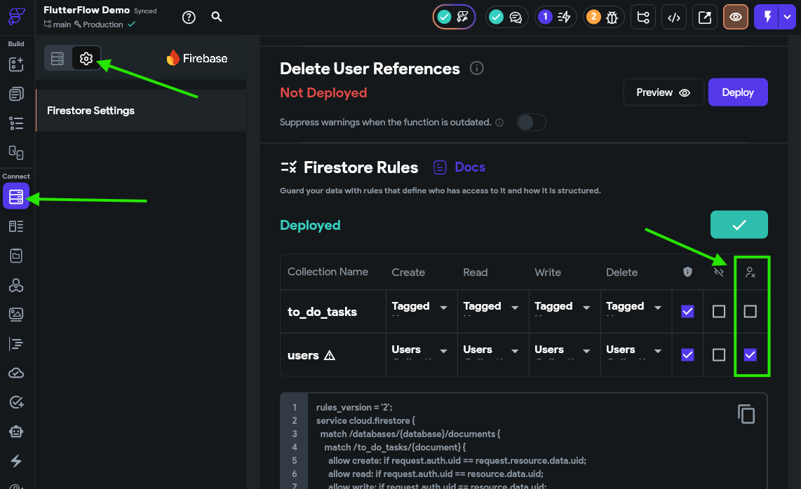

{}

Unfortunately, the last step in this process would be to go to the **Delete User References** section above and click the {}Deploy{} button to deploy those rules. However, those rules are only supported in a paid Firebase plan, which we aren't using for this demo. In a fully deployed application, you should switch to a paid Firebase tier to enable this option fully and test it before releasing the application.

Thankfully, since we have properly secured our data there is no risk of that data being visible to other users, but it is still stored in our system. 

{}

## Gravatar

Another cool feature we can implement in our application is the use of [Gravatar](https://gravatar.com/) profile images in place of our own system for storing and retrieving images. This makes our app a bit simpler since we don't have to store user profile images in a paid Firebase storage plan, and many users on the web already have a Gravatar profile configured to make this quick and easy. The full documentation for this process can be found in the [Gravatar Documentation](https://docs.gravatar.com/sdk/images/).

In effect, all we must do is create a [sha256 hash](https://docs.gravatar.com/rest/hash/) of our user's email address, and then construct a URL to request the image that looks like the following:

```
https://gravatar.com/avatar/<hash>?d=mp
```

The simplest way to do this in our current application is to build this URL when the user account is first created and store it in the user profile's `photo_url` field. First, we'll need to install the `crypto` library, which allows us to generate the sha256 hash of a string. For this, we'll go to our **Settings & Integrations** page and then find the **Project Dependencies** section. Under **Custom Pub Dependencies** we'll just add the `crypto` library. Then, we click the **Refresh** button at the top right to update our project dependencies. 

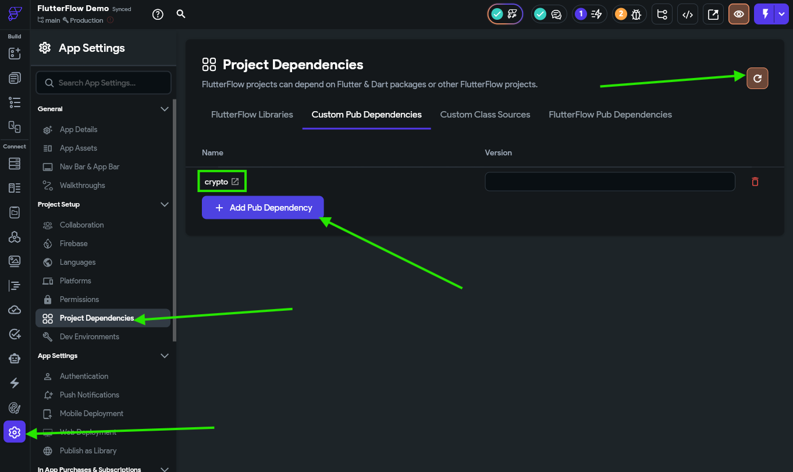

This will refresh our project and install the new library so we can use it in our code.

{}

Just like many other programming frameworks, Flutter includes a whole range of custom packages that we can easily install in our application. You can search for packages to add to your application at [pub.dev](https://pub.dev/). 

In fact, there is even a [Gravatar](https://pub.dev/packages/gravatar) package we could use, but it hasn't been updated in 12 years so it may be best to build our own.

{}

Once the project dependencies are updated, we can write a quick custom action that can generate the proper Gravatar URL for us. Let's go to the **Custom Code** page again and create a new custom action called `generatePhotoUrl` with the following code:

```dart
// Automatic FlutterFlow imports
import '/backend/backend.dart';
import '/backend/schema/structs/index.dart';
import '/flutter_flow/flutter_flow_theme.dart';
import '/flutter_flow/flutter_flow_util.dart';
import '/custom_code/actions/index.dart'; // Imports other custom actions
import '/flutter_flow/custom_functions.dart'; // Imports custom functions
import 'package:flutter/material.dart';
// Begin custom action code
// DO NOT REMOVE OR MODIFY THE CODE ABOVE!

import 'package:crypto/crypto.dart';
import 'dart:convert';

// Set your action name, define your arguments and return parameter,
// and then add the boilerplate code using the green button on the right!

Future<String> generatePhotoUrl(String email) async {
  String emailLower = email.trim().toLowerCase();
  var digest = sha256.convert(utf8.encode(emailLower));
  return "https://gravatar.com/avatar/" + (digest.toString()) + "?d=mp";
}
```

Finally, after saving the action, make sure the return type is set to **ImagePath** in the sidebar, even if the function itself returns a **String** value. This is important for making sure our value matches what the database expects in a later step. 

The full setup for this is shown below:

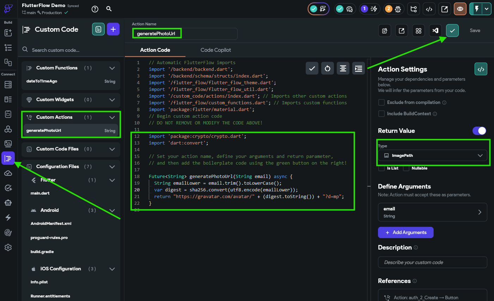

{}

Notice that this time we chose to create a new custom **action** instead of a custom **function**? This is because we cannot import code libraries in a custom function, so we aren't able to access the `crypto` library there. Instead, we can make a custom **action** that includes that import. We just have to make sure the code will compile properly by checking it before continuing.

{}

So, let's go back to our `auth_2_create` page and update the action on the **Create Account** button.

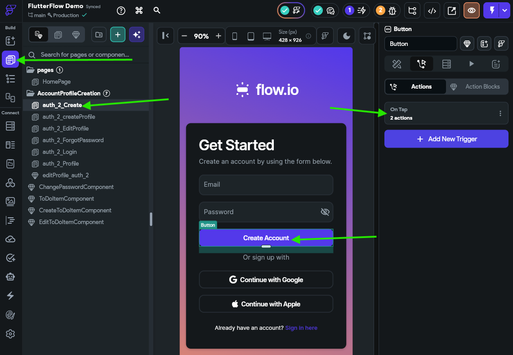

In the **Action Flow Editor**, we'll need to add a new action to the top of the chain that is our new `generatePhotoUrl` action, with the `email` variable set to the `emailAddress` widget state. We can name the output variable `gravatar` for now.

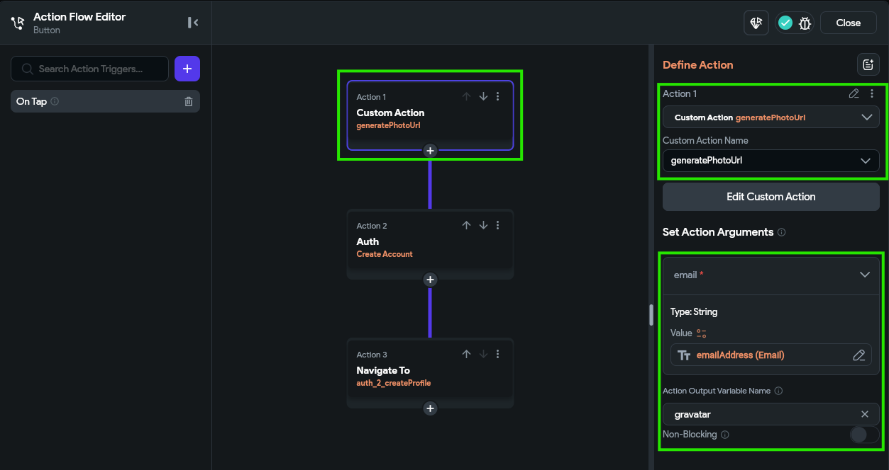

Finally, in the **Create Account** action, we can add the `photo_url` field and set it's value to the `gravatar` variable, found under **Action Outputs** from the previous action.

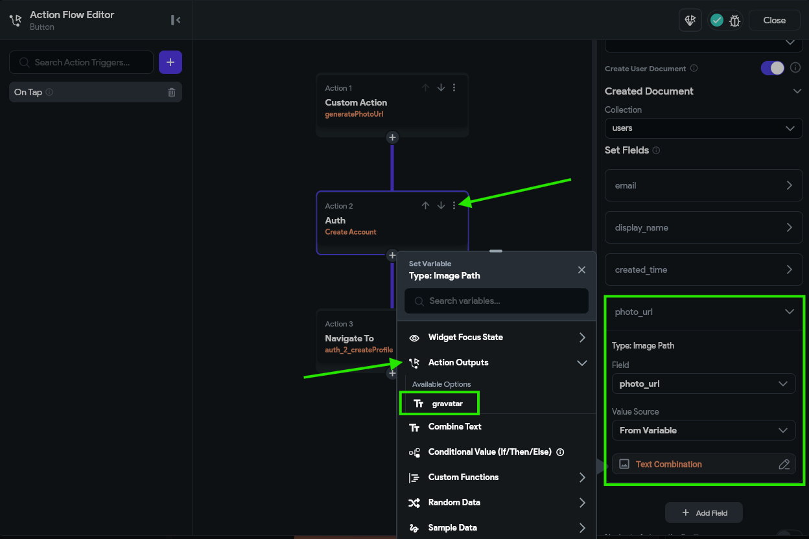

{}

If you get an type mismatch error here, it is probably because you need to back to the `generatePhotoUrl` custom action created above and manually set the output type in the sidebar on the right to be **ImagePath** and not **String**. 

{}

Now, with all that in place, we can run our application in **Test Mode** and see if it works. Of course, we'll need to create an account using an email address that is already registered with [Gravatar](https://gravatar.com/).

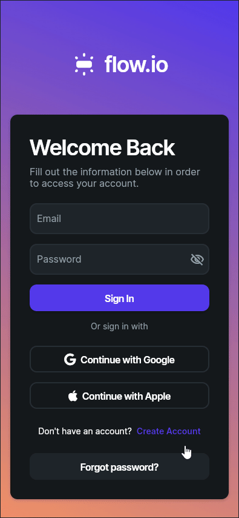

As we test this, we may see a few places that still use the old placeholder image, so we can go through and update those as needed to use the correct `photo_url` field. 

{}

Right now our application just stores the URL of the user's Gravatar image directly in the application. However, by storing that URL instead of the photo itself, it allows the user to update their profile image directly in Gravatar and then that new image will be shown in our application (because the URL of that image itself did not change). This allows users to seamlessly update their profile images without our app having to do anything!

{}

## Summary

At this point, we have implemented a large number of the features we wanted to include in our application:

- [X] To Do tasks should include a short title and longer description.
- [X] To Do tasks should track the date it was created and the date it is due.
- [X] To Do tasks should track whether it has been completed or not.
- [X] Tasks may optionally have an address associated with the task.
- [X] To Do tasks should be assigned to different priorities (Low, High).
- [X] When a task is completed, it should track the date and time when it was completed.
- [X] Users should be able to create, edit, and delete tasks.
- [X] Tasks should be sorted according to completion, due date, and priority.
- [X] Our application should include user accounts so that multiple users can use the app.
- [X] User accounts should use an email address and password to log in.
- [X] User data should be stored in the cloud so they can use the app across devices.
- [X] Each user's data should be stored securely and not accessible by other users.
- [X] If a task has an address, the application should allow the user to request directions to that address.
- [X] If the user gives permission, it should also track the location where a task was completed.
- [ ] Our application should track the percentage of tasks completed on-time (before the due date).
- [X] Users should be able to configure their display name and update their password.
- [X] Users should be able to delete their account and all associated data.
- [X] User profile pictures should be visible from [Gravatar](https://gravatar.com/)
- [ ] The app should display a global leaderboard showing the users with the highest on-time completion percentage.

All that is really left is tracking the percentage of tasks completed on-time and building a leaderboard. We'll cover that on the next page of this tutorial.

