

One of the last features we could add to our application is a leaderboard, which keeps track of the percentage of tasks that are completed on time. This will demonstrate some additional functionality we can build in Firebase to allow users to share data in a protected way throughout the application.

{}

In these last parts of the tutorial, we'll shift to showing a bit less of the process in screenshots and assume that you are becoming comfortable with navigating through an application in FlutterFlow. However, if you get stuck at any point, refer to the video above for a visual walkthrough of the whole process.

{}

## Leaderboard Collection

First, we'll need to create a `leaderboard` collection in Firebase with the following attributes:

* `onTime` - Integer
* `totalCompleted` - Integer
* `displayName` - String
* `photoUrl` - Image Path
* `uid` - String

After creating that collection, we should see this layout:

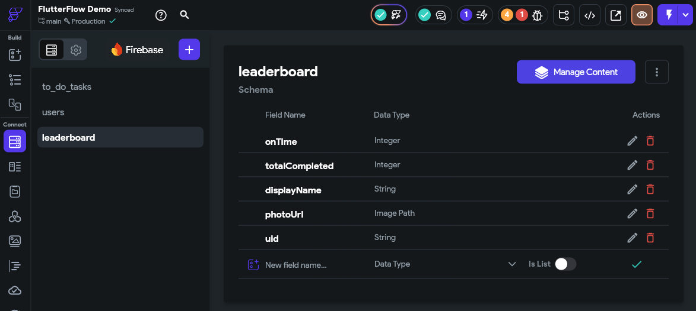

Next, we'll go to the **Firestore Settings** and scroll down to the **Firestore Rules** section. Here, we'll set the `leaderboard` collection to have the following rules:

* Create - Tagged Users (use the `uid` attribute)
* Read - Authenticated Users
* Write - Tagged Users (use the `uid` attribute)
* Delete - Tagged Users (use the `uid` attribute)

With this setup, users will be able to create, update, and delete their entry in the leaderboard, and all authenticated users will be able to read the contents of the leaderboard. This is what allows us to display the leaderboard for each user!

Finally, checkmark the box to delete data if the user account is deleted as well. When completed, the final rules should look like this.

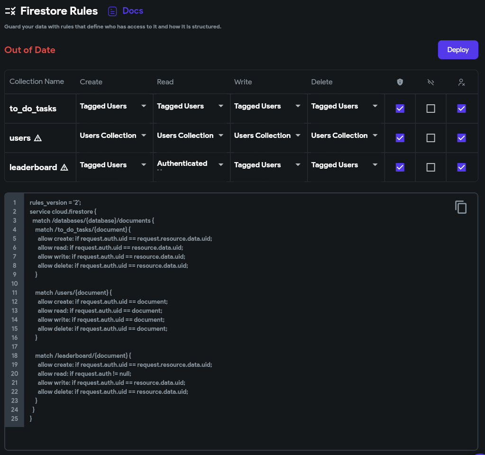

Go ahead and click the {}Deploy{} button to deploy those rules to Firestore.

## Creating the Leaderboard

Next, we need to update our process for creating a new user to add an entry to the `leaderboard` collection as well. So, we'll go to our `auth_2_Create` page and update the action tied to the **Create Account** button to add another step. This step will create a document in the `leaderboard` collection with the following field values:

* `onTime` - 0
* `totalCompleted` - 0
* `displayName` - `emailAddress` widget state
* `photoUrl` - `gravatar` action output from the `generatePhotoUrl` action
* `uid` - the `User ID` from the authenticated user

The final setup will look like this:

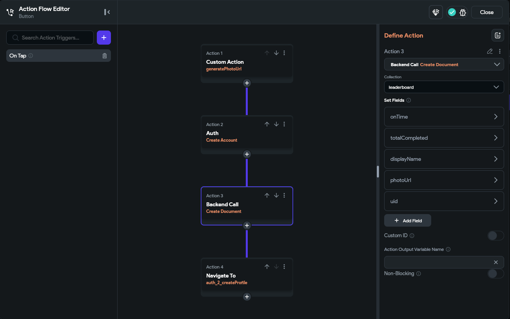

Now, when we create a new user account, we'll also create an entry for that user in the `leaderboard` collection.

## Updating the Leaderboard Display name

Of course, we also want to allow the user to update the display name shown in the leaderboard. So, in the `editProfile_auth_2` component, we need to update the action attached to the **Button** widget at the bottom to update that document as well. First, we need to add a **Backend Query** to the top-level **Form** widget in this component to get the user's `leaderboard` entry so it is accessible in the widget's state. 

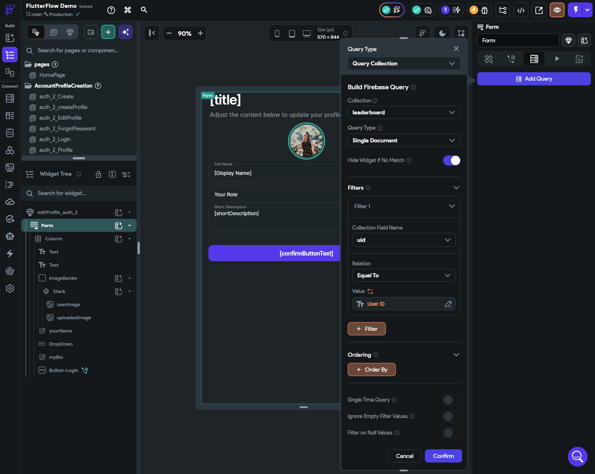

Now, we can use that query result to update the user's `leaderboard` entry in the **Button** widget's action. For this, we'll add a new **Update Document** action below the existing one in the action flow, and update the `displayName` field in the `leaderboard` document to match the `yourName` field's widget state. 

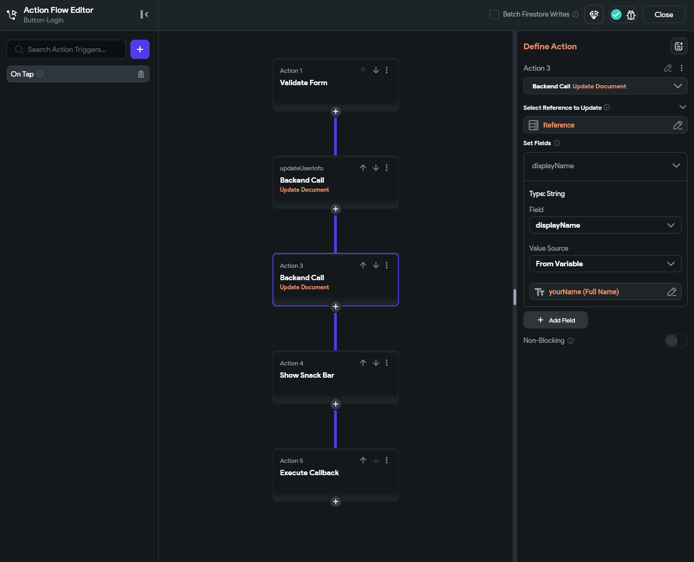

This allows the user to update their name on the leaderboard. Of course, to update their display image, they'll have to update their entry on Gravatar. 

## Tracking Leaderboard Stats

Now for the fun part! Let's update our process for marking tasks complete to track the statistics in the leaderboard. For this, we'll once again start by adding a backend query, but this time we'll add it to the **HomePage** of our application. This query will again get the user's document in the `leaderboard` collection:

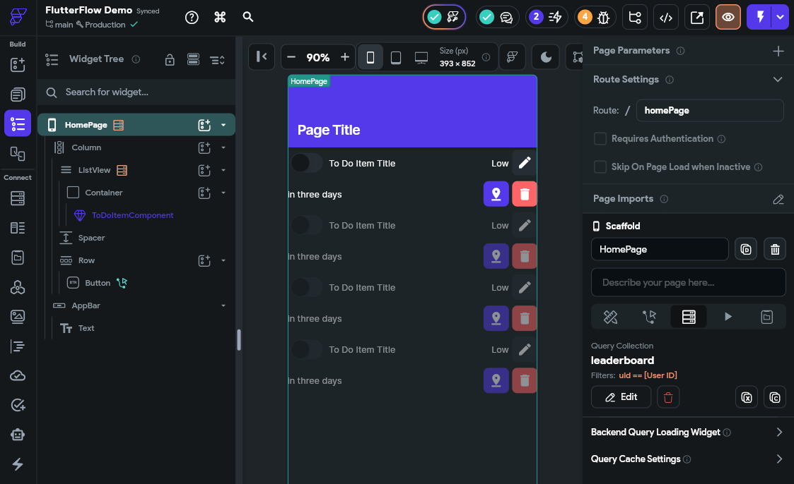

Next, we'll need to pass that query value to each of our `ToDoItemComponent` components in the **ListView** widget. So, we'll start by defining a new parameter for that widget that accepts the `leaderboard` document.

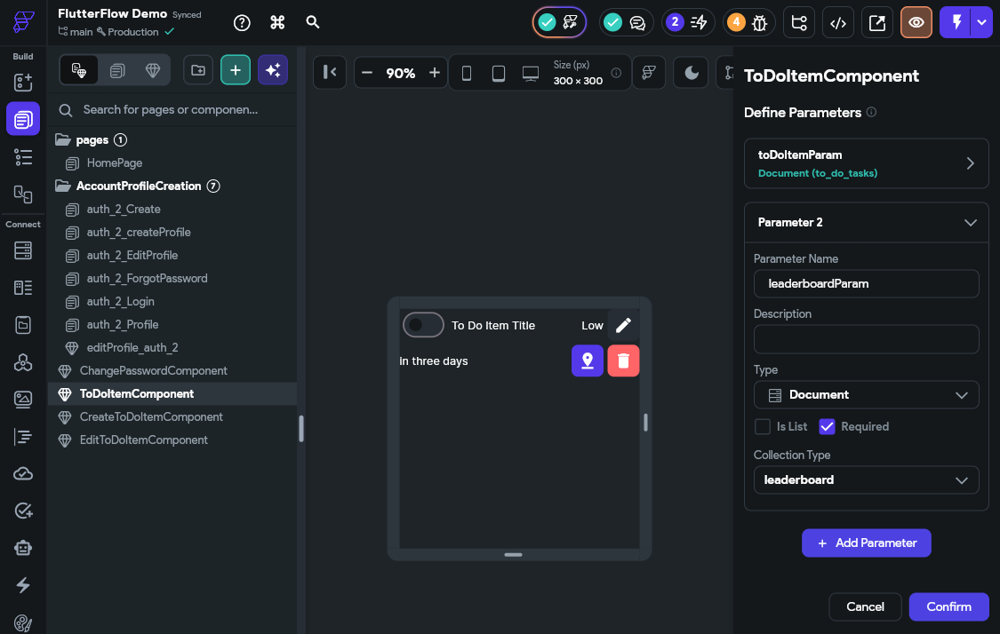

Then, we'll set that parameter to match the `leaderboard` document in our **HomePage** page from the query we just created. 

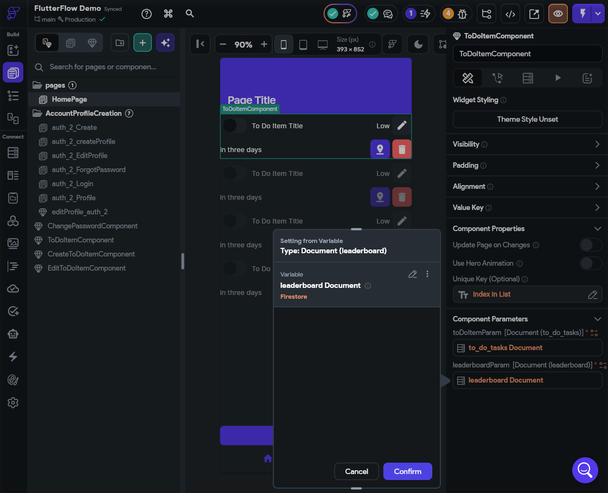

After that, we'll need to create a quick custom function to help us compare dates. We'll call this `dateIsBefore` and set it up with the following settings:

* Argument 1 - `date1` as a String
* Argument 2 - `date2` as a String
* Return Value - Boolean

The contents of the function will be a simple date comparison:

```dart
bool dateIsBefore(
  String date1,
  String date2,
) {
  /// MODIFY CODE ONLY BELOW THIS LINE

  return date1.compareTo(date2) < 0;

  /// MODIFY CODE ONLY ABOVE THIS LINE
}
```

The final code will look like this:

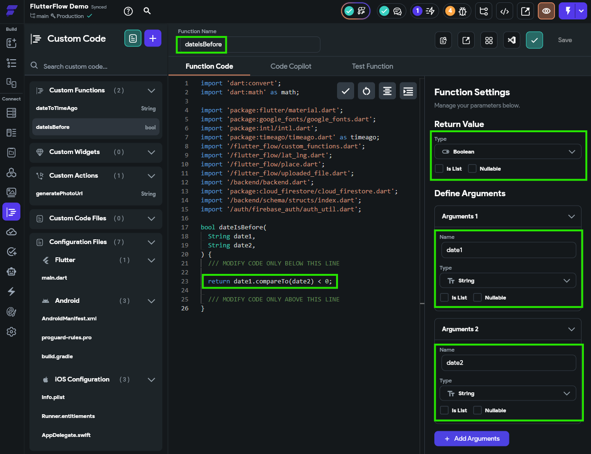

Once created, save the function and check the code to make sure it is valid before continuing. 

Now, back on our `ToDoItemComponent` component, we need to update the logic attached to our **Switch** widget. For this, we'll add another action to each of the states. 

For the **On Toggled On** action, we'll do the following:
* Increment the `totalCompleted` field by 1 (in the **Value Source**, look for an **Update** option to find **Increment**)
* If the device's current date is less than the due date, increment the `onTime` field by 1, otherwise leave it alone.

To do this, create a **Conditional Value** for the increment value, and use the new `dateIsBefore` function to compare the device's current time with the `dateDue` value of the task. If the current time is before that date, then increment by 1. Otherwise, increment by 0 (leaving the value unchanged).

The key here is that we'll need to do this action _before_ we update the `to_do_tasks` document, to make sure that our leaderboard is updated before the tasks list is updated.

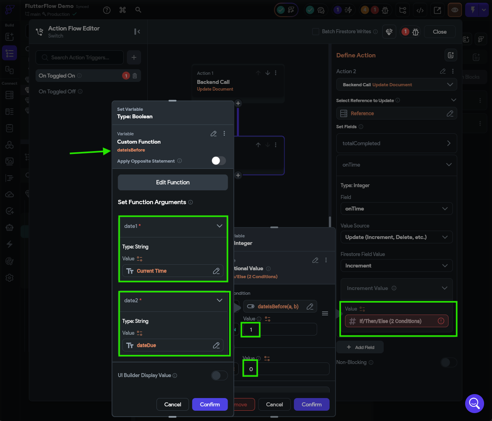

We'll do something similar for the **On Toggled Off** action:
* Decrement the `totalCompleted` field by 1
* If the `dateCompleted` value of the task is less than the `dateDue`, also decrement the `onTime` field by 1. Otherwise, leave it alone. 

Just like before, we'll need to do this action _before_ we update the `to_do_tasks` document, since we need to access the `dateCompleted` field before it is reset. So, when adding this action to the action flow, make sure it comes first. 

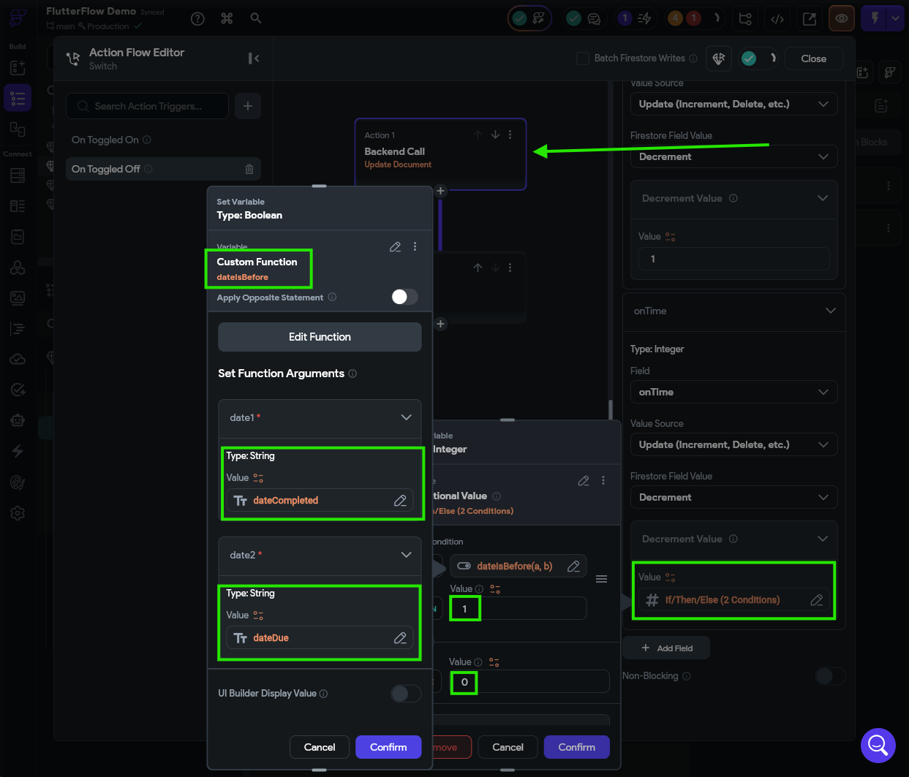

Finally, let's test this setup in **Test Mode** to make sure it is working correctly. It may be helpful to also have the [Firebase Console](https://console.firebase.google.com/) open at the same time to see the changes as they are made. Remember that you'll have to create a new account for this to work!

{}

In fact, now is a good time to completely clear out Firebase, including all accounts and documents, since this is the last major change we'll be making to our Firebase structure. This gives us a clean slate for future testing.

{}

If everything goes to plan, we should be able to see our leaderboard updating in real time as we complete tasks in our list.

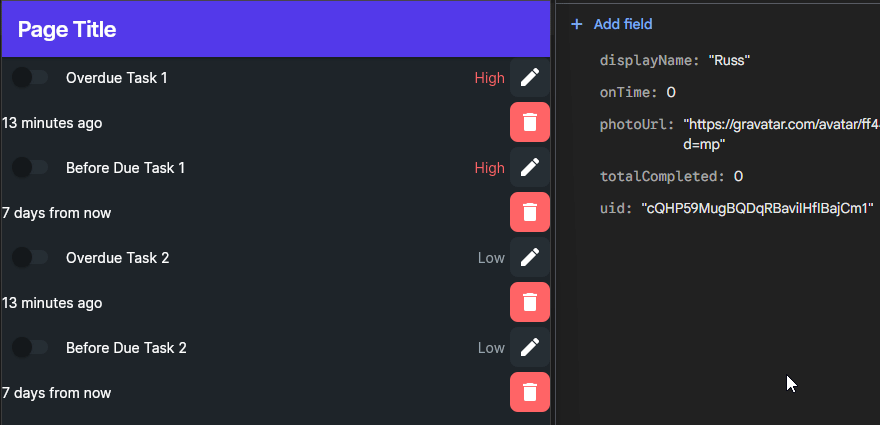

Now all we have to do is create a page to display that leaderboard!

## Creating a Leaderboard Page

The last step in this process is to create a page to display our leaderboard. **This is left as an exercise for you to complete**, but here are some basic things you'll probably need to do:

1) Currently we don't track the percentage of tasks completed on time, so we'll have to add that as an attribute to our `leaderboard` collection and make sure it gets updated each time a task is completed (or marked as incomplete). 
   * Hint: do this as a separate action in the action flow for the **Switch** widget after the leaderboard fields are updated; this ensures that you are reading the new values for each field. You can use an inline function to perform the division operation between two fields that are linked as parameters to the inline function. 
2) Create a new page for the Leaderboard. You can use FlutterFlow's AI designer to get started with this.
   * Here's the prompt we used: Create a page to display a leaderboard showing the top three entries in the leaderboard collection based on the percentage of tasks completed on time. The leaderboard should show the users profile image, display name, and percentage of completed tasks. It should not have any interactivity, just a static display of those three values from the collection. 
3) Once the page is created, add a backend query to get the top 3 items in the `leaderboard` collection based on the percentage of tasks completed on time. 
4) Use the results of that query to populate the data on the leaderboard page
   * This can be a tedious process in FlutterFlow. Pages that are very data-heavy like this show the limitations of this platform compared to doing it directly in code, which may be faster. 
   * You may need to set proper default values or conditional visibility on leaderboard widgets to seamlessly handle the case where you have fewer than 3 entries in the leaderboard collection. 
5) Add the Leaderboard page to the nav bar so users can see it.

A final, working design for this page might look like what is shown below:

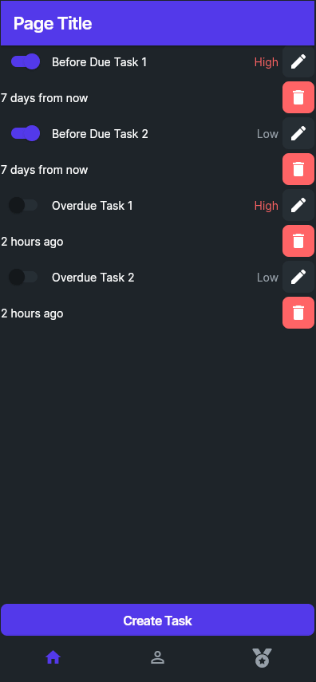

## Summary

Finally, we have completed all of the features in our original feature list for this application:

## Summary

At this point, we have implemented a large number of the features we wanted to include in our application:

- [X] To Do tasks should include a short title and longer description.
- [X] To Do tasks should track the date it was created and the date it is due.
- [X] To Do tasks should track whether it has been completed or not.
- [X] Tasks may optionally have an address associated with the task.
- [X] To Do tasks should be assigned to different priorities (Low, High).
- [X] When a task is completed, it should track the date and time when it was completed.
- [X] Users should be able to create, edit, and delete tasks.
- [X] Tasks should be sorted according to completion, due date, and priority.
- [X] Our application should include user accounts so that multiple users can use the app.
- [X] User accounts should use an email address and password to log in.
- [X] User data should be stored in the cloud so they can use the app across devices.
- [X] Each user's data should be stored securely and not accessible by other users.
- [X] If a task has an address, the application should allow the user to request directions to that address.
- [X] If the user gives permission, it should also track the location where a task was completed.
- [X] Our application should track the percentage of tasks completed on-time (before the due date).
- [X] Users should be able to configure their display name and update their password.
- [X] Users should be able to delete their account and all associated data.
- [X] User profile pictures should be visible from [Gravatar](https://gravatar.com/)
- [X] The app should display a global leaderboard showing the users with the highest on-time completion percentage.

There are still lots of design elements we can update and personalize to make this app our own, and there is still plenty of room for additional testing before preparing this application for release. In the next part of this tutorial, we'll add one other important feature to our application and prepare it for deployment.


