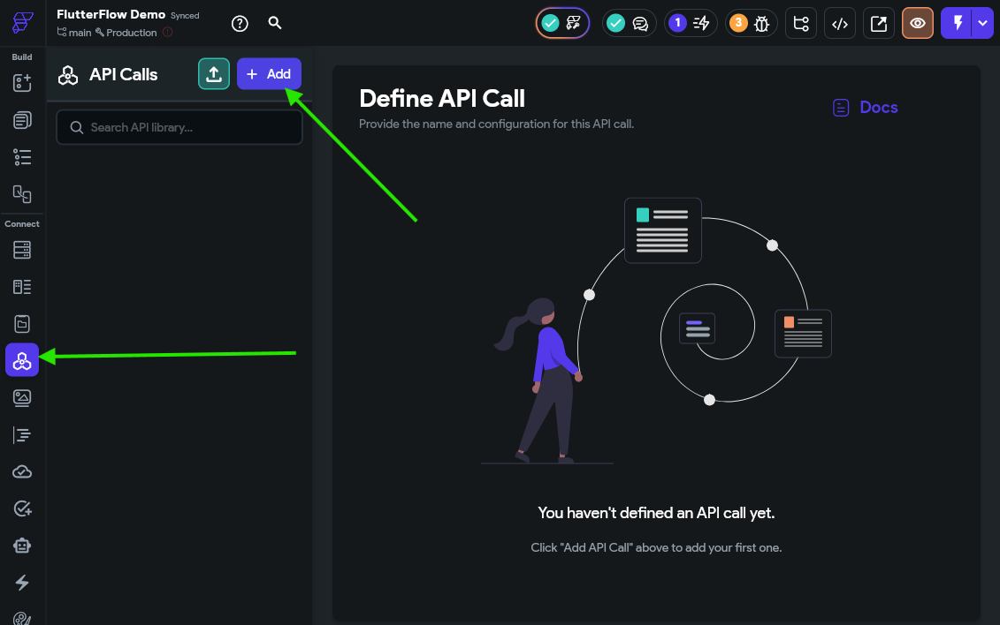
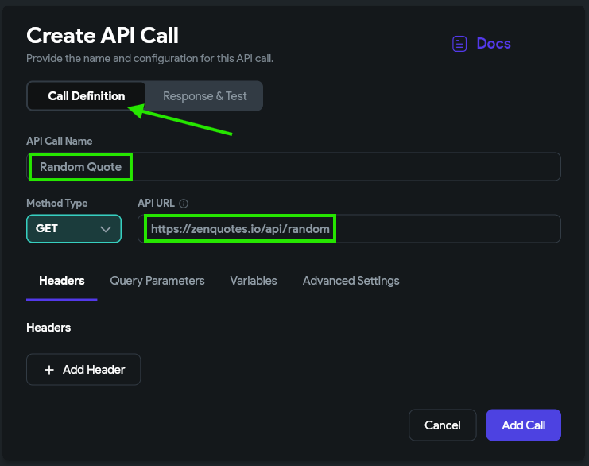
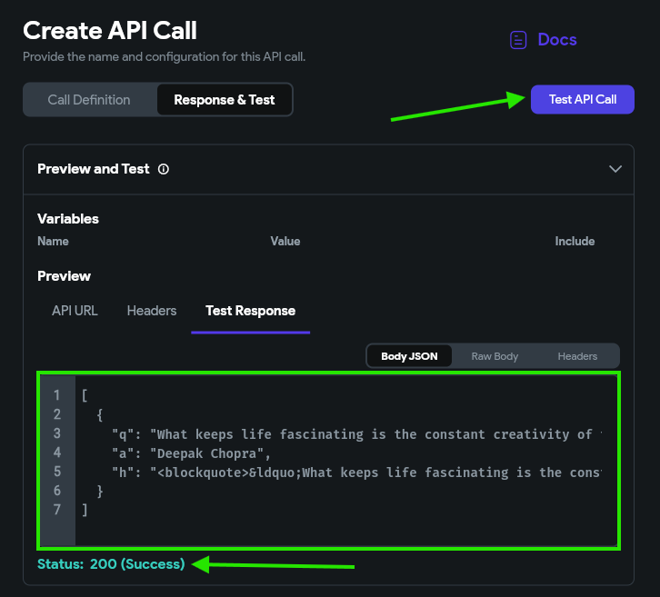
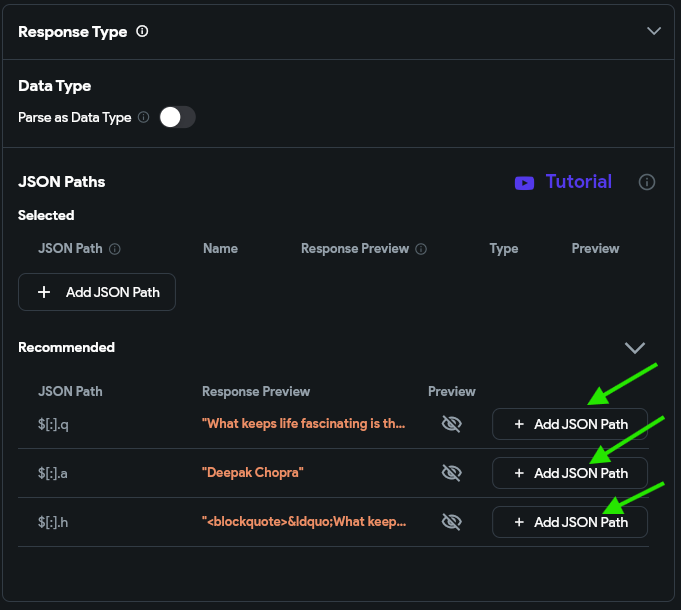
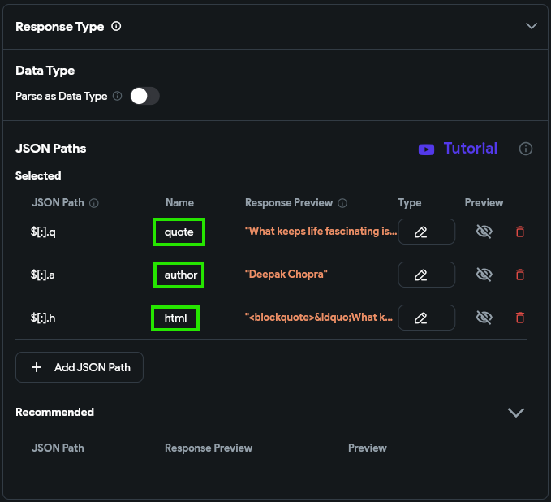
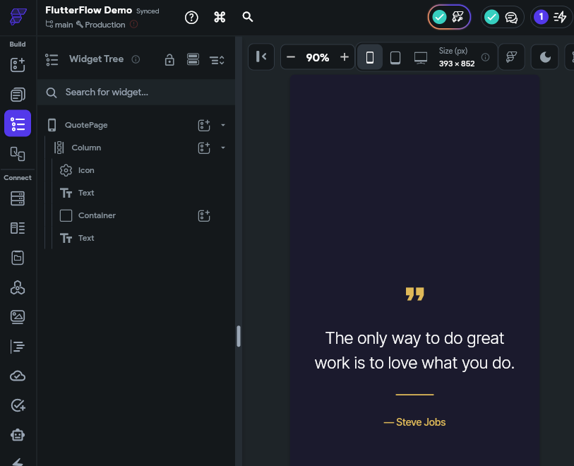
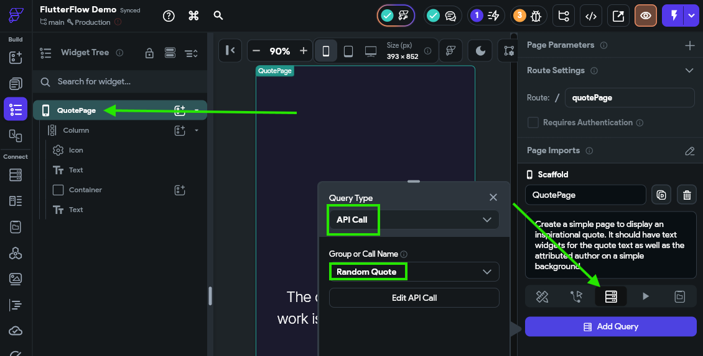
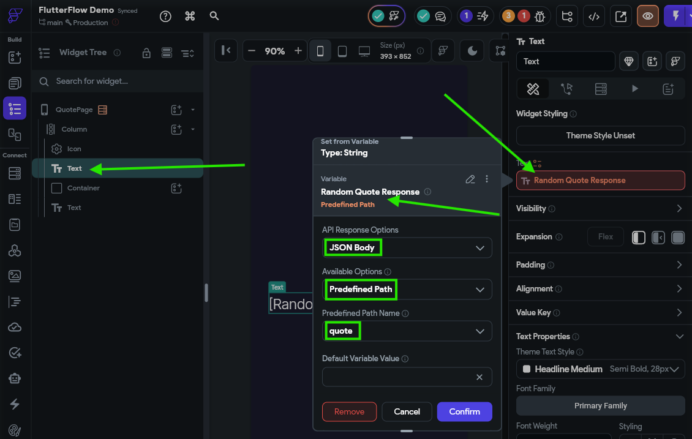
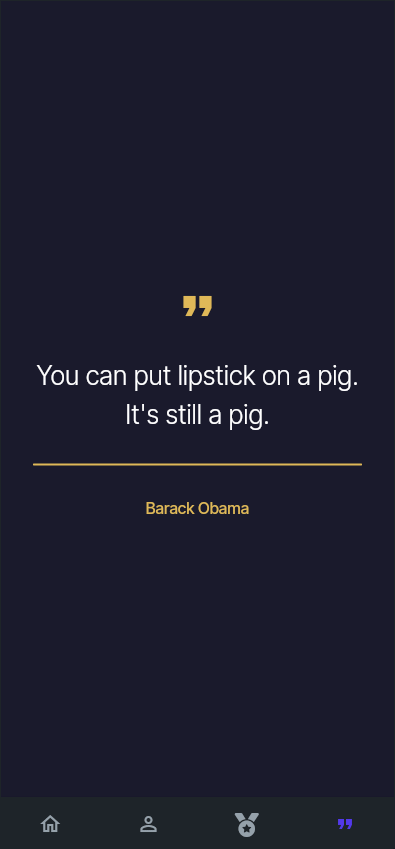



Another very useful feature we may want to include in our application is the ability to query data directly from a web API and include that in our application. So, let's look at the basic process of adding an API call to our application.

{}

Recall our discussion from earlier in this tutorial about the security concerns that are inherent in building a mobile application that is installed on user's devices. Anything contained in the application is potentially visible to the user, and this includes any API keys used within the application itself. An API key is how users are identified when they access a paid API service, such as a weather data service or an AI chat service.

For example, consider a situation where you want users of your application to talk with an AI chat service. To enable this, you as the developer sign up for an API key to access the AI service, and then use that API key within your application. Each message sent to the AI chat service involves some cost paid by you, but you are able to offset that by payments from your users who use the application. However, one user decides to take apart your application and finds your API key - now they can send unlimited message to the AI chat service, and you'll be the one stuck paying the bill!

To avoid this, you must either embed your API key in a cloud function (either one hosted on Firebase or elsewhere), or build a back-end service for your application that contains your secure API key and other information. Either way, your app must talk to another service that includes the API key so that the API key isn't part of the app itself. Building such a system is outside of the scope of this tutorial, but FlutterFlow does include some options for routing API calls through a secure cloud function if that is available to you in a paid Firebase plan.

For this tutorial, we will only use free APIs that don't require an API key.

{}

## Finding a Free API

There are many lists of APIs available on the web. One notable list is the [Public APIs](https://github.com/public-apis/public-apis) list hosted on GitHub. It contains a long list of free, publicly available APIs, many of which don't require any API keys at all.

For this example, we'll use the random quotes API provided by [ZenQuotes.io](https://zenquotes.io/). They provide many examples of retrieving a quote in the [ZenQuotes Documentation](https://docs.zenquotes.io/zenquotes-documentation/), but for this example we'll just use their random quote generator, available at this URL: https://zenquotes.io/api/random

A response from that URL has this structure:

```json
[
  {
    "q": "Tis not too late to seek a newer world.",
    "a": "Heraclitus",
    "h": "\u003Cblockquote\u003E&ldquo;Tis not too late to seek a newer world.&rdquo; &mdash; \u003Cfooter\u003EHeraclitus\u003C/footer\u003E\u003C/blockquote\u003E"
  }
]
```

The response consists of a list containing a single object with 3 attributes:

* `q` - the raw text of the quote
* `a` - the attributed author of the quote
* `h` - a pre-formatted HTML snippet containing the quote and the author

As we can see, this is a very simple but useful structure we can use in our application. So, let's add it to FlutterFlow.

## Adding an API

To add an API call, go to the **API Calls** page found in the **Navigation Bar**, then click the {}Add{} button at the top to add a new API call.



On the **Call Definition** section, we'll give the API call a name and add the URL. Since we don't need to add any parameters or headers, we'll leave the rest blank for now.



Then, on the **Response & Test** section, we can click the {}Test API Call{} button to test our API and receive a response. 



Below, we can also add some JSON paths to our API to make it easier to find certain parts of the response in our application. Let's just add the three suggested paths for this example.



Once we add them to the list, we can give them useful names such as `quote`, `author`, and `html`.



Finally, we can click the {}Add Call{} button at the bottom to save our API call in our application.

## Using API Calls

Now, we can use our API call in our application. For this example, we'll create a new simple page using the AI page generator to display our quote as well. For our example, we used the following prompt:

> Create a simple page to display an inspirational quote. It should have text widgets for the quote text as well as the attributed author on a simple background. 

We ended up with this page with a very simple layout:



To use this page, we must first add our API call to the page itself. This can be done on the **Backend Query** tab, and this time selecting an **API Call** as the query type.



Once that is done, we can set the text for each **Text** widget to the results of the API call:



That's really all there is to it! For testing, we'll add this page to our nav bar so it is accessible. Then, we can load our application in **Test Mode** to see it in action!



Each time we reach the quotes page, it will pull a new quote from the API. 

## Summary

As we can see, using an API in our application is very straightforward. Here are just a few things you could use APIs for in your application:

* Getting the current weather
* Getting recommendations for movies, music, books, and more
* Finding cover art for music
* Getting data about Pokemon
* Accessing transit schedules
* Getting airline flight data

The possibilities are endless! Just make sure you protect your API key for any paid APIs as discussed above.


