+++
ordinal = "6"
title = "Video Intros"
pre = "<b>6. </b>"
weight = 6
+++

{}

To get access to any of the MS Teams, YouTube channels, or online tools that are needed for this project, contact Russ Feldhausen or another faculty.

{}

## Step 0 - Acquire New Intros



The new intros are currently in the **Computational Core Faculty** MS Team Folder under `Documents > Video Editing > CS Zero > New AI Intros`:

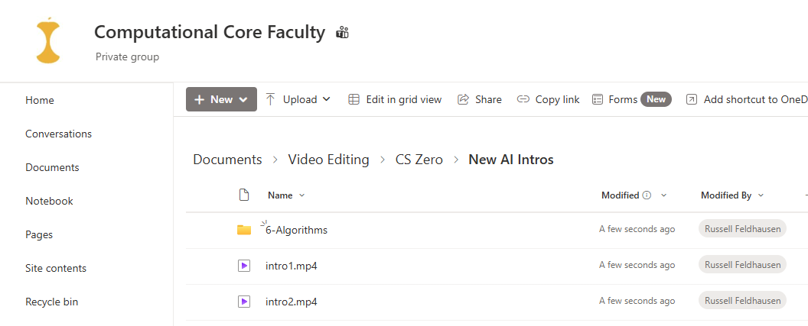

Download and save these videos locally. Alternatively, you can choose to link the top level `Video Editing` folder to your own Microsoft OneDrive to sync it to your computer for access there.

## Step 1 - Acquire Original Video

For this step, you'll need to acquire a few things:
1. The existing edited video (you pretty much need this)
2. The intro image (this can be recreated; see below)
3. The subtitle file (this can be recreated; see below)

After acquiring all of the materials for one video, you'll have something like this:

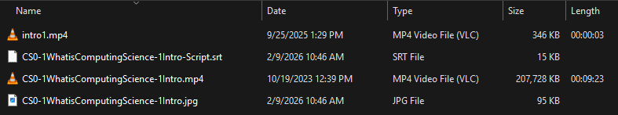

I recommend downloading a chapter's worth of videos at a time, so you can edit them all at once. So, I'll download the second video in this chapter as well.

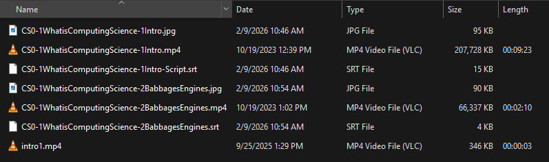

### Step 1A - Original Videos

Most videos are in the Computational Core Faculty MS Team folders on SharePoint:

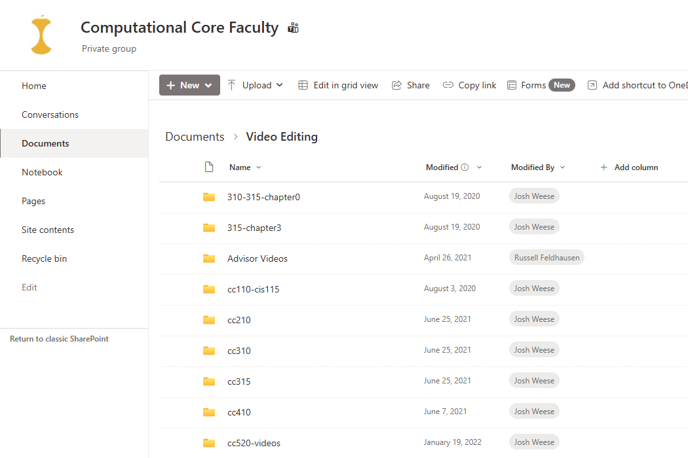

For the CS Zero course (CC 110 / CIS 115), they are in the `Video Editing > CS Zero` folder, organized by topic:

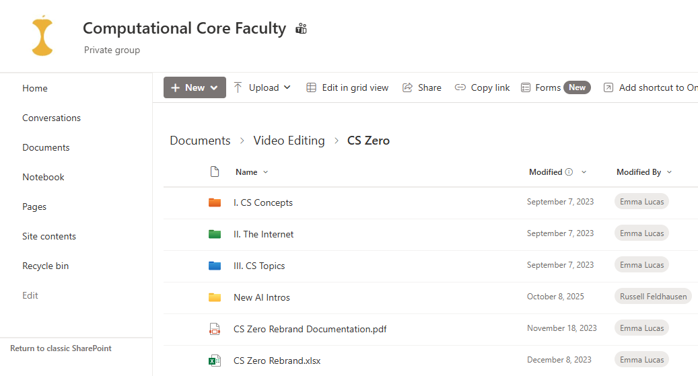

When you find a video, make sure that the title image matches the video that you are replacing. So, find the video on the textbook at https://textbooks.cs.ksu.edu/ and compare. There are several versions out there for CS Zero, but generally we want the one that says "Introduction to Computing" at the bottom. The other courses have been more consistent throughout.

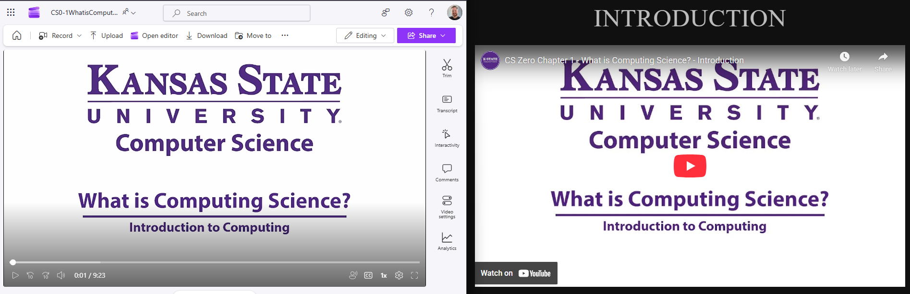

Once found, you'll want to download the edited `.mp4` version of the video. 

{}

Alternatively, if you cannot find the original videos, they can also be downloaded through YouTube. You'll need to log in to the Computational Core YouTube channel, then go to YouTube Studio and search for the video by title or ID. Once found, click the Menu button to download the video:

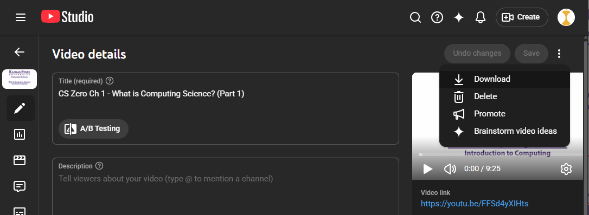

However, these videos may have been compressed or modified by YouTube, so we don't want to use them unless we must.

{}

### Step 1B - Intro Image and Subtitles

If available, often in a nearby `Other Materials` folder, you'll also want to download the intro image `.jpg` or `.png` as well as the subtitle file `.txt` or `.srt`. The subtitle file should have timestamp markers contained inside like this example:

```srt
1
00:00:04,400 --> 00:00:07,250
Unknown: In this course, we're
going to ask ourselves, what is

2
00:00:07,250 --> 00:00:10,100
computing science? It's a really
important topic that we'd like
```

If so, feel free to rename it from `.txt` to `.srt` so that it works well with other programs.

{}

The subtitle files are plan text files with extra formatting, but many programs expect them to use the `.srt` file extension in order to work properly. So, I recommend renaming them to change the extension as needed. If you don't see file extensions in your file browser, you should [enable them](https://www.youtube.com/watch?v=CvJn_8ZUdpk).

{}

If you don't find these, they can easily be recreated later in this process.

## Step 2 - Edit Videos in DaVinci



In this step, you'll need to load the video to be edited as well as the intro to be added to a video editing program. I'll discuss how to do this using DaVinci Resolve. 

First, open up DaVinci Resolve and create a new project:

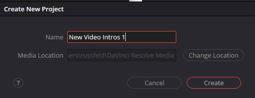

In DaVinci, go to the Media tab, and drag the two `.mp4` video files (the original video and the new intro) into the media pool below. If you are editing multiple videos, you can drag them all into the media pool at once. If prompted, choose to change the Timeline frame rate and settings to match the clips.

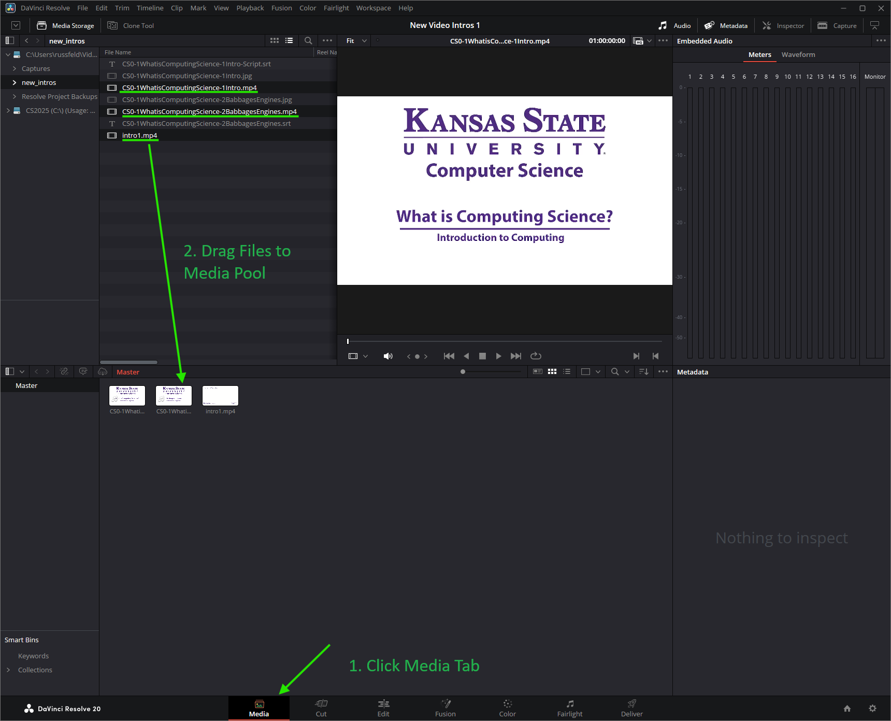

Now, we'll repeat some steps for each file.

### Step 2A - Edit Individual Timeline

In DaVinci, click the Edit tab and then click `File > New Timeline` to create a timeline. Give it a helpful name (e.g. "1 - What is CS"). 

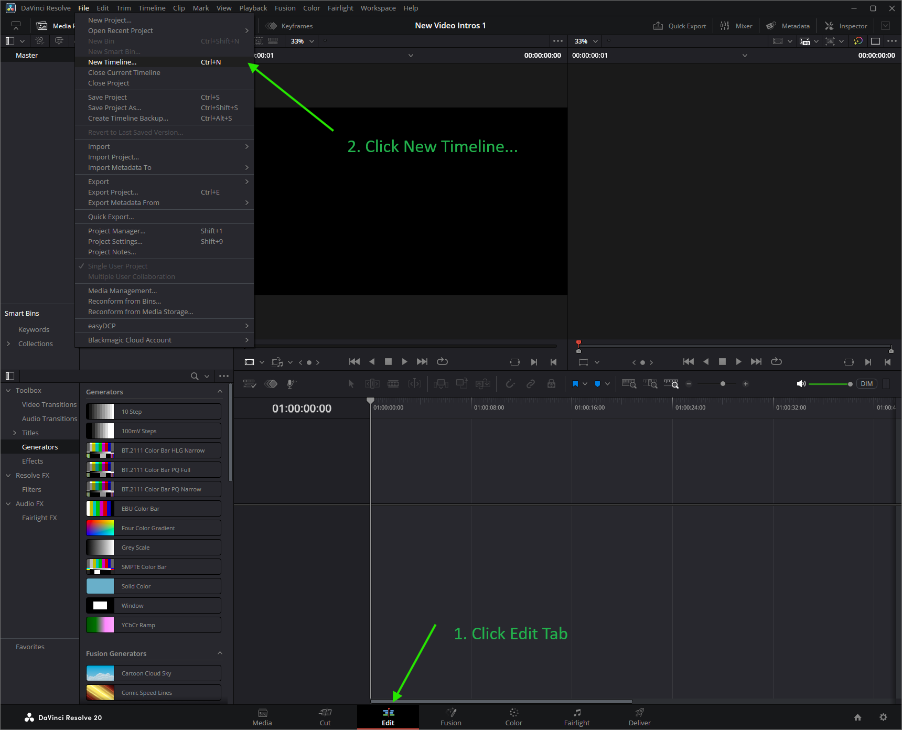

You will now see the timeline selected in the Media Pool at the top, and a new timeline at the bottom in the Edit Panel. 

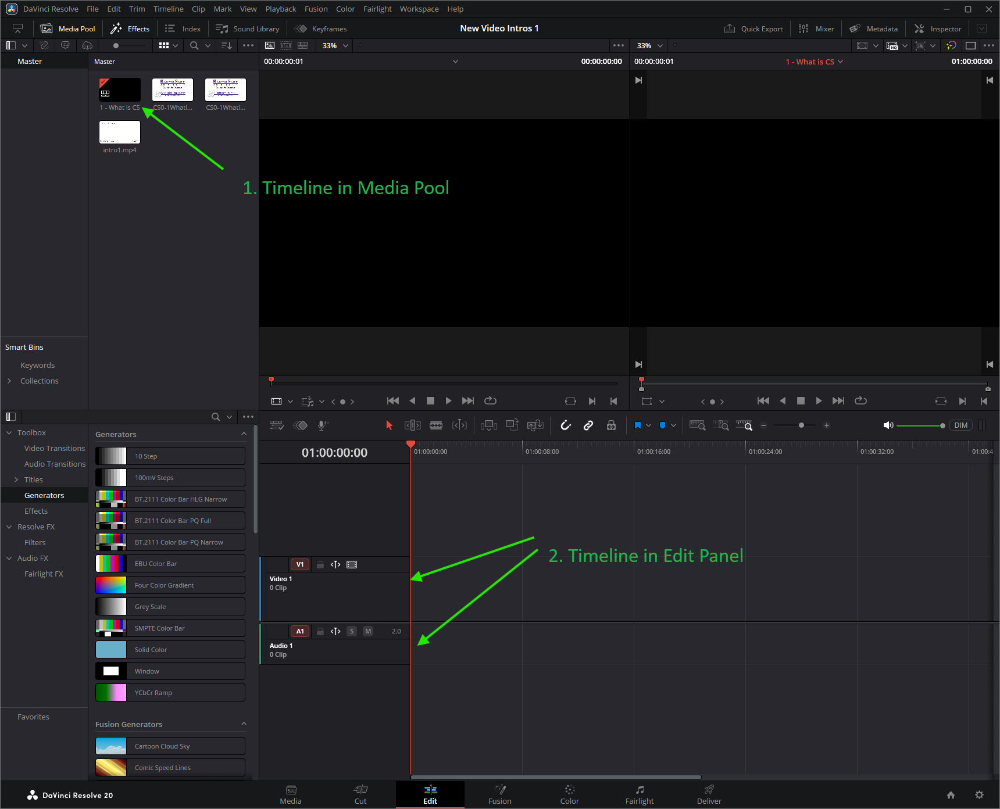

Next, click and drag the original video onto the timeline. Once that is done, click and drag the new intro and place it above the video in the timeline - it should create a new "track" for the video. Make sure it is aligned with the beginning of the original video. You can use the slider to adjust the zoom as needed to make it easier to see.

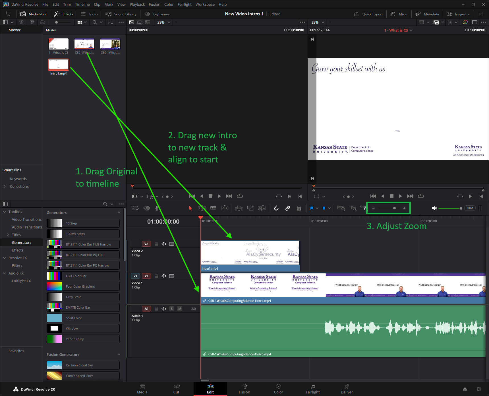

At this point, you can watch the video and see what it looks like. Generally we like to have 5 seconds of intro before the video, which is enough time for 3 seconds of the new intro (they are 3:15 long, but with the crossfade it is really 3 second) plus 2 seconds of the original title screen. However, notice that this video cuts the original title screen short at 4 seconds:

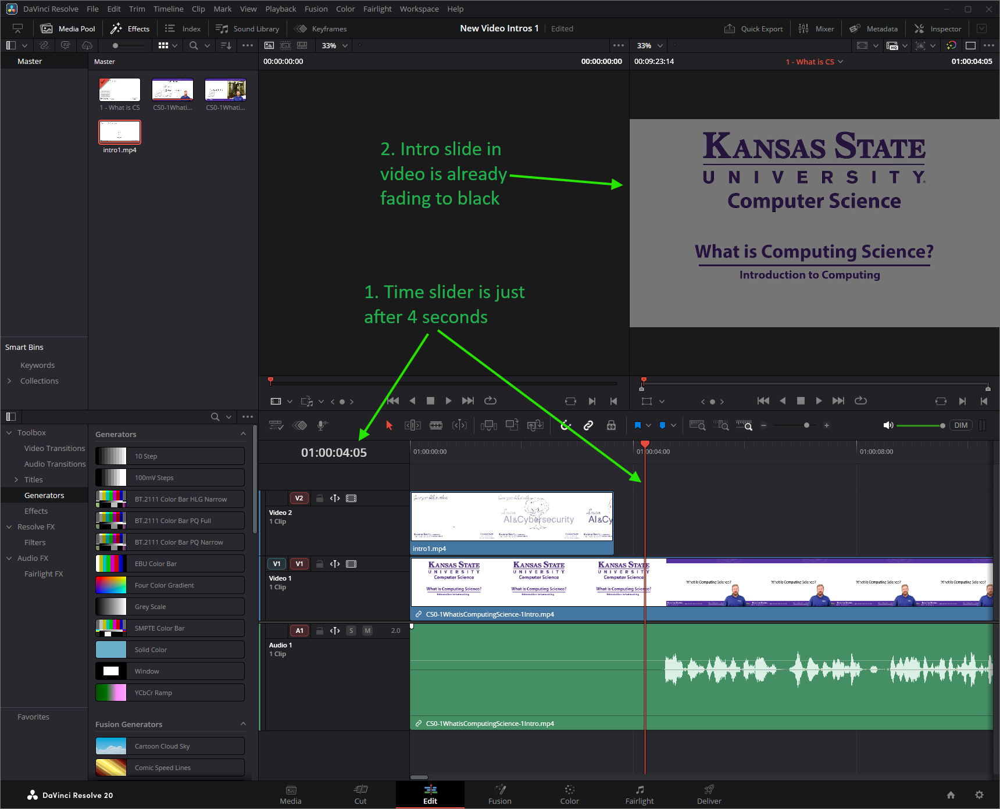

{}

Unfortunately, these videos have been edited by several hands over the year, so you'll find that some of the intro timing is inconsistent. To make room for the new intro, we may have to adjust the timing a bit, which I'll show below. Use your best judgement to do what it takes to make them look professionally done!

{}

To adjust, we can simply slide the original video back in the timeline. I'm going to slide it exactly 1 second, which will make adjusting the subtitles easier later on. To do this, place the time slider at exactly 1 second, then click and drag the video to align with that mark (it should snap into place by default):

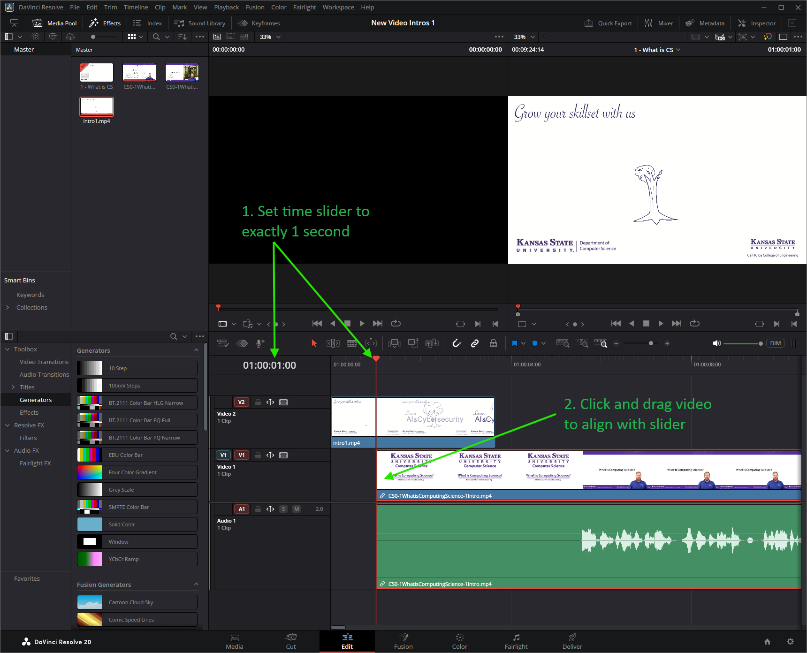

Finally, we need to add a simple crossfade to our new intro so that it fades into the original title slide. To do this, place your mouse cursor on the right side of that video in the timeline until it changes into a square bracket icon showing the right-side end of a film strip, then right-click, and then choose "Add 12 frame Cross Dissolve" (depending on the frame rate of the original video, it may be "Add 15 frame Cross Dissolve" or similar; we're shooting for half of a second in total)

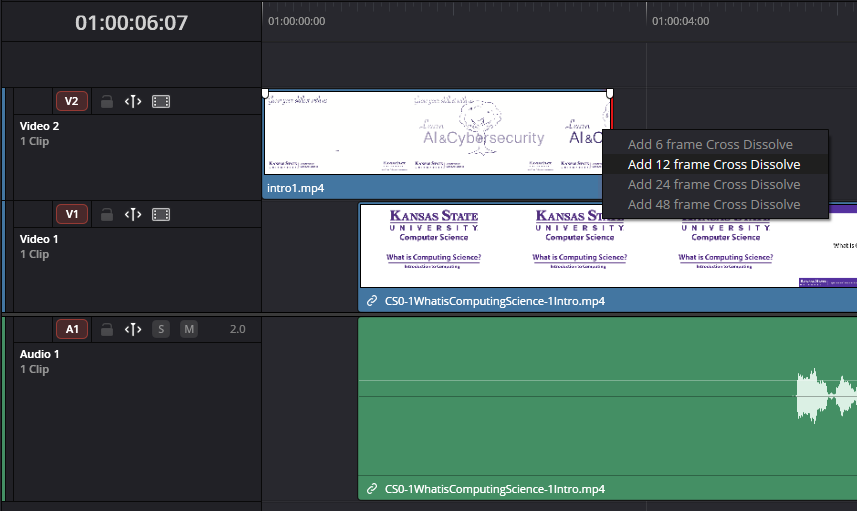

At this point, we can preview the video once again to make sure it looks good. Pay special attention to the timing of the transition between the new intro and the title card, and ensure the title card is on screen long enough to be read. 

If you are satisfied, repeat this process for each video you want to edit, starting with creating a new timeline. For the second video in this chapter, I had to adjust the timing by 1:15 (one second and 15 frames) to get everything to line up.

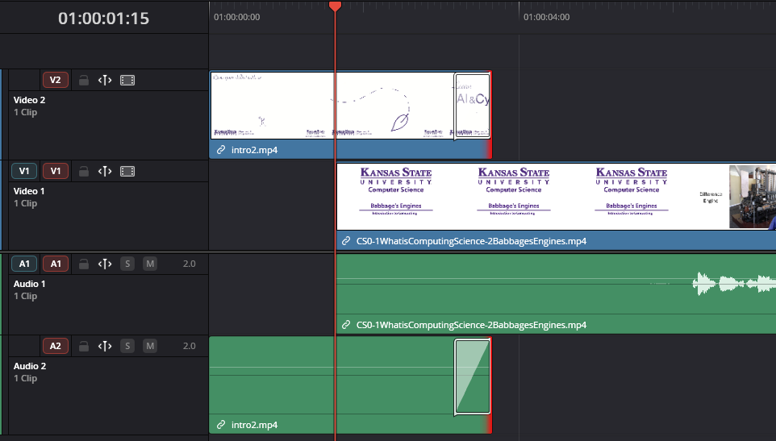

## Step 3 - Render Videos

Once each video has been edited, it is time to render them. In DaVinci, click the Deliver tab at the bottom to get to this page. At the top, choose the timeline you want to render, then adjust the settings on the side:

* Setting Preset: H.264 Master
* Filename: generally I name them after the chapter in the book and then the video, such as `1whatiscs1intro` for a video in "Chapter 1 - What is Computing Science?" that is on the "1 - Title" page of the chapter. 
* Location: up to you; I generally recommend making a new folder for each chapter to keep track of things.
* Video Format: MP4
* Video Codec: H.264
* Leave everything else as default

Once it is set correctly, click Add to Render Queue to add to the queue. Repeat this process for each timeline. 

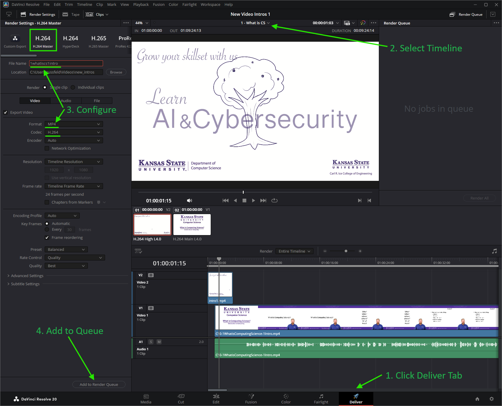

Once all videos are configured and added to the queue, select all items in the queue (<kbd>SHIFT</kbd> + click) and click Render All.

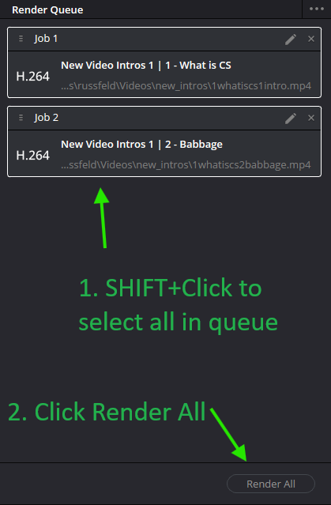

After a few minutes (depending on your PCs power), the videos will be rendered and are ready for the next step.

## Step 4 - Get / Update Supporting Materials



Hopefully you were able to find the `.jpg` or `.png` intro image as well as the subtitle file `.srt` for each video. If not, you can easily recreate them. Also, if an existing subtitle file is found but the video was adjusted, the subtitles have to be re-timed to match.

### Step 4A - Recreate Intro Image

To recreate the intro image, open the rendered video in [VLC Media Player](https://www.videolan.org/) and pause the video on a clean image of the intro slide (around 4 seconds into the video). Then, press <kbd>SHIFT</kbd>+<kbd>S</kbd> to save that current frame as a file. By default it will be saved in your Pictures folder, so you'll need to move it into the folder where you saved the new videos. Please name this file using the same name as your video (e.g. `1whatiscs1intro.mp4` would get `1whatiscs1intro.png` as the intro image)

### Step 4B - Recreate Subtitles

To recreate the subtitles, the simplest method is to upload the new video file to [Notta.ai](https://app.notta.ai/) with no speaker identification selected. Once it is done processing after a few minutes, you can review the transcripts for any obvious missed words. Once it looks good, you can download the transcript (button toward top right of screen) as an `.srt` file. Select the `Transcript` option.

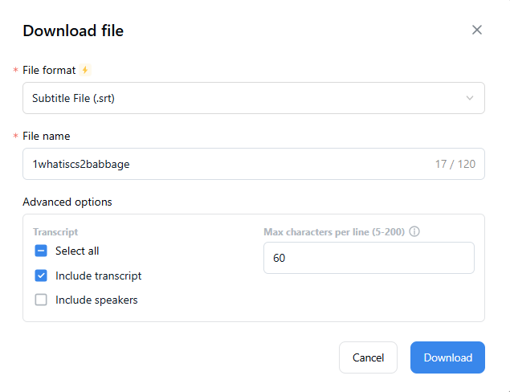

{}

Contact Russ for the login credentials for Notta.ai - we pay for a subscription to use it.

{}

### Step 4C - Retiming Subtitles

If the original video had to be adjusted to make room for the new intro, then any existing subtitles must be retimed. The easiest way to do this is via the [Subtitle Edit Online](https://www.nikse.dk/subtitleedit/online) tool. Simply upload the existing file by clicking the `Subtitle > Open` option:

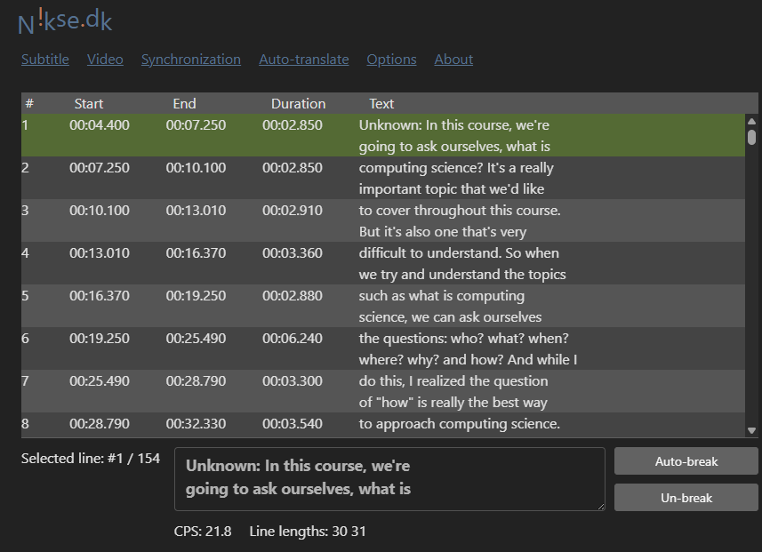

Then select the first line and click `Synchronization > Show Earlier / Later` and then adjust by the number of seconds needed (it will accept fractional seconds; for example, 1 second and 15 frames is about 1.5 seconds when the video is 24 or 30 frames per second). You should see the times adjust to match. Then, you can click `Subtitle > Save/Download` and choose the `SubRip` format and `UTF-8 with BOM` encoding (the default options) to get a new `.srt` file with the correct timings. Again, make sure it is saved in the same folder as the video with a matching filename (e.g. `1whatiscs1intro.mp4` would get `1whatiscs1intro.srt` as the subtitle file)

{}

Login should not be required to use this tool.

{}

To check your subtitles, simply open the video in [VLC Media Player](https://www.videolan.org/). As long as the subtitles in are in a file with the same name and in the same location, they will automatically be displayed.

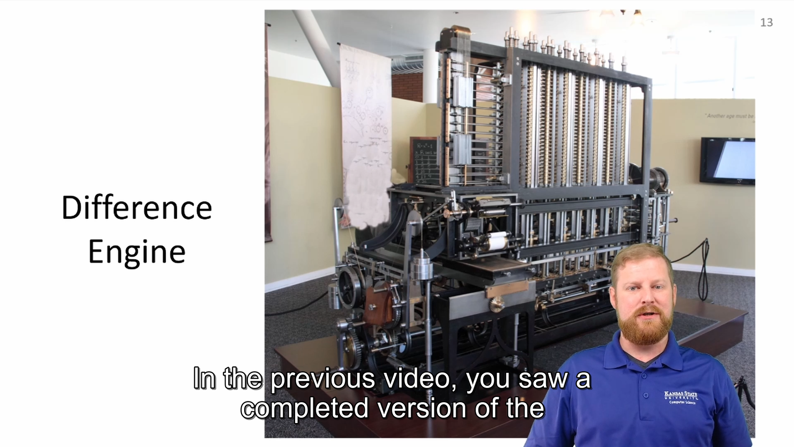

## Step 5 - Upload to YouTube



At this point, you should have all of the materials you need to upload the video to YouTube. These videos should be uploaded to the Computational Core YouTube channel. On YouTube, make sure you switch account to the correct channel, then click the **Your Videos** link on the side to go the [YouTube Studio](https://studio.youtube.com/), and then select the Content button if needed to see all videos on the channel.

Repeat the steps below for each video (you can upload multiple videos at a time and edit them after uploading as well)

First, click the Create button at the top right of the page, then click Upload videos, and choose the videos to be uploaded.

For each video, click the Edit button if needed (when uploading a single video, the Edit window appears automatically).

In this window, configure the following:
1. Video Title - should be descriptive containing the class name, chapter name, and video name, such as "CS Zero Chapter 1 - What is CS - Introduction" or similar.
2. Video Thumbnail - Upload the title image `.jpg` or `.png` file showing the video title and course.
3. Playlist - choose the correct playlist for this video or create a new unlisted playlist if needed. For CS Zero we are using "CS Zero - New Intros"

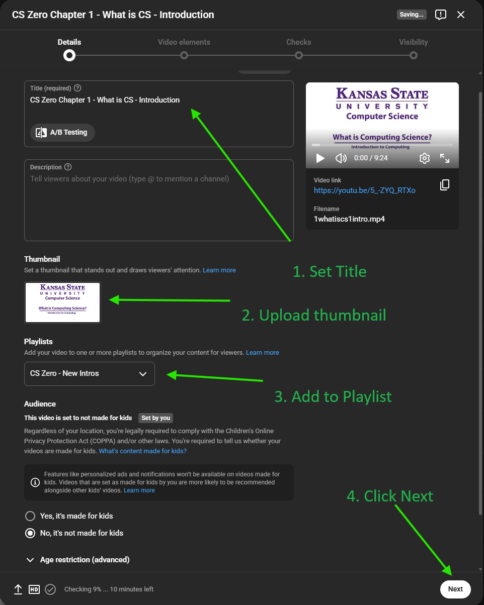

Once this is done, click Next.

On the second page, click "Add" next to the "Add Subtitles" option, then choose "Upload file" in the window that appears, and select "With timing" and then choose the `.srt` file for this video. It should show the subtitles with the appropriate timing included. 

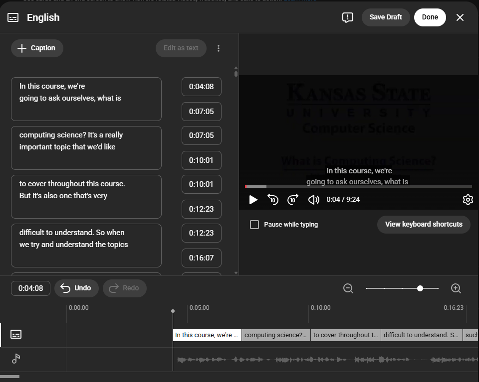

Once satisfied, click Done, then click Next

On the Checks page, there should be no errors. If errors are found, contact the faculty for assistance. Click Next.

On the Visibility page, ensure the video is set to Unlisted, then click Save.

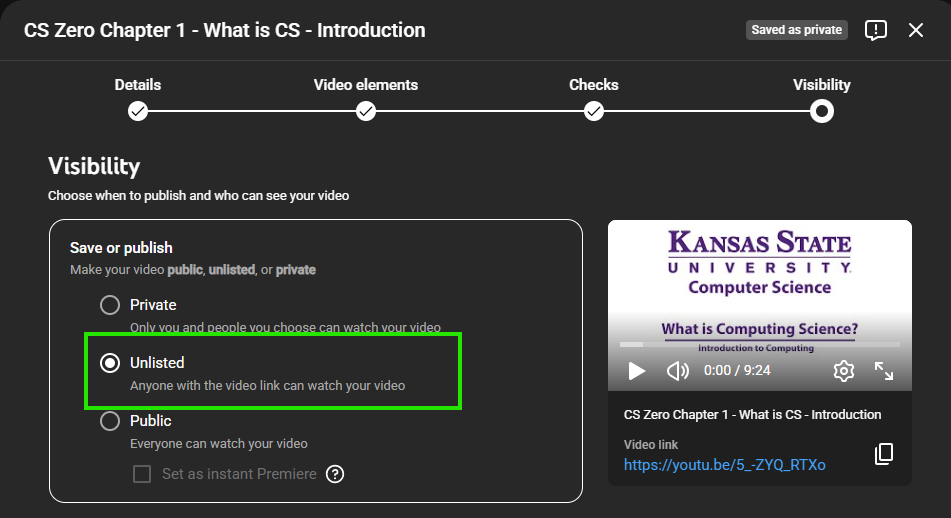

Once the video is saved, you'll be shown the Video Link. Make a note of that link since you'll need it later. You'll especially need the part at the end, which is the Video ID.

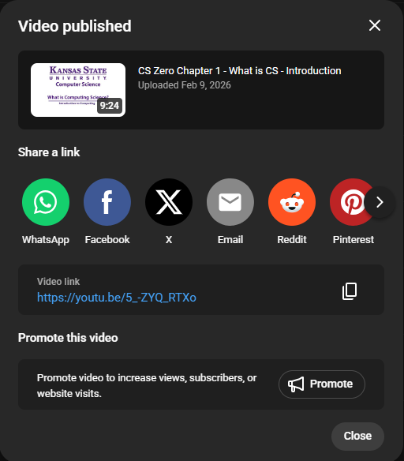

Repeat this process for any videos that are uploaded until all have been finalized. It is best if you make a spreadsheet containing the names / URLs of textbook pages you are updating and the new YouTube video URLs so that can be shared with the faculty. 

## Step 6 - Post Videos to Textbook



{}

Generally this step will be done by the faculty, but I'm including it here in case we ask you to do it as well.

{}

Once the videos have been uploaded and reviewed, they can be added to the textbook. To make simple one-off changes, simply use the Edit button at the top of each page in the textbook:

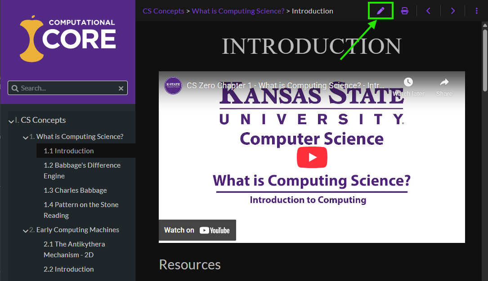

Then, simply replace the existing YouTube video ID with the new one, while keeping the old one in a comment so it can be referenced if needed. 

**Before**

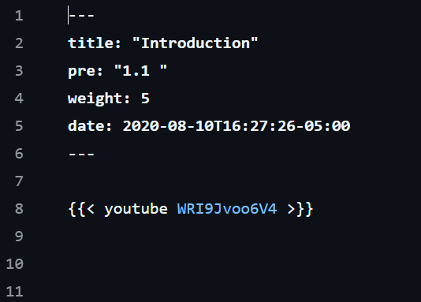

**After**

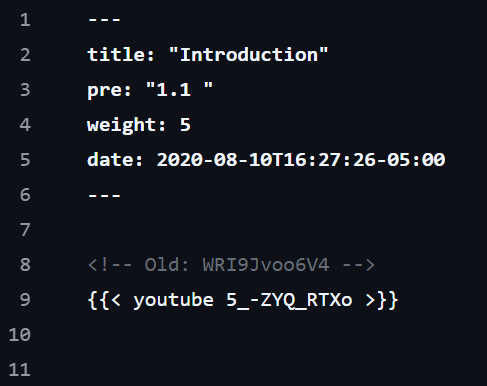

Then, click the Commit Changes button and enter a helpful message. After committing, the textbook will be republished and it may take a few minutes for changes to appear on the site.

To make larger changes to the textbook (i.e. update an entire chapter at once), it is best to clone the textbook repository locally, make changes, and then commit and push. That is outside the scope of what I'll cover here - again, generally the faculty will do this step.

## Step 7 - Upload Videos to SharePoint / OneDrive



Finally, once the videos have been finalized, upload the new videos and any supporting materials to the Computational Core Faculty folders on SharePoint / OneDrive. Currently we are creating a `New AI Intros` folder for each class, then creating a folder for each chapter inside of that:

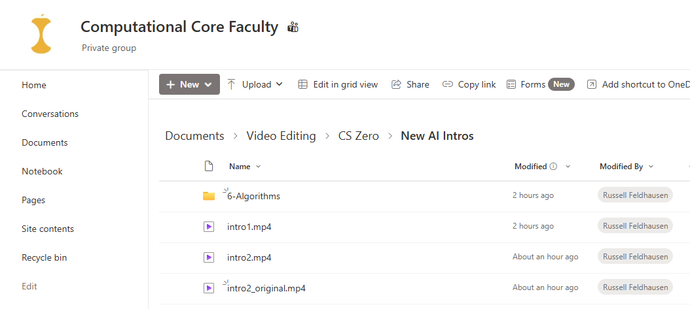

Inside of the folder should be the videos, `.jpg` or `.png` thumbnails, and the subtitle `.srt` files, all ideally named the same for each video (or at least named in a way that they are easily found):

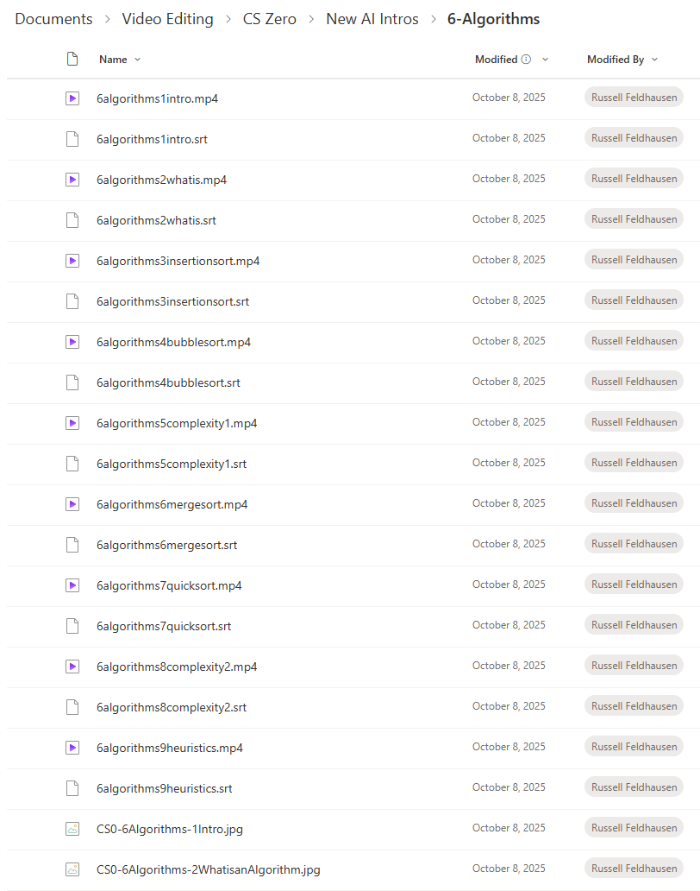

That covers it! If you have any questions, ask Russ or another faculty member for help. Thanks for all your assistance getting this done!